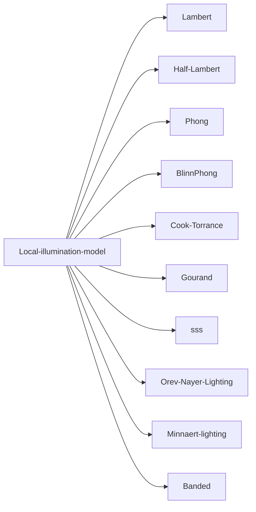

# 局部光照模型

```mermaid
flowchart LR
	root[Local-illumination-model]-->Lambert
    root-->Half-Lambert
    root-->Phong
    root-->BlinnPhong
    root-->Cook-Torrance
    root-->Gourand
    root-->sss
    root-->Orev-Nayer-Lighting
    root-->Minnaert-lighting
    root-->Banded
	
```

# 全局光照模型
