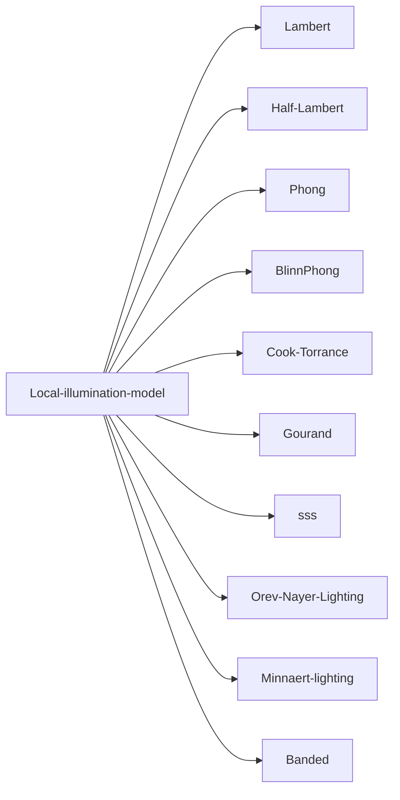

# 着色
## 定义
根据法线计算光照
## 着色方式
根据光照情况在图中引入明暗不同的
在渲染三角形面内的具体像素时，按法线、颜色的来源途径，可以分为三种方式：
**已知三角形内每个顶点的法线、坐标**
![[Pasted image 20230106214228.png]]
1.  **Flat shading**
    先平均各顶点的法向量，在计算每个像素的颜色时，共用这个平均法向量。这种方法在渲染圆滑物体时很不好用。
2.  **Gouraud shading**
    先计算各顶点的颜色，三角形内的像素颜色由插值各顶点得出。
3.  **Phong shading**
    在绘制每个像素时，先插值计算出当前像素的法向量，用这个法向量计算颜色。

**Gouraud 与 Phong 着色有何不同？**

**Gouraud着色（Gouraud shading)**：在顶点着色器中**逐顶点**计算光照
在每个顶点上计算光照，然后再渲染图元内部进行线性插值。
- 顶点数目小于像素数目，因此计算量小于 phong 着色
- 但是由于以来线性插值获得像素光照，当光照模型中有非线性的计算（例如计算高光反射）时，就会破坏原计算的非线性关系，我们会发现高光部分明显不平滑。
- 由于在渲染图元内部对顶点颜色进行插值，导致渲染图元内部的颜色总是暗于顶点颜色，会产生明显的棱角现象

**Phong 着色（Phong shading）**：片元着色器中**逐像素**计算光照：
又称**法线矢量插值着色**，以每个像素为基础得到法线（对顶点法线插值得到或从法线纹理中采样得到）
- @ 注意：着色方式不是光照模型，不要将 phong 着色和 phong、blinnphong 光照模型混为一谈。
# 兰伯特余弦定律
我们可以将光看作是光子的集合，在空间中按特定的方向传播。每个光子都载有 (光）能量。
光源每秒发出的 (光）能量称为**辐射通量 (radiant flux)**。
而单位面积上的**辐射通量密度 ( irradiance，称为辐（射)照度)** 是一种很重要的概念, 因为我们将用它来确定表面某区域所接收到的光量 (即眼睛感受到的明亮度)。
**一般来讲，我们可以认为辐照度是照射到表面某区域的光量，或者是通过空间中某假想区域的光量。**
![[Pasted image 20230509104204.png]]
光线垂直照射到表面 (即光向量 $L$ 与法向量 $n$ 相等时)的强度要大于以某个角度照射到表面的强度。试想有一小束辐射通量为 $P$ 且横截面面积为 $A$ 的光束。如果将此光束正向垂直打向表面（见图 8.10a ), 则光束照射到表面上的面积为 $A_1$，而 $A_1$ 内的辐照度为 $E_1 = P/A_1$。
现假设转动光源，使光束以某个入射角度照射到表面上 (如图 8.10b ), 则光束将覆于表面上的更大面积 $A_2$。此时, 该面积的辐照度为 $E_2=P/A_2$ 根据三角学可知，$A_1$ 及 $A_2$ 的关系为:
$$
\cos\theta=\frac{A_1}{A_2}\Rightarrow\frac{1}{A_2}=\frac{\cos\theta}{A_1}
$$
所以，
$$
E_2=\frac{P}{A_2}=\frac{P}{A_1}\cos\theta=E_1\cos\theta=E_1\left(\boldsymbol{n\cdot L}\right)
$$
换句话说, 面积 $A_2$ 内的辐照度就相当于将受垂直方向光照的面积 $A_1$ 内的辐照度按比例 $n·L =\cos \theta$ 进行缩放。这就是传说中的兰伯特余弦定律 ( Lambert's Cosine Law)。考虑到光线照射到表面另一侧的情况（此时，点积的结果为负值），我们用 $max$ 函数来钳制"“缩放因子”的取值范围: $f (\theta) = max (cos\theta,0)= max (L\cdot n, 0)$

# 局部光照模型

## 

![[c404f0cfb630ff9ac5fc30909c269875_MD5.jpg]]

![[021c6a631aad71fa57904c06acc7b364_MD5.jpg]]

![[9267fb507b68fe8f7f25bc9548902ced_MD5.jpg]]

![[5f51e5ecc0c308b8b4d58c351f8d9807_MD5.jpg]]

![[52d8e697cac4e888da910201f343b92f_MD5.jpg]]
