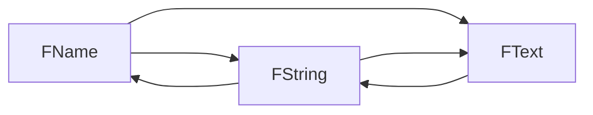

1.  [大钊老师啊：虚幻C++进阶之路](https://link.zhihu.com/?target=https%3A//www.bilibili.com/video/BV1C7411F7RF)
2.  [梁迪_梁迪腾讯课堂官网](https://link.zhihu.com/?target=http%3A//didi.ke.qq.com/%23tab%3D1%26category%3D-1) （迪迪老师 教你 C 草实战）
3.  [技术宅阿棍儿](https://link.zhihu.com/?target=https%3A//space.bilibili.com/92060300/video)（大标题直击要领，很棒）
4.  [来自程序员的暴击：虚幻四C++入坑指南合集版](https://link.zhihu.com/?target=https%3A//www.bilibili.com/video/BV14K411J7v2)

# 一、属性 UPROPERTY
## 属性声明

属性使用标准的 C++变量语法声明，前面用 `UPROPERTY` 宏来定义属性元数据和变量说明符。
`UPROPERT` 宏作为声明序言的变量可被引擎执行垃圾回收，也可在虚幻编辑器中显示和编辑。

```c++
UPROPERTY([specifier, specifier, ...], [meta(key=value, key=value, ...)])
Type VariableName;
```

## 属性说明符

声明属性时，**属性说明符** 可被添加到声明，以控制属性与引擎和编辑器诸多方面的相处方式。

|属性标签|效果|
|---|---|
|`AdvancedDisplay`|属性将被放置在其出现的任意面板的**高级（下拉） 部分**中。|
|`AssetRegistrySearchable`|`AssetRegistrySearchable` 说明符说明此属性与其值将被自动添加到将此包含为成员变量的所有资源类实例的资源注册表。不可在结构体属性或参数上使用。|
|⭐ **`BlueprintAssignable`**|⭐只能与**多播委托**共用。公开属性在蓝图中指定。|
|`BlueprintAuthorityOnly`|此属性必须为一个多播委托。在蓝图中，其只接受带 `BlueprintAuthorityOnly` 标签的事件。 |
|⭐ **`BlueprintCallable`**|⭐ 仅用于**多播委托**。应公开属性在蓝图代码中调用。|
|`BlueprintGetter=GetterFunctionName` |此属性指定一个自定义存取器函数。如此属性不带 `BlueprintSetter` 或 `BlueprintReadWrite` 标签，则其为隐式 `BlueprintReadOnly`。 |
|⭐ **`BlueprintReadOnly`**|⭐此属性可由蓝图读取，但不能被修改。|
|⭐ **`BlueprintReadWrite`**|⭐可从蓝图读取或写入此属性。|
|`BlueprintSetter=SetterFunctionName`|此属性拥有一个自定义编译函数，被隐式标记为 `BlueprintReadWrite`。注意：必须对变异函数进行命名，并为相同类的一部分。 |
|⭐ **`Category="TopCategory\|SubCategory\|..."`**|⭐指定在蓝图编辑工具中显示时的属性类别。使用 \| 运算符定义嵌套类目。|
|`Config`|此属性将被设为可配置。当前值可被存入与类相关的 `.ini` 文件中，创建后将被加载。无法在默认属性中给定一个值。暗示为 `BlueprintReadOnly`。|
|`DuplicateTransient` |说明在任意类型的复制中（复制/粘贴、二进制复制等），属性的值应被重设为类默认值。|
|⭐ **`EditAnywhere`** |⭐说明此属性可通过属性窗口在原型和实例上进行编辑。|
|⭐ **`EditDefaultsOnly`**|⭐说明此属性可通过属性窗口进行编辑，但只能在原型上进行。|
|`EditFixedSize`|只适用于动态数组。这能防止用户通过虚幻编辑器属性窗口修改数组长度。|
|`EditInline`|允许用户在虚幻编辑器的属性查看器中编辑此属性所引用的Object的属性（只适用于Object引用，包括Object引用的数组）。|
|⭐ **`EditInstanceOnly`**|⭐说明此属性可通过属性窗口进行编辑，但只能在实例上进行，不能在原型上进行。|
|`Export`|只适用于Object属性（或Object数组）。说明Object被复制时（例如复制/粘贴操作）指定到此属性的Object应整体导出为一个子Object块，而非只是输出Object引用本身。|
|`GlobalConfig`|工作原理与 `Config` 相似，不同点是无法在子类中进行覆盖。无法在默认属性中对其给定一个值。暗示为 `BlueprintReadOnly`。|
|`Instanced`|仅限Object（`UCLASS`）属性。此类的一个实例创建时，其将被给定一个Object的特殊副本，指定到默认项中的此属性。用于实例化类默认属性中定义的子Object。暗示为 `EditInline` 和 `Export`。|
|`Interp`|说明值可随时间由Sequencer中的一个轨道驱动。|
|`Localized`|此属性的值将拥有一个定义的本地化值。多用于字符串。暗示为 `ReadOnly`。|
|`Native`|属性为本地：C++代码负责对其进行序列化并公开到[垃圾回收](https://docs.unrealengine.com/5.2/zh-CN/unreal-object-handling-in-unreal-engine)。|
|`NoClear`|阻止从编辑器将此Object引用设为空。隐藏编辑器中的清除（和浏览）按钮。|
|`NoExport`|只适用于本地类。此属性不应包含在自动生成的类声明中。|
|`NonPIEDuplicateTransient`|属性将在复制中被重设为默认值，除非其被复制用于PIE会话。|
|`NonTransactional`|说明对此属性值的修改不会包含在编辑器的撤销/重新执行历史中。|
|`NotReplicated`|跳过复制。这只会应用到服务请求函数中的结构体成员和参数。|
|`Replicated`|属性应随网络进行复制。|
|`ReplicatedUsing=FunctionName`|`ReplicatedUsing` 说明符指定一个回调函数，其在属性通过网络更新时执行。|
|`RepRetry`|只适用于结构体属性。如果此属性未能完全发送（举例而言：Object引用尚无法通过网络进行序列化），则重新尝试对其的复制。对简单引用而言，这是默认选择；但对结构体而言，这会产生带宽开销，并非优选项。因此在指定此标签之前其均为禁用状态。|
|`SaveGame`|此说明符可简便地将域显式包含，用于属性关卡中的检查点/保存系统。应在作为游戏存档一部分的所有域上设置此标签，并使用代理归档器对其进行读写。|
|`SerializeText`|本地属性应被序列化为文本（`ImportText`、`ExportText`）。|
|`SkipSerialization`|此属性不会被序列化，但仍能导出为一个文本格式（例如用于复制/粘贴操作）。|
|`SimpleDisplay`|出现在 **细节** 面板中的可见或可编辑属性，无需打开"高级"部分即可见。|
|`TextExportTransient`|此属性将不会导出为一个文本格式（因此其无法用于复制/粘贴操作）。|
|`Transient`|属性为临时，意味着其无法被保存或加载。以此方法标记的属性将在加载时被零填充。|
|⭐ **`VisibleAnywhere`**|⭐ 说明此属性在所有属性窗口中**可见**，但**无法被编辑**。此说明符与"Edit"说明符不兼容。|
|⭐ **`VisibleDefaultsOnly`**|⭐ 说明此属性只在原型的属性窗口中可见，**无法被编辑**。此说明符与所有"Edit"说明符均不兼容。 |
|⭐ **`VisibleInstanceOnly`**|⭐ 说明此属性只在实例的属性窗口中可见（在原型属性窗口中不可见），**无法被编辑**。此说明符与所有"Edit"说明符均不兼容。|

## 数据类型
![[Pasted image 20230902142824.png|181]]
>上面为原生 C++类型，下面为对应的 UE 类型

为什么 UE 自己定义类型？
1. 跨平台
2. 兼容反射
3. 方便宏替换，C++原生类型有空格不方便
![[Pasted image 20230901195356.png]]
### 整数

整数数据类型转换是"int"或"uint"后跟位大小。

|变量类型|说明|
|---|---|
|**uint8**|8位无符号|
|**uint16**|16位无符号|
|**uint32**|32位无符号|
|**uint64**|64位无符号|
|**int8**|8位有符号|
|**int16**|16位有符号|
|**int32**|32位有符号|
|**int64**|64位有符号|

#### 作为位掩码
##### 整数属性位掩码
整数属性现在可**以位掩码形式公开给编辑器**。要将整数属性标记为位掩码，只需在 meta 分段中添加 `Bitmask` 即可，如下所示：

```c++
/*~ BasicBits appears as a list of generic flags in the editor, instead of an integer field. */
//BasicBits在编辑器中显示为一个通用flag标志列表，而不是一个整数字段
UPROPERTY(EditAnywhere, Meta = (Bitmask))
int32 BasicBits;
```

添加此元标记将使整数作为下拉列表形式可供编辑，它们使用笼统命名标记（"Flag 1"、"Flag 2"、"Flag 3"等等），可以 单独打开或关闭。

![[cd2166f5df34fcddfa25e7e5196ce3a7_MD5.jpg]]
##### 蓝图整数位掩码
**也可以让蓝图可调用函数的整型参数表现为位掩码**，方法是在参数的 `UPARAM` 指定器上添加 `Bitmask` 元标签（不需要值）。

```c++
/*~ You can set MyFunction using a generic list of flags instead of typing in an integer value. */
//你可以使用一个通用的flag标志列表来设置MyFunction，而不是输入一个整数值。
UFUNCTION(BlueprintCallable)
void MyFunction(UPARAM(meta=(Bitmask)) int32 BasicBitsParam)
```
##### 自定义位标记名称
**自定义位标记名称**，首先必须使用`Bitflags`元标记来创建 `UENUM`：

```c++
UENUM(Meta = (Bitflags))
enum class EColorBits
{
    ECB_Red,
    ECB_Green,
    ECB_Blue
};
```

比特掩码枚举类型的范围是0到31，包括0和31。其对应于32位整型变量的位数（从第0位开始）。在上面的例子中，第0位是 `ECB_Red`，第1位是 `ECB_Green`，第2位是 `ECB_Blue`。

作为**另一种声明方式，你可以使用 `ENUM_CLASS_FLAGS` 在定义完枚举类型后，将其变成一个位掩码。** 为了在编辑器中使用标志选择器（flag selector），我们还必须添加元字段 `UseEnumValuesAsMaskValuesInEditor` 并将其设置为 `true`。关键的区别在于，这个方法直接使用掩码值，而不是比特数。使用此方法制作的等效枚举类型看起来像这样：

```c++
UENUM(Meta = (Bitflags, UseEnumValuesAsMaskValuesInEditor = "true"))
enum class EColorBits
{
    ECB_Red = 0x01,
    ECB_Green = 0x02,
    ECB_Blue = 0x04
};

ENUM_CLASS_FLAGS(EColorBits);
```

**创建该UENUM后，可以使用`BitmaskEnum`元标记来引用它**，如：

```c++
/*~ This property lists flags matching the names of values from EColorBits. */
//这个属性列出了与EColorBits中值的名称相匹配的标志
UPROPERTY(EditAnywhere, Meta = (Bitmask, BitmaskEnum = "EColorBits"))
int32 ColorFlags;
```

完成这个更改后，下拉框中列出的位标记将使用列举类条目的名称和值。在上述示例中， ECB_Red 值为0，表示它被选中时将激活位0（将ColorFlags增加1）。ECB_Green对应于位1（将ColorFlags增加2），ECB_Blue 对应于位2（将ColorFlags增加4）。

![[47dbb9ed69b8e8601e913aa90c304f74_MD5.jpg]]

**同样，你可以在 `UPARAM` 标签的meta部分添加 `BitmaskEnum` 和对应的枚举类型名称来定制它。**

```c++
/*~ MyOtherFunction shows flags named after the values from EColorBits. */
UFUNCTION(BlueprintCallable)
void MyOtherFunction(UPARAM(meta=(Bitmask, BitmaskEnum = "EColorBits")) int32 ColorFlagsParam)
```

虽然列举类型包含超过32个条目，但在属性编辑器UI中，位掩码关联中只会看到前32个值。同样，虽然可接受显式值条目，但显式值介于0-31的条目不会包含在下拉列表中。

### 浮点数

虚幻使用标准 C++浮点类型、浮点和双精度。
```c++
float  //32bit
double //64bit
```

### 布尔

布尔类型可以使用 C++ bool 关键字表示或表示为位域。
```c++
uint32 bIsHungry : 1;
bool bIsThirsty;
```

# 二、类 UCLASS
虚幻引擎包含一个用于处理游戏对象的强大系统。虚幻引擎中**所有对象的基类都是 `UObject`**。

声明包含一个类的标准 C++ 类声明。在标准声明之上，描述符（如类说明符和元数据）将被传递到 `UCLASS` 宏。
**`UCLASS` 宏的作用**是标记 `UObject` 的子类，以便 **UObject** 处理系统可以识别它们。

```c++
UCLASS([specifier, specifier, ...], [meta(key=value, key=value, ...)])
class ClassName : public ParentName
{
    GENERATED_BODY()
}
```

## 1 UCLASS 宏

**UCLASS** 宏为 `UObject` 提供了一个 `UCLASS` 引用，用于描述它在虚幻引擎中的类型。每个 `UCLASS` 都保留一个称作 **类默认对象（Class Default Object）** 的对象，简称`CDO`。`CDO` 本质上是一个默认"模板"对象，由类构建函数生成，之后就不再修改。

你可以为指定对象获取其 `UCLASS` 和 `CDO`，虽然它们通常都是只读类型。
>使用 **`GetClass()`** 函数即可随时访问对象实例的 UCLASS。


> [!NOTE]
> `UObject` 类还可包括仅限本地的属性，这些属性没有用 `UFUNCTION` 或者 `UPROPERTY` 指定器标记用于反射。**只有用指定器宏标记过的函数和属性会列举在它们对应的 `UCLASS` 中。**

## 2 类说明符

声明类时，可以为声明添加 **类说明符**，以控制类相对于引擎和编辑器的各个方面的行为。

|类说明符|效果|
|---|---|
| `Abstract` |**Abstract** 说明符会将类声明为"**抽象基类**"，阻止用户向关卡中添加此类的 Actor。对于单独存在时没有意义的类，此说明符非常有用。例如，`ATriggerBase` 基类是抽象类，而 `ATriggerBox` 子类不是抽象类，可以放置在关卡中。|
| `AdvancedClassDisplay` |**AdvancedClassDisplay** 说明符强制类的所有属性仅在显示这些属性的 ["细节面板（Details Panel）"](https://docs.unrealengine.com/5.2/zh-CN/level-editor-details-panel-in-unreal-engine) 的"高级（Advanced）"部分中显示。要覆盖单个属性上的此说明符，在该属性上使用 `SimpleDisplay` 说明符。|
| `AutoCollapseCategories=(Category1, Category2, ...)` | `AutoCollapseCategories` 说明符使父类上的 **AutoExpandCategories** 说明符的列出类别的效果无效。|
| `AutoExpandCategories=(Category1, Category2, ...)` |为此类的对象指定应自动在虚幻编辑器属性窗口中展开的一个或多个类别。要自动展开未使用类别声明的变量，请使用声明变量的类的名称。 |
|⭐ **`Blueprintable`**|⭐将此类公开为用于**创建蓝图的可接受基类**。默认为 `NotBlueprintable`，除非继承时就并非如此。此说明符由子类继承。|
|⭐ **`BlueprintType`**|将此类公开为可用于蓝图中的变量的类型。|
| `ClassGroup=GroupName` |指示在虚幻编辑器的 Actor 浏览器中启用 **组视图（Group View）** 时，**Actor 浏览器** 应在指定的 `GroupName` 中包含此类及此类的所有子类。|
| `CollapseCategories` |指示此类的属性不应划分到虚幻编辑器属性窗口的类别中。此说明符会传播到子类，可由 `DontCollapseCategories` 说明符覆盖。|
| `Config=ConfigName` |指示此类可在配置文件（`.ini`）中存储数据。如果存在任何使用 `config` 或 `globalconfig` 说明符声明的类属性，此说明符将使这些属性存储在指定的配置文件中。此说明符会传播到所有子类并且无法使此说明符无效，但是子类可通过重新声明 `config` 说明符并提供不同的 `ConfigName` 来更改配置文件。常见的 `ConfigName` 值是"Engine"、"Editor"、"Input"和"Game"。|
| `Const` |此类中的所有属性和函数都是 `const` 并且导出为 `const`。此说明符由子类继承。|
| `ConversionRoot` |根转换，将子类限制为仅可沿层级向上转换为第一个根类的子类。|
| `CustomConstructor` |阻止构造函数声明自动生成。|
| `DefaultToInstanced` |此类的所有实例都被认为是"实例化的"。实例化的类（组件）将在构造时被复制。此说明符由子类继承。|
| `DependsOn=(ClassName1, ClassName2, ...)` |列出的所有类将先于此类被编译。提供的类名必须指示同一个或前一个包中的类。可以使用单个 `DependsOn` 行（以逗号分隔）来标识多个依赖类，或者可以通过为每个类使用单独的 `DependsOn` 行来指定多个依赖类。当某个类使用在另一个类中声明的结构体或枚举时，这非常重要，因为编译器仅知道它已编译了类中的哪些部分。|
| `Deprecated` |此类已弃用，序列化时将不保存此类的对象。此说明符由子类继承。|
| `DontAutoCollapseCategories=(Category, Category, ...)` |使列出的类别的继承自父类的 `AutoCollapseCategories` 说明符无效。|
| `DontCollapseCategories` |使继承自基类的 `CollapseCatogories` 说明符无效。|
| `EditInlineNew` |指示可以从虚幻编辑器"属性（Property）"窗口创建此类的对象，而非从现有资源引用。默认行为是仅可通过"属性（Property）"窗口指定对现有对象的引用。此说明符会传播到所有子类；子类可通过 `NotEditInlineNew` 说明符覆盖它。|
| `HideCategories=(Category1, Category2, ...)` |列出一个或多个应该对用户完全隐藏的分类。要隐藏未使用类别声明的属性，请使用声明变量的类的名称。此说明符会传播到子类。|
| `HideDropdown` |阻止此类在属性窗口组合框中显示。|
| `HideFunctions=(Category1, Category2, ...)` |让指定分类中的所有函数都对用户完全隐藏。|
| `HideFunctions=FunctionName` |将提到的函数对用户完全隐藏。|
| `Intrinsic` |指示此类直接在 C++中声明，无 **Unreal Header Tool** 生成的样板。请勿在新类上使用此说明符。|
| `MinimalAPI` |导致仅导出此类的类型信息，以供其他模块使用。可以以此类为目标进行强制转换，但此类的函数无法被调用（除了使用内联方法）。这可以缩短编译时间，因为没有针对无需从其他模块访问其所有函数的类导出一切。|
| `NoExport` |指示此类的声明不应包含在由标头生成器自动生成的 C++头文件中。必须在单独的头文件中手动定义该 C++类声明。仅对本地类有效。请勿对新类使用此说明符。|
| `NonTransient` |使继承自基类的 `Transient` 说明符无效。|
| `NotBlueprintable` |指定此类不是可用于创建蓝图的可接受基类。此为默认说明符，将由子类继承。|
| `NotPlaceable` |使继承自基类的 `Placeable` 说明符无效。指示不可以在编辑器中将此类的对象放置到关卡、UI 场景或蓝图中。|
| `PerObjectConfig` |此类的配置信息将按对象存储，在 ``.ini`文件中，每个对象都有一个分段，根据对象命名，格式为`` [ObjectName ClassName] `。此说明符会传播到子类。|
| `Placeable` |指示可在编辑器中创建此类，而且可将此类放置到关卡、UI 场景或蓝图（取决于类类型）中。此标志会传播到所有子类；子类可使用 `NotPlaceable` 说明符覆盖此标志。|
| `ShowCategories=(Category1, Category2, ...)` |使列出的类别的继承自基类的 `HideCategories` 说明符无效。|
| `ShowFunctions=(Category1, Category2, ...)` |在属性查看器中显示列出的类别中的所有函数。|
| `ShowFunctions=FunctionName` |在属性查看器中显示指定的函数。|
| `Transient` |从不将属于此类的对象保存到磁盘。当与播放器或窗口等本质上不持久的特定种类的原生类配合使用时，它非常有用。此说明符会传播到子类，但是可由 `NonTransient` 说明符覆盖。|
| `Within=OuterClassName` |此类的对象无法在 `OuterClassName` 对象的实例之外存在。这意味着，要创建此类的对象，需要提供 `OuterClassName` 的一个实例作为其 `Outer` 对象。 |

## 3 TSubclassOf


**`TSubclassOf`** 是提供 `UClass` 类型安全性的模板类。它**在分配从特定类型派生出来的类时很有效**。

- 例如，你可以把这个变量公开给蓝图，设计者可以为玩家角色指定生成的武器类别。
- 例如您在创建一个投射物类，允许设计者指定伤害类型。您可只创建一个 `UClass` 类型的 `UPROPERTY`，让设计者指定派生自 `UDamageType` 的类；或者您可使用 `TSubclassOf` 模板强制要求此选择。以下示例代码展示了不同之处：

```c++
/** type of damage */
UPROPERTY(EditDefaultsOnly, Category=Damage)
UClass* DamageType;
```

Vs.

```c++
/** type of damage */
UPROPERTY(EditDefaultsOnly, Category=Damage)
TSubclassOf<UDamageType> DamageType;
```

在第二个声明中，模板类告知编辑器的属性窗口只列出派生自 UDamageType 的类（作为属性选择）。在第一个声明中可选择任意 UClass。下图对此进行了说明。

![[0373df02883ba7ef2855694b2d997626_MD5.jpg]]
>策略游戏投射物蓝图的范例

除 `UPROPERTY` 安全外，您还能获得 C++ 层级上的类型安全。**如尝试进行不兼容 `TSubclassOf` 类型的相互指定，将出现编译错误。** 
尝试指定泛型 `UClass` 时，它将执行一个运行时检查，以确定它可执行指定。如运行时检查失败，结果数值为 nullptr。

```c++
UClass* ClassA = UDamageType::StaticClass();

TSubclassOf<UDamageType> ClassB;

ClassB = ClassA; // Performs a runtime check

TSubclassOf<UDamageType_Lava> ClassC;

ClassB = ClassC; // Performs a compile time check
```


## 4 虚幻头文件工具 UHT

为利用 `UObject` 派生类型所提供的功能，需要在头文件上为这些类型执行一个预处理步骤，以核对需要的信息。该预处理步骤由 **UnrealHeaderTool（简称 UHT）** 执行。`UObject` 派生的类型需要遵守特定的结构。

### 头文件格式

`UObject` 在源（. cpp）文件中的实现与其他 C++ 类相似，其**在头（. h）文件中的定义必须遵守特定的基础结构**，以便在虚幻引擎 4 中正常使用。使用编辑器的"New C++ Class"命令是设置格式正确头文件的最简单方法。
`UObject` 派生类的基础头文件可能看起来与此相似，假定 UObject 派生物被称为 UMyObject，其创建时所在的项目被称为 MyProject：

```c++
#pragma once

#include 'Object.h'
#include 'MyObject.generated.h'

UCLASS()
class MYPROJECT_API UMyObject : public UObject
{
    GENERATED_BODY()

};
```

虚幻引擎特定的部分如下：

1. 此行预计为此文件中最后一个 `#include` 指令。如此头文件需要了解其他类，可将它们在文件中的任意位置提前声明，或包括在 MyObject. generated. h 上。

```c++
#include "MyObject.generated.h"
```

2.  `UCLASS` 宏使虚幻引擎能识别 `UMyObject`。此宏支持大量参数[类说明符](https://docs.unrealengine.com/5.2/zh-CN/class-specifiers)，参数决定类功能的开或关。

```c++
UCLASS()
```

3. **如 MyProject 希望将 UMyObject 类公开到其他模块，则需要指定 `MYPROJECT_API`**。这对游戏项目将包括的模块或插件十分实用。这些模块和插件将故意使类公开，在多个项目间提供可携的自含式功能。

```c++
class MYPROJECT_API UMyObject : public UObject
```

4. **`GENERATED_BODY` 宏不获取参数，但会对类进行设置，以支持引擎要求的基础结构。所有 `UCLASS` 和 `USTRUCT` 均有此要求。**
```c++
GENERATED_BODY() //GENERATED_BODY()宏必须被放置在类体的最前方。
```

5. 虚幻头文件工具支持最下 C++集。当使用自定义 `#ifdefs` 宏包裹 UCLASS 的部分时，UHT 会忽略不包含 `WITH_EDITOR` 或者 `WITHEDITORONLY_DATA` 宏的宏。

# 三、结构体 USTRUCT
**结构体（Struct）** 是一种数据结构，帮助你组织和操作相关属性。在虚幻引擎中，结构体会被引擎的反射系统识别为 **`USTRUCT`**，但**不属于 ` UObject` 生态圈,且不能在 `UClasse` 的内部使用。** 

- 在相同的数据布局下， `USTRUCT` 比 `UObject` 能更快创建。
- `USTRUCT`支持`UPROPERTY`, 但它不由垃圾回收系统管理，不能提供`UFUNCTION`

## 实现USTRUCT

要把一个结构体变成 `USTRUCT`，请遵循以下步骤：

1. 打开你要定义结构体的 **header (.h)** 文件。
2. 要定义你的C++结构体，请将 `USTRUCT` 宏放在结构体定义的上方。
3. 将 `GENERATED_BODY()` 宏作为定义的第一行。

其结果应该与下面的的例子一致：

```c++
USTRUCT([Specifier, Specifier, ...])
struct FStructName
{
    GENERATED_BODY()
};
```

你可以用`UPROPERTY`来标记结构体的相关变量，使它们在虚幻反射系统和蓝图脚本中可见。

## 结构体说明符

**结构体说明符** 提供元数据，控制你的结构在引擎和编辑器中各方面的表现。

-  `Atomic` ：表示该结构体应始终被序列化为一个单元。将不会为该类创建自动生成的代码。标头仅用于解析元数据。
-  `BlueprintType`： 将此结构体作为一种类型公开，可用于蓝图中的变量。
-  `NoExport` ：将不会为该类创建自动生成的代码。标头仅用于解析元数据。

## 最佳做法与技巧

下面是一些使用 `USTRUCT` 时需要记住的有用提示：

1. `USTRUCT` 可以使用虚幻引擎的[智能指针](https://docs.unrealengine.com/5.2/zh-CN/smart-pointers-in-unreal-engine)和垃圾回收系统来防止垃圾回收删除 `UObjects`。
2. 结构体最好用于简单数据类型。对于你的项目中更复杂的交互，也许可以使用 `UObject` 或 `AActor` 子类来代替。
3. `USTRUCTs` **不可以** 用于复制。但是 `UPROPERTY` 变量 **可以** 用于复制。
4. 虚幻引擎可以自动为结构体创建Make和Break函数。
    1. Make函数出现在任何带有 `BlueprintType` 标签的 `USTRUCT` 中。
    2. 如果在USTRUCT中至少有一个 `BlueprintReadOnly` 或 `BlueprintReadWrite` 属性，Break函数就会出现。
    3. Break 函数创建的纯节点为每个标记为 `BlueprintReadOnly` 或 `BlueprintReadWrite` 的资产提供一个输出引脚。

## 数据表
 继承 `FTableRowBase` 之后可以用于 DataTable

```cpp
struct FInventoryItemInfo : public FTableRowBase
{
    GENERATED_BODY()

    UPROPERTY(EditAnywhere, BlueprintReadWrite)
        FString ItemName UMETA(DisplayName="名称");

    UPROPERTY(EditAnywhere, BlueprintReadWrite)
        int32 index UMETA(DisplayName="编号");

    UPROPERTY(EditAnywhere, BlueprintReadWrite)
        bool bCanStaking UMETA(DisplayName="可否叠加");

    UPROPERTY(EditAnywhere, BlueprintReadWrite)
        int32 Count UMETA(DisplayName="数量");

    UPROPERTY(EditAnywhere, BlueprintReadWrite)
        UTexture2D* Icon UMETA(DisplayName="图标");

    UPROPERTY(EditAnywhere, BlueprintReadWrite)
        TSubclassOf<AActor> ItemClass;

    UPROPERTY(EditAnywhere, BlueprintReadWrite)
        USkeletalMesh* SkeletalMesh;
};

UPROPERTY(EditAnywhere,BlueprintReadWrite)
    FInventoryItemInfo EmptyItem;
```

![[2a910ca10a8e8545b4aadc6ff0026ade_MD5.png]]
# 四、接口 UINTERFACE
接口类用于确保一组可能不相关的类实现一组公共的函数。在一些游戏功能可能由原本不相似的大型复杂类共享的情况下，这很有用。

游戏可能有这样一个系统，玩家角色进入触发器体积时可以激活陷阱、提醒敌人或向玩家奖励积分。这可以通过陷阱、敌人或积分奖励上的"ReactToTrigger"函数来实现。但是，陷阱可能派生自[AActor](https://docs.unrealengine.com/5.2/zh-CN/actors-in-unreal-engine)，敌人派生自专门的[APawn](https://docs.unrealengine.com/5.2/zh-CN/pawn-in-unreal-engine)或[ACharacter](https://docs.unrealengine.com/5.2/zh-CN/characters-in-unreal-engine)子类，而积分奖励派生自 `UDataAsset` 。

所有这些类都需要共享的功能，但除了 `UObject` 之外，没有其他公共的父类。在这种情况下，推荐使用接口。

## 1 接口声明

声明接口类与声明普通的虚幻类相似，但仍有两个主要区别。

1. 首先，接口类使用 `UINTERFACE` 宏而不是 `UCLASS` 宏，继承 `UInterface` 而不是 `UObject`  

```c++
UINTERFACE([specifier, specifier, ...], [meta(key=value, key=value, ...)])
class UClassName : public UInterface
{
    GENERATED_BODY()
};
```

2. 其次，`UINTERFACE` 类不是实际的接口；它是一个空白类，它的存在只是为了向虚幻引擎反射系统确保可见性。将由其他类继承的实际接口必须具有相同的类名，但是**开头字母`U`必须改为`I`。**

```c++ file:ReactToTriggerInterface.h
#pragma once

#include "ReactToTriggerInterface.generated.h"

//确保反射系统可见性
UINTERFACE(MinimalAPI, Blueprintable)
class UReactToTriggerInterface : public UInterface
{
    GENERATED_BODY()
};

//实际接口
class IReactToTriggerInterface
{
    GENERATED_BODY()

public:
    /** 在此处添加接口函数声明 */
};
```

- 前缀为 `U`的类不需要构造函数或任何其他函数
- 前缀为 `I`的类将包含所有接口函数，且此类实际上将被你的其他类继承。

## 2 接口说明符

接口说明符用于向虚幻反射系统公开你的类，详见下表：

|接口说明符|含义|
|---|---|
|⭐ **`Blueprintable`**|⭐将该类公开为可接受的用于创建蓝图的基类，让蓝图实现此接口|
|⭐ **`BlueprintType`** |⭐将该类公开为可用于蓝图中的变量的类型。|
|`DependsOn=(ClassName1, ClassName2, ...)` |所有列出的类都将在该类之前编译。ClassName必须在同一个（或上一个）包中指定一个类。多个依赖性类可以使用以逗号分隔的单个"DependsOn"行来指定，也可以使用单个"DependsOn"行为每个类指定。当一个类使用在另一个类中声明的结构体或枚举时，这一点非常重要，因为编译器只知道它已经编译的类中的内容。|
|`MinimalAPI`|仅导致该类的类型信息被导出以供其他模块使用。你可以向该类转换，但不能调用该类的函数（内联方法除外）。对于不需要其所有函数在其他模块中均可供访问的类，通过不导出这些类的所有内容，这可以缩短编译时间。|

## 3 在 C++中实现接口

若要在一个新的类中使用你的接口，只需从前缀为 `I` 的接口类继承（除了你正在使用的任何基于 `UObject`的类）即可。

```c++ file:Trap.h
#include "CoreMinimal.h"
#include "GameFramework/Actor.h"
#include "ReactToTriggerInterface.h"
#include "Trap.generated.h"

UCLASS(Blueprintable, Category="MyGame")
class ATrap : public AActor, public IReactToTriggerInterface
{
    GENERATED_BODY()

public:
    /** 在此处添加接口函数重载。 */
}
```

## 4 声明接口函数

有几种方法可以在接口中声明函数，由环境决定能够实现或调用哪种方法。
所有方法都必须在前缀为 `I` 的类中为接口声明，而且必须为 `public` ，以便对外部的类可见。

### 仅C++的接口函数

可以在接口的头文件中声明一个**不带 `UFUNCTION` 说明**的虚函数。这些函数必须为 virtual，以便在实现接口的类中重载它们。

```c++ file:ReactToTrigger.h
public:
virtual bool ReactToTrigger();
```

然后，可以在头文件本身或接口的 `.cpp` 文件中提供一个默认的实现。

```c++ file:ReactToTrigger.cpp
bool IReactToTriggerInterface::ReactToTrigger()
{
    return false;
}
```

当在一个Actor类中实现接口后，可以创建并实现一个针对该类的重载。

```c++ file:Trap.h
public:
virtual bool ReactToTrigger() override;
```


```c++ file:Trap.cpp
    bool ATrap::ReactToTrigger()
    {
        return false;
    }
```

**但是，这些C++接口函数对蓝图不可见。**

### 蓝图可调用接口函数

**要创建蓝图可调用的接口函数，必须在带 `BlueprintCallable` 说明符的函数声明中提供一个 `UFUNCTION` 宏。还必须使用 `BlueprintImplementableEvent` 或 `BlueprintNativeEvent` 说明，而且函数不能为virtual。**

```c++ file:ReactToTrigger.h
public:
/**只能在蓝图中实现的React To Trigger版本。*/
UFUNCTION(BlueprintCallable, BlueprintImplementableEvent, Category=Trigger Reaction)
bool ReactToTrigger();
```


```c++ file:ReactToTrigger.h
public:
/**可以在C++或蓝图中实现的React To Trigger版本。*/
UFUNCTION(BlueprintCallable, BlueprintNativeEvent, Category=Trigger Reaction)
bool ReactToTrigger();
```

`BlueprintCallable`：**引用实现接口的对象的 C++或蓝图**可以调用使用 `BlueprintCallable` 说明符的函数。

`BlueprintImplementableEvent`：使用 `BlueprintImplementableEvent` 的函数**不能在 C++中被重载，但可以在任何实现或继承接口的蓝图类中被重载。**

`BlueprintNativeEvent`：在 C++中，可通过重载一个同名函数来实现使用 `BlueprintNativeEvent` 的函数，但要在末尾添加上后缀 `_Implementation` 。该说明符还**允许在蓝图中重载实现**。

```c++ file:Trap.h
public:
bool ReactToTrigger_Implementation() override;
```

```c++ file:Trap.cpp
bool ATrap::ReactToTrigger_Implementation() const
{
    return false;
}
```


## 5 确定类是否实现了接口

为了与实现接口的C++和蓝图类兼容，可以使用以下任意函数：

```c++
// 如果OriginalObject实现了UReactToTriggerInterface，则bisimplemated将为true。
bool bIsImplemented = OriginalObject->GetClass()->ImplementsInterface(UReactToTriggerInterface::StaticClass()); 

// 如果OriginalObject实现了UReactToTrigger，bIsImplemented将为true。
bIsImplemented = OriginalObject->Implements<UReactToTriggerInterface>(); 

// 如果OriginalObject实现了UReactToTriggerInterface，则ReactingObject将为非空。
IReactToTriggerInterface* ReactingObjectA = Cast<IReactToTriggerInterface>(OriginalObject); 
```

如果 **`StaticClass()`** 函数在前缀为 `I` 的类中没有实现，尝试在前缀为 `U` 的类上使用 `Cast` 将失败，代码将无法编译。

## 6 转换类型 Cast

虚幻引擎的转换系统支持**从一个接口转换到另一个接口**，或者在适当的情况下，**从一个接口转换到一个虚幻类型**。

```c++
IReactToTriggerInterface* ReactingObject = Cast<IReactToTriggerInterface>(OriginalObject); // 如果接口被实现，则ReactingObject将为非空。

ISomeOtherInterface* DifferentInterface = Cast<ISomeOtherInterface>(ReactingObject); // 如果ReactingObject为非空而且还实现了ISomeOtherInterface，则DifferentInterface将为非空。

AActor* Actor = Cast<AActor>(ReactingObject); // 如果ReactingObject为非空且OriginalObject为AActor或AActor派生的类，则Actor将为非空。
```

# 五、函数 UFUNCTION

**`UFUNCTION`** 是一种 C++函数，可以被虚幻引擎（UE）反射系统识别。 `UObject` 或蓝图函数库可将**成员函数**声明为 `UFUNCTION`，方法是将 `UFUNCTION` 宏放在头文件中函数声明上方的行中。

宏将支持 **函数说明符** 更改虚幻引擎解译和使用函数的方式。

```c++
UFUNCTION([specifier1=setting1, specifier2, ...], [meta(key1="value1", key2, ...)])
ReturnType FunctionName([Parameter1, Parameter2, ..., ParameterN1=DefaultValueN1, ParameterN2=DefaultValueN2]) [const];
```

可利用函数说明符将`UFUNCTION`对蓝图公开，以便开发者从蓝图资源调用或扩展`UFUNCTION`，而无需更改C++代码。

## 函数说明符

声明函数时，可以为声明添加 **函数说明符**，以控制函数相对于引擎和编辑器的各个方面的行为方式。

**常用：**
1. **`BlueprintCallable`** ：函数可从**蓝图**中调用，但**只能通过 C++代码修改**。
    - 码将更改它所调用的对象的某些内容或一些其他全局状态，意味着必须调用它，必须连接白色执行线（调度它）。
2. **`BlueprintPure`**：函数可从**蓝图**中调用，但**只能通过 C++代码修改**。
    - 不会更改它所调用的对象的任何内容或任何其他全局状态，它只需要输入，然后告诉您输出，类似于数学运算节点，不需要连接白色执行线。![[Pasted image 20230901194721.png]]
3. **`BlueprintImplementableEvent`**：函数由其**蓝图**的子类实现，不应该在 C++中给出函数的实现，这会导致链接错误。
    - 如果没有返回值或输出参数，那么在蓝图中为一个事件
    - 如果它有返回值或任何输出参数，那么在蓝图中为一个函数
4. **`BlueprintNativeEvent`** ：函数提供一个 C++的默认实现，同时也可以被蓝图重载。默认实现的函数名为 `函数名_Implementation` 。
    - 如果需要，您仍然可以调用默认实现，方法是在事件或函数条目节点上 **右键单击**，并选择"将调用添加到父项（Add call to parent）"。

```c++
//.h中声明
UFUNCTION(BlueprintNativeEvent)
void TestFunction(); //由蓝图重载
virtual void TestFunction_Implementation();  //由cpp实现

//.cpp中实现
//只需要实现名为_Implementation的默认实现
void ATestActor::TestFunction_Implementation()  
{  
    //功能...
}

//.cpp中调用
//仍旧使用原版本，如果该函数没有被蓝图重载，则自动生成代码调用TestFunction_Implementation()
TestFunction(); 
```

|函数说明符|效果|
|---|---|
|`BlueprintAuthorityOnly` |如果在具有网络权限的机器上运行（服务器、专用服务器或单人游戏），此函数将仅从蓝图代码执行。|
|⭐ **`BlueprintCallable`**|⭐**此函数可在蓝图或关卡蓝图图表中执行。**|
|`BlueprintCosmetic`|此函数为修饰性的，无法在专用服务器上运行。 |
|⭐ **`BlueprintImplementableEvent`**|⭐**此函数可在蓝图或关卡蓝图图表中实现。**|
|⭐ **`BlueprintNativeEvent`**|⭐**此函数旨在被蓝图覆盖掉，但是也具有默认原生实现。** 用于声明名称与主函数相同的附加函数，但是末尾添加了`_Implementation`，是写入代码的位置。如果未找到任何蓝图覆盖，该自动生成的代码将调用`_ Implementation` 方法。 |
|`BlueprintPure` |此函数不对拥有它的对象产生任何影响，可在蓝图或关卡蓝图图表中执行。|
|⭐ **`CallInEditor`**|⭐**可通过细节（Details）面板中的按钮在编辑器中的选定实例上调用此函数。** |
|⭐ **`Category = "TopCategory\|SubCategory\|Etc"`**|⭐**在蓝图编辑工具中显示时指定函数的类别**。使用 \| 运算符定义嵌套类别。 |
|`Client`|此函数仅在拥有在其上调用此函数的对象的客户端上执行。用于声明名称与主函数相同的附加函数，但是末尾添加了`_Implementation`。必要时，此自动生成的代码将调用`_ Implementation` 方法。|
|`CustomThunk`|`UnrealHeaderTool` 代码生成器将不为此函数生成thunk，用户需要自己通过 `DECLARE_FUNCTION` 或 `DEFINE_FUNCTION` 宏来提供thunk。|
|`Exec`|此函数可从游戏内控制台执行。仅在特定类中声明时，Exec命令才有效。|
|`NetMulticast`|此函数将在服务器上本地执行，也将复制到所有客户端上，无论该Actor的 `NetOwner` 为何。|
|`Reliable`|此函数将通过网络复制，并且一定会到达，即使出现带宽或网络错误。仅在与`Client`或`Server`配合使用时才有效。|
|`SealedEvent`|无法在子类中覆盖此函数。``SealedEvent`关键词只能用于事件。对于非事件函数，请将它们声明为`static`或`final``，以密封它们。|
|`ServiceRequest`|此函数为RPC（远程过程调用）服务请求。这意味着 `NetMulticast` 和 `Reliable`。|
|`ServiceResponse`|此函数为RPC服务响应。这意味着 `NetMulticast` 和 `Reliable`。|
|`Server`|此函数仅在服务器上执行。用于声明名称与主函数相同的附加函数，但是末尾添加了 `_Implementation`，是写入代码的位置。必要时，此自动生成的代码将调用 `_Implementation` 方法。|
|`Unreliable`|此函数将通过网络复制，但是可能会因带宽限制或网络错误而失败。仅在与`Client`或`Server`配合使用时才有效。|
|`WithValidation`|用于声明名称与主函数相同的附加函数，但是末尾需要添加`_Validate`。此函数使用相同的参数，但是会返回`bool`，以指示是否应继续调用主函数。|

## 函数参数说明符

|参数说明符|描述|
|---|---|
|Out|声明由引用传递的参数，使函数对其进行修改。|
|Optional|通过任选关键词可使部分函数参数变为任选，便于调用。任选参数的数值（调用方未指定）取决于函数。例如， `SpawnActor` 函数使用任选位置和旋转，默认为生成的 Actor 根组件的位置和旋转。添加 `= [value]` 参数可指定任选参数的默认值。例如： `function myFunc(optional int x = -1)` 。在多数情况下，如无数值被传递到任选参数，将使用变量类型的默认值或零（例如 0、false、""、none）。|

## Exec 控制台可调用函数

此函数可从游戏中的控制台中执行。Exec命令仅在特定类中声明时才产生作用。包括：

- Pawns,
- Player Controllers,
- Player Input,
- Cheat Managers,
- Game Modes,
- Game Instances,
- overriden Game Engine classes,
- Huds

```cpp
UFUNCTION(Exec, Category = "methods")
void FunExec(float Value);


void AMyPawn::FunExec(float Value)
{
	GEngine->AddOnScreenDebugMessage(-1, 1.0f, FColor::Blue, FString::Printf(TEXT("BPNative C++ Call  Value:%f"), Value));
}
```

![[942fee0c636bb0a81e921eaa99e52bd0_MD5.png]]

# 六、参数 UPARAM
主要用于将 C++ 代码公开到蓝图

若要使参数通过**引用传递并仍然显示为输入**，请使用 `UPARAM()` 宏。

![[Pasted image 20230829220832.png]]

```c++
UFUNCTION(BlueprintCallable, Category = "Example Nodes")
static void HandleTargets(UPARAM(ref) TArray<FVector>& InputLocations, TArray<FVector>& OutputLocations);
```

您还可以使用`UPARAM()`来**更改引脚的显示名称**。例如， MakeRotator 函数使用"`UPARAM()`和`DisplayName`关键字来更改绕 Z 轴的旋转、绕 X 轴的旋转、绕 Y 轴的旋转参数在蓝图中的显示方式。

![[54948c4fcd6856e0a406abb1d203171e_MD5.jpg]]

```c++
/** 根据采用度数的旋转值制作一个旋转体{绕Z轴的旋转、绕X轴的旋转、绕Y轴的旋转} */
UFUNCTION(BlueprintPure, Category="Math|Rotator", meta=(Keywords="construct build rotation rotate rotator makerotator", NativeMakeFunc))
static FRotator MakeRotator(
UPARAM(DisplayName="X (Roll)") float Roll,
UPARAM(DisplayName="Y (Pitch)") float Pitch,
UPARAM(DisplayName="Z (Yaw)") float Yaw);
```

# 七、元数据说明符
文档：
[虚幻引擎元数据说明符 | 虚幻引擎5.2文档 (unrealengine.com)](https://docs.unrealengine.com/5.2/zh-CN/metadata-specifiers-in-unreal-engine/)

声明类、接口、结构体、列举、列举值、函数，或属性时，可添加 **元数据说明符** 来**控制其与引擎和编辑器各方面的交互方式**。
每一种类型的数据结构或成员都有自己的元数据说明符列表。

> [!warning] 
> Metadata 只存在于编辑器中。请不要编写能够访问到 Metadata 的游戏逻辑。

**要添加元数据说明符，需使用单词 `meta`，后接说明符列表**。如有必要，可以将它们的值添加到 `UCLASS`、`UENUM`、`UINTERFACE`、`USTRUCT`、`UFUNCTION` 或 `UPROPERTY` 宏，如下所示：

```c++
{UCLASS/UENUM/UINTERFACE/USTRUCT/UFUNCTION/UPROPERTY}(SpecifierX, meta=(MetaTag1="Value1", MetaTag2, ..), SpecifierY)
```

## 属性说明符

**`DisplayName` 别名**，可以便于蓝图变量搜索，如果变量名不好记的话

**`EditCondition` 是否可编辑**：支持 bool、比较等条件判断

```cpp
UPROPERTY(EditAnywhere,BlueprintReadWrite, meta = (DisplayName="UseOffset1、2 标志位") )
	bool bUseOffset;

UPROPERTY(EditAnywhere, meta = (DisplayName = "ContitionValue 控制 offset3"))
	int32 ContitionValue;

UPROPERTY(EditAnywhere, meta = (DisplayName = "ContitionColorBits 控制 offset4"))
	EColorBits1 ContitionColorBits;

UPROPERTY(EditAnywhere, BlueprintReadWrite, meta = (EditCondition = "bUseOffset"))
	float Offset1;

UPROPERTY(EditAnywhere, BlueprintReadWrite, meta = (EditCondition = "!bUseOffset"))
	float Offset2;

UPROPERTY(EditAnywhere, BlueprintReadWrite, meta = (EditCondition = "ContitionValue>0"))
	float Offset3;

UPROPERTY(EditAnywhere, BlueprintReadWrite, meta = (EditCondition = "ContitionColorBits==EColorBits1::ECB_Green"))
	float Offset4;
```

![[9eeca8d2381f93f451dfd5c02844ce29_MD5.png]]

**`BindWidget`**： 和 UMG 同名同类型控件绑定

```scss
UPROPERTY(EditAnywhere, meta = (BindWidget))
  UImage* TCanvas;

UPROPERTY(EditAnywhere, BlueprintReadWrite , meta = (BindWidget))
  UButton* Btn_Mass;
```

**`UMETA`** ：扩展宏
- cpp meta里的中文在蓝图经常会乱码
    - 解决方法一：高级保存选择 Unicode 65001
    - 解决办法二：使用UMETA中的DisplayName
- 可用于Enum的元素别名
- 可用于结构体的元素别名
- 可用于Datatable的别名

```cpp
UPROPERTY(EditAnywhere)
	FName ChineseName UMETA(DisplayName="中文名");

UPROPERTY(EditAnywhere)
	float Weight UMETA(DisplayName = "体重") = 65.0f;

UPROPERTY(EditAnywhere)
	EColorBits1 FavoriteColorBits UMETA(DisplayName = "最喜欢的颜色")=EColorBits1::ECB_Blue;
```

![[b8afbd1280f8a8633fc10e17329ba58a_MD5.png]]

### 函数说明符
`ExpandEnumAsExecs`
```cpp
UENUM(BlueprintType)
enum class BranchOutput : uint8
{
	Branch0,
	Branch1,
	Branch2,
};

UFUNCTION(BlueprintCallable, Category = "methods", Meta = (ExpandEnumAsExecs = "Branches"))
void FunExpandEnumAsExecs(int32 Input, BranchOutput& Branches);
```

```c++
void AMyActor::FunExpandEnumAsExecs(int32 Input, BranchOutput& Branches)
{
	if (Input == 0)
	{
		Branches = BranchOutput::Branch0;
	}
	else if(Input == 1)
	{
		Branches = BranchOutput::Branch1;
	}
	else
	{
		Branches = BranchOutput::Branch2;
	}
}
```

![[9d2428a628a890cc0469f887bcfc294e_MD5.png]]


# 十、字符串
## TCHAR 字符类型
对于大多数情况下，虚幻依靠 `TCHAR` 类型来表示字符。

```c++
ANSICCHAR  //对应char
WIDECHAR   //wchar_t宽字符
TCHAR      //也是宽字符，WIDECHAR的别名


//以下类型不常用
UTF8CHAR   //uint8别名
UCS2CHAR   //uint16别名
UTF16CHAR  //uint32别名
UTF32CHAR  
```
## TEXT()
`TEXT()` 宏可用于表示 `TCHAR` 字符串。

```c++
(TEXT("Samson Aloysius"));
```

## 打印信息
FString 可被打印到 **视口** 和 **输出日志**，以便进行调试。


### 打印到输出日志 UE_LOG 
**查看输出日志：
**Game 模式**：在 Game（打包）模式下，记录 Log 需要在启动参数后加 `-Log`。 
**编辑器模式**：在编辑器下，需要打开输出日志窗口（Window->DeveloperTools->OutputLog）。

---

`UE_LOG` 参数：
**参数一**： 日志类别（可自定义）。 
**参数二**：类型，有 Log、Warning、Error   三种类型。这三种类型区别是颜色不同，Log 为灰色，Warning 为黄色，Error 为红色。
**参数三**：具体的输出内容为 TEXT，可以根据需要自行构造。

---


**UE_LOG** 使用 printf 标记进行参数化。
几种常用的符号如下：
1.  `%s` 字符串（`TCHAR*` / `*FString`）：使用 `%s` 参数包含 `FString` 时，必须使用 `*` 运算符返回 `%s` 参数所需的 `TCHAR*`。
2.  `%d` 整型数据（`int32`）
3.  `%f` 浮点形（`float`）

---

- **默认类别打印**
```c++
UE_LOG(LogTemp, Log, TEXT("Hello world!"));
```

- **带变量打印**
```c++
UE_LOG(LogTemp, Warning, TEXT("log: %s"),*FString("Hello")) 
UE_LOG(LogTemp, Warning, TEXT("log: %d"),100);

//创建FString变量FString::Format
TArray<FStringFormatArg> args;
args.Add(FStringFormatArg(playerName)); 
args.Add(FStringFormatArg(healthValue));

FString outputMessage2 = FString::Format(TEXT("Name is {0}, health value is {1}"), args);
UE_LOG(LogTemp, Warning, TEXT("FString::Format: %s"), *outputMessage2);
```

- **自定义日志类别**
```c++
//.h 自定义日志分类
DECLARE_LOG_CATEGORY_CLASS(GMDebugLog, Log, All);

//.cpp 输出日志 自定义分类
UE_LOG(GMDebugLog, Warning, TEXT("Hello world!"));
UE_LOG(GMDebugLog, Error, TEXT("Hello world!"));
```

> [!NOTE]
> 虚幻引擎 4 提供了多种自定义 Category 的宏。参考 LogMactos.h 文件。
> 在使用自定义 Log 分类的时将此宏放在你需要输出 Log 的源文件顶部。
> 为了更方便地使用，可以将它放到 PCH 文件里，或者模块的头文件里（原则上是将 Log 分类定义放在被多数源文件 include 的文件里）。

### 打印到屏幕
```c++
GEngine->AddOnScreenDebugMessage(-1, 5.f, FColor::Red, TEXT("Screen Message"));

UKismetSystemLibrary::PrintString(this, "Hello world!"); //蓝图中PrintString的实现方法
```

**`UEngine:: AddOnScreenDebugMessage ()`**参数：

|参数名|参数类型|描述|
|---|---|---|
|Key|int|防止相同信息多次添加的唯一键。使用 -1 作为键，使调试信息短时出现。|
|TimeToDisplay|float|信息显示时长，按秒计。|
|DisplayColor|FColor|文本显示的颜色。|
|DebugMessage|FString|显示的信息（FString）。|

### 打印向量
```c++
GEngine->AddOnScreenDebugMessage(-1, 5.f, FColor::Orange, FString::Printf(TEXT("My Location is: %s"), *GetActorLocation().ToString()));
```

```c++
// 定义打印消息函数以打印到屏幕
#define print(text) if (GEngine) GEngine->AddOnScreenDebugMessage(-1, 1.5, FColor::Green,text)
#define printFString(text, fstring) if (GEngine) GEngine->AddOnScreenDebugMessage(-1, 5.f, FColor::Magenta, FString::Printf(TEXT(text), fstring))

void ATestActor::BeginPlay()
{
	Super::BeginPlay();
	
	// 标准控制台打印
	UE_LOG(LogTemp, Warning, TEXT("I just started running"));

	// 打印到屏幕
	GEngine->AddOnScreenDebugMessage(-1, 5.f, FColor::Red, TEXT("Screen Message"));

	// 打印向量
	FVector MyVector = FVector(200,100,900);
	GEngine->AddOnScreenDebugMessage(-1, 5.f, FColor::Orange, FString::Printf(TEXT("My Location is: %s"), *MyVector.ToString()));

	// 使用上面定义的快捷方式打印消息
	print("Hello Unreal");	
	printFString("My Variable Vector is: %s", *MyVector.ToString());
}
```
## FName

- **`FName`** 是对**全局字符串表** (哈希表)中**不可变且不区分大小写**的**字符串的引用**。
- 同样的字符串只在字符串表里只被存储一次，可以重复使用
- 借助这个哈希表，从字符串到 FName 的转换，以及根据 Key 查找和访问 FName 会变得非常快速。

**使用场景：**
- 在内容浏览器中为新资源命名时 
- 变更动态材质实例中的参数
- 访问骨骼网格体中的一块骨骼时 

### 创建

```c++
FName TestHUDName = FName(TEXT("ThisIsMyTestFName"));
```

### 对比

`==` 运算符：对比两个 FName，返回 true 或 false。它并**不执行字符串的对比，而是对比索引中的数值**，可极大地节约 CPU 开销。

**`FName::Compare`** ：对比两个 FName。如小于 Other 将返回小雨 0；如等于 Other 将返回 0；如大于 Other 将返回大于 0。

```
    CompareFloat = TestFName.Compare(OtherFName);
```

### 使用

从 Actor 的骨骼网格体组件中选择名为"pelvis（骨盆）"的骨骼。以下的 C++ 代码展示了即时构建的 FName 的使用，它将同时被传递到 **GetBoneRotation()**。

```c++
FRotator rotPelvis = 
Mesh->MeshGetInstance(this))->GetBoneRotation(FName(TEXT("pelvis")));
```

此代码将创建一个传递到 `GetBoneRotation()` 的 FName，将返回相应骨骼的 FRotator。 **包加载时骨骼命名将被加载到 FName 表格**中，因此 FName 的构建函数可在散列表中找到骨骼的命名，不需要进行分配。

### 搜索名称表

如需确定 FName 是否在名称表中（但不希望进行自动添加），可在 FName 构建函数中补充一个不同的搜索类型：

```c++
if(FName(TEXT("pelvis"), FNAME_Find) != NAME_None )
{
    // Do something
}
```

如名称不在名称表中，FName 的索引将被设为 `NAME_None`。注意：将不对指针进行 null 检查，因为使用的是普通字符串。
## FText

> [!NOTE]
> FText 表示一个“被显示的字符串”。所有你希望“显示”的字符串都应该是 FText。
> 因为 FText 提供了内置的本地化支持，也通过一张**查找表**来支持运行时本地化。
> FText **不提供任何的更改操作**。
> Slate 控件的文字参数往往是 FText。这是为了强制要求本地化。

[虚幻引擎中的FText | 虚幻引擎5.2文档 (unrealengine.com)](https://docs.unrealengine.com/5.2/zh-CN/ftext-in-unreal-engine/)

- `FText` 是指定**用于处理本地化的更可靠的字符串表示**。

在 **虚幻引擎** 中，[文本本地化](https://docs.unrealengine.com/5.2/zh-CN/text-localization-in-unreal-engine)的主要组件是 `FText` 类。此类通过提供下列功能支持文本本地化，**因此面向用户的所有文本都应使用此类：**
- [创建本地化的文本文字。](https://docs.unrealengine.com/5.2/zh-CN/text-localization-in-unreal-engine)
- [设置文本格式](https://docs.unrealengine.com/5.2/zh-CN/text-localization-in-unreal-engine)（根据占位符模式生成文本）。
- [根据数字生成文本。](https://docs.unrealengine.com/5.2/zh-CN/text-localization-in-unreal-engine)
- [根据日期时间生成文本。](https://docs.unrealengine.com/5.2/zh-CN/text-localization-in-unreal-engine)
- [生成衍生文本](https://docs.unrealengine.com/5.2/zh-CN/text-localization-in-unreal-engine)，如将文本设为大写或小写。

### 创建

 `FText::GetEmpty()` 或仅使用 `FText()`：创建空白 `FText`。

### 比较

`FText` 数据比简单字符串复杂，因此其**不支持重载运算符比较**。其**提供多个函数，以执行识别其中细微数据的比较**。可用下列比较函数：

|`FText` 函数|描述|
|---|---|
|`EqualTo`|此函数使用 [`ETextComparisonLevel`](https://api.unrealengine.com/INT/API/Runtime/Core/Internationalization/ETextComparisonLevel__Type/index.html)值决定要使用的比较规则。其返回 `布尔`，表明在此类比较规则下，调用 `FText` 是否与其他函数匹配。|
|`EqualToCaseIgnored`|此函数为包装，用于以 `ETextComparisonLevel` 的 `Second` 值调用 `EqualTo`。返回值直接来自 `EqualTo`。|
|`CompareTo`|此函数使用 [`ETextComparisonLevel`](https://api.unrealengine.com/INT/API/Runtime/Core/Internationalization/ETextComparisonLevel__Type/index.html)值决定要使用的比较规则。与多数字符串或内存比较函数相同，其会返回 `int32`，其中零表示相等，而负值或正值分别表示调用 `FText` 的序位低于或高于 `FText` 参数。|
|`CompareToCaseIgnored`|此函数为包装，用于以 `ETextComparisonLevel` 的 `Second` 值调用 `CompareTo`。返回值直接来自 `CompareTo`。|

### 在用户界面中使用FText

#### Slate/UMG

Slate和UMG使用内置控件的 `FText` 属性或参数，此类内置控件显示或控制面向用户文本。建议使用用户构建的自定义控件的 `FText`。

#### HUD/画布

要利用带画布的HUD系统显示 `FText`，新建 `FCanvasTextItem` 并将其 `Text` 变量设为要显示的文本，如下放范例代码所示：

```c++
// Create a new FCanvasTextItem instance to contain the text.
FCanvasTextItem TextItem(FVector2D::ZeroVector, TestHUDText, BigFont, FLinearColor::Black);
// Add the text into the FCanvasTextItem.
TextItem.Text = FText::Format(LOCTEXT("ExampleFText", "You currently have {0} health left."), CurrentHealth);
// Draw the text to the screen with FCanvas::DrawItem.
Canvas->DrawItem(TextItem, 10.0f, 10.0f);
```

在 HUD 中使用画布时，须在 `DrawHUD` 函数中调用 `DrawItem`，或者在以 `DrawHUD` 开头的函数链中调用该函数。

## FString

> [!NOTE]
> FString 是**唯一提供修改操作**的字符串类。同时也意味着 FString 的消耗要高于 FName 和 FText。
  
`FString` 是典型的"动态字符数组"字符串类型
`FString` 本质是构建在 `TArray<TCHAR>` 之上

```c++
//FString 转换为 Tchar*
MyTchar = *MyFString
```

**`FString` 对象保存自己的字符数组**，而 `FName` 和 `FText` 对象保存共享字符数组 (查找表)的指针，并且可以完全根据索引值建立相等性。**这也是 FString 开销高于 FName 和 FText 的原因**

### 创建

```c++
FString TestString = FString(TEXT("This is my test FString."));
```

### 对比

重载的 `==` 运算符可用于两个 FString 的对比

**`FString::Equals()`** :
- 参数一：对比的 `FString` 
- 参数二：**`ESearchCase`** 枚举，确定是否作为参数忽略大小写。
    - 如希望对比忽略大小写，使用 **`ESearchCase::IgnoreCase`**；
    - 如不忽略，则使用 **`ESearchCase::CaseSensitive`**。

```c++
TestHUDString.Equals(TEXT("Test"), ESearchCase::CaseSensitive);
```

### 搜索

**`FString::Contains()`**：是否包含，找到子字符串后返回 true，否则返回 false。
- 可搜索 `FString` 或 `TCHAR*` 子字符串。
 -  `ESearchCase` 枚举可用于指定搜索是否忽略大小写，默认忽略
 -  `ESearchDir` 枚举可用于指定搜索的方向。默认从开始执行搜索。

```c++
TestHUDString.Contains(TEXT("Test"), ESearchCase::CaseSensitive, ESearchDir::FromEnd);
```

**`FString::Find() `**：返回找到的第一个子字符串实例的索引。未找到子字符串，返回 -1。
-  可对 ` FString ` 或 ` TCHAR*`  子字符串进行搜索。
-    `ESearchCase` 枚举可用于指定搜索是否忽略大小写，默认忽略
 -  `ESearchDir` 枚举可用于指定搜索的方向。默认从开始执行搜索。也可在索引中任选一个索引开始搜索。

```c++
    TestHUDString.Find(TEXT("test"), ESearchCase::CaseSensitive, ESearchDir::FromEnd, 10);
```

### 构建 
可通过两种方法用子字符串或其他变量类型构建字符串。首先，串联只接受 FString 作为参数。在串联其他类型的变量时需要将其转换为 FString。 第二，`Printf` 可接受数字输入（如 int 和浮点），在输入被添加到字符串时还可对其格式进行设置。
#### 串联

有两个运算符用于串联字符串：

|运算符|描述|用法|
|---|---|---|
|`+=`|将提供的字符串附加到 FString 对象。|`StringResult += AddedString;`|
|`+`|新建一个 FString 对象并附加提供的字符串。||

#### Printf

**`FString::Printf`** 构建：格式参数拥有和 C++ printf 函数相同的说明符，如下例所示。

```c++
FString AShooterHUD::GetTimeString(float TimeSeconds)
{
    // only minutes and seconds are relevant
    const int32 TotalSeconds = FMath::Max(0, FMath::TruncToInt(TimeSeconds) % 3600);
    const int32 NumMinutes = TotalSeconds / 60;
    const int32 NumSeconds = TotalSeconds % 60;
    
    const FString TimeDesc = FString::Printf(TEXT("%02d:%02d"), NumMinutes, NumSeconds);
    return TimeDesc;
}
```

使用 `%s` 参数包含 `FString` 时，必须使用 `*` 运算符返回 `%s` 参数所需的 `TCHAR*`。

### HUD 中的 FString

#### Canvas

如需在 HUD 中显示 FString，使用 [Canvas](https://docs.unrealengine.com/5.2/zh-CN/user-interfaces-and-huds-in-unreal-engine) 调用 **`FCanvas::DrawText()`** 函数：

```
Canvas->DrawText(BigFont, TestHUDString, 110.0f,110.0f);
```

必须在 HUD 类的 **`DrawHUD()`** 函数中调用 **`DrawText()`** 函数，或在以 `DrawHUD()` 开始的函数链中调用。

## 类型转换

### 字符串互转


```c++ file:FName/FString
//FName 转 FString
MyString = MyName.ToString();
//FString 转 FName ：因为 FName 不区分大小写，所以转换有损
MyName = FName(*MyString);
```

```c++ file:FName/FText
//FName 转 FText 
MyText = FText::FromName(MyName); 
//FText 转 FName : 无法直接转换，要先转换到 FString，再转换到 FName
MyName = Name(*MyName.ToString());
```

```c++ file:FText/FString
//FText 转 FString : 有损失，将废弃（或无法创建）本地化数据。
MyString  = MyText.ToString(); //不包含本地化数据
//FString 转 FText
MyText = FText::FromString(MyString);
MyText = FText::AsCultureInvariant(MyString);
```


- `FString`，`FText` 到 `FName`：执行这些转换时，需注意它们可能包含对创建中的 `FName` 类型无效的字符。
    -  `NameTypes.h` 文件中的 `INVALID_NAME_CHARACTERS` 宏定义 FName 中无效的字符；
    -  `FName` 中的数个函数（如 `IsValidObjectName()`）将对 FName 在特定使用情况下的有效性进行检查。
- `FText` 和 `Fstring` 间可相互转换。：有损失，将废弃（或无法创建）本地化数据。

### 其他类型转String 
#### 到 FString

|变量类型|从字符串转换|字符串格式|
|---|---|---|
|float| `FString::SanitizeFloat(FloatVariable);` ||
|int| `FString::FromInt(IntVariable);` ||
|bool| `InBool ? TEXT("true") : TEXT("false");` |either 'true' or 'false'|
|FVector| `VectorVariable.ToString();` |'X= Y= Z='|
|FVector2D| `Vector2DVariable.ToString();` |'X= Y='|
|FRotator| `RotatorVariable.ToString();` |'P= Y= R='|
|FLinearColor| `LinearColorVariable.ToString();` |' (R=, G=, B=, A=)'|
|UObject| `(InObj != NULL) ? InObj->GetName() : FString(TEXT("None"));` |UObject's FName|

对于其他数值转换，可使用带合适参数的 **FString:: Printf ()** 函数。

#### 从 FString

从 FString 到 int 和浮点型数字变量，以及到布尔型变量之间也存在转换。

|变量类型|从字符串转换|注解|
|---|---|---|
|bool| `TestHUDString.ToBool();` ||
|int| `FCString::Atoi(*TestHUDString);` ||
|float | `FCString::Atof(*TestHUDString);` |  |
|TChar | `MyTchar = *MyFString;`|  |
# 十三、断言

**`assert` 的关键特性之一是不存在于发布代码中，这意味着不但不会影响发布产品的性能，也没有任何副作用**。**对 `assert` 最简单的理解就是："断言"必须一律为 true，否则程序会停止运行。**

虚幻引擎提供 `assert` 等同项的三个不同族系：`check`、`verify` 和 `ensure`。各个功能的行为略有不同，但它们都是开发期间使用的诊断工具，目标大致相同。

## Check

Check 族系最接近基础 `assert`，因为当第一个参数得出的值为 false 时，此族系的成员会停止执行，且默认不会在发布版本中运行。以下 Check 宏可用：

```c++
//当Expression为以下值时触发断言
//空指针
//0
//false
check(Expression); 
check(Expression && "Expression can not be NULL"); 

//附加报错文本
checkf(Expression ,TEXT("Expression can not be NULL"))

//代码执行到这一行就触发断言
checkNoEntry();
```

|宏|参数|行为|
|---|---|---|
| `check` 或 `checkSlow` |`Expression`|若 `Expression` 为 false，停止执行|
| `checkf` 或 `checkfSlow` | `Expression`、`FormattedText`、`...` |若 `Expression` 为 false，则停止执行并将 `FormattedText` 输出到日志|
| `checkCode` | `Code` |在运行一次的 do-while 循环结构中执行 `Code`；主要用于准备另一个 Check 所需的信息|
| `checkNoEntry` |（无）|若此行被 hit，则停止执行，类似于 `check(false)`，但主要用于应不可到达的代码路径 |
| `checkNoReentry` |（无）|若此行被 hit 超过一次，则停止执行|
| `checkNoRecursion` |（无）|若此行被 hit 超过一次而未离开作用域（递归），则停止执行 |
| `unimplemented` |（无）|若此行被 hit，则停止执行，类似于 `check(false)`，但主要用于应被覆盖而不会被调用的虚拟函数 |

> [!NOTE] 此行被 hit 的含义
> 这句话意思就是代码执行到这一行

## Verify

**若某个函数执行操作，然后返回 `bool` 来说明该操作是否成功，则应使用 Verify 而非 Check 来确保该操作成功。** 
因为在发布版本中 Verify 将忽略返回值，但仍将执行操作。而 Check 在发布版本中根本不调用该函数，所以行为才会有所不同。

```c++
// 使用Verify而非Check，因为表达式需要先执行操作———设置网格体。
verify((Mesh = GetRenderMesh()) != nullptr);
```

|宏|参数|行为|
|---|---|---|
| `verify` 或 `verifySlow` | `Expression` |若 `Expression` 为 false，停止执行|
|`verifyf` 或 `verifyfSlow`| `Expression`、`FormattedText`、`...` |若 `Expression` 为 false，则停止执行并将 `FormattedText` 输出到日志|

## Ensure

**Ensure 宏的表达式计算得出的值为 false，将报告崩溃，<font color="#ff0000">仍会继续运行（即可以在编辑器点击继续运行）</font>。**

为避免崩溃报告器收到太多通知，Ensure 宏在每次引擎或编辑器会话中仅报告一次。若实际情况需要 Ensure 宏在每次表达式计算得值为 false 时都报告一次，则使用"Always"版本的宏。

```c++
// 这行代码捕获了在产品发布版本中可能出现的小错误。
// 此错误较小，无需停止执行便可解决。
// 虽然该bug已修复，但开发者仍然希望了解之前是否曾经出现过此bug。
void AMyActor::Tick(float DeltaSeconds)
{
    Super::Tick(DeltaSeconds);
    // 确保bWasInitialized为true，然后再继续。若为false，则在日志中记录该bug尚未修复。
    if (ensureMsgf(bWasInitialized, TEXT("%s ran Tick() with bWasInitialized == false"), *GetActorLabel()))
    {
        //（执行一些需要已正确初始化AMyActor的操作。)
    }
}
```

|宏|参数|行为|
|---|---|---|
| `ensure` | `Expression` | `Expression` 首次为 false 时通知崩溃报告器|
| `ensureMsgf` | `Expression`、`FormattedText`、`...` | `Expression` 首次为 false 时通知崩溃报告器并将 `FormattedText` 输出到日志|
| `ensureAlways` | `Expression` | `Expression` 为 false 时通知崩溃报告器|
| `ensureAlwaysMsgf` | `Expression`, `FormattedText`, `...` | `Expression` 为 false 时通知崩溃报告器并将 `FormattedText` 输出到日志|


# GameplayTags
[使用虚幻引擎中的Gameplay标签 | 虚幻引擎5.2文档 (unrealengine.com)](https://docs.unrealengine.com/5.2/zh-CN/using-gameplay-tags-in-unreal-engine/)

# 创建蓝图 API：提示和技巧
[在虚幻引擎中将C++暴露给蓝图 | 虚幻引擎5.2文档 (unrealengine.com)](https://docs.unrealengine.com/5.2/zh-CN/exposing-cplusplus-to-blueprints-visual-scripting-in-unreal-engine/)
程序员创建对蓝图公开的 API 时需要考虑以下几点：

- 可选参数便于在蓝图中处理：
    
```c++
/**
 * 将字符串显示到日志中，也可选择显示到屏幕上。
 * 如 Print To Log 为 true，它将显示在 Output Log 窗口中。否则它将被记录为"Verbose"，通常不会显示。
 *
 * @param   InString        登出字符串
 * @param   bPrintToScreen  是否将输出显示到屏幕上
 * @param   bPrintToLog     是否将输出保存到日志中
 * @param   bPrintToConsole 是否将输出显示到控制台
 * @param   TextColor       是否将输出显示到控制台
 */
UFUNCTION(BlueprintCallable, meta=(WorldContext="WorldContextObject", CallableWithoutWorldContext, Keywords = "log print", AdvancedDisplay = "2"), Category="Utilities|String")
static void PrintString(UObject* WorldContextObject, const FString& InString = FString(TEXT("Hello")), bool bPrintToScreen = true, bool bPrintToLog = true, FLinearColor TextColor = FLinearColor(0.0,0.66,1.0));
```

- 在带大量返回参数的函数和返回结构体的函数之间优先前者。以下片段显示如何在节点上创建多个输出引脚：
    
```c++
UFUNCTION(BlueprintCallable, Category = "Example Nodes")
static void MultipleOutputs(int32& OutputInteger, FVector& OutputVector);
```
    
- 可在现有函数上添加新参数，但如果要进行移除或变更，则需要否决原始函数并添加一个新函数。必须使用否决元数据，使新函数的信息显示在蓝图中：
    
```c++
UFUNCTION(BlueprintCallable, Category="Collision", meta=(DeprecatedFunction, DeprecationMessage = "Use new CapsuleOverlapActors", WorldContext="WorldContextObject", AutoCreateRefTerm="ActorsToIgnore"))
static ENGINE_API bool CapsuleOverlapActors_DEPRECATED(UObject* WorldContextObject, const FVector CapsulePos, float Radius, float HalfHeight, EOverlapFilterOption Filter, UClass* ActorClassFilter, const TArray<AActor*>& ActorsToIgnore, TArray<class AActor*>& OutActors);
```
    
- 如果函数需要接受枚举，考虑将"expand enum as execs"用作元数据，可使节点更易于使用。
    
```c++
UFUNCTION(BlueprintCallable, Category = "DataTable", meta = (ExpandEnumAsExecs="OutResult", DataTablePin="CurveTable"))
static void EvaluateCurveTableRow(UCurveTable* CurveTable, FName RowName, float InXY, TEnumAsByte<EEvaluateCurveTableResult::Type>& OutResult, float& OutXY);
```
    
- 许多完成耗时较长的操作（如 move here）均为隐藏函数。
    
```c++
/**
 * 执行带延迟的隐藏操作。
 *
 * @param WorldContext  世界背景。
 * @param Duration      延迟长度。
 * @param LatentInfo    隐藏操作。
 */
UFUNCTION(BlueprintCallable, Category="Utilities|FlowControl", meta=(Latent, WorldContext="WorldContextObject", LatentInfo="LatentInfo", Duration="0.2"))
static void Delay(UObject* WorldContextObject, float Duration, struct FLatentActionInfo LatentInfo );
```
    
- 如有可能，考虑将函数放入共享库。便于在多个类之间使用，避开"target"引脚。
    
```c++
class DOCUMENTATIONCODE_API UTestBlueprintFunctionLibrary : public UBlueprintFunctionLibrary
```
    
- 尽可能将节点标记为纯，可避免在节点上使用连线的执行引脚。
    
```c++
/* 在 0 和 最大 - 1 之间返回一致分配的随机数 */
UFUNCTION(BlueprintPure, Category="Math|Random")
static int32 RandomInteger(int32 Max);
```
    
- 将一个函数标记为 `const` 也可使蓝图节点不带执行引脚：
    
```c++
/**
 * 获得 actor 到世界的转换。
 * @return 从 actor 空间转换到世界空间的转换。
 */
UFUNCTION(BlueprintCallable, meta=(DisplayName = "GetActorTransform"), Category="Utilities|Transformation")
FTran
```

