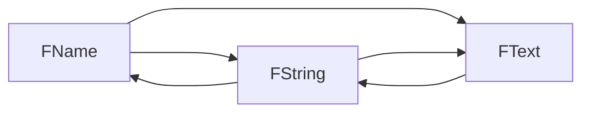

## TArray 数组

`TArray` 是 UE4 中最常用的容器类。其速度快、内存消耗小、安全性高。`TArray` 类型由两大属性定义：元素类型和可选分配器。

**同质容器：所有元素均为完全相同类型**。

**分配器常被省略，默认为最常用的分配器。** 其定义对象在内存中的排列方式；以及数组如何进行扩展，以容纳更多的元素。若默认行为不符合要求，可选取多种不同的分配器，或自行编写。

`Tarray` 为数值类型，**建议在实际操作中勿使用 `new` 和 `delete` 创建或销毁 `TArray` 实例**。
元素也为数值类型，为容器所拥有。`TArray` 被销毁时其中的元素也将被销毁。若在另一 `TArray` 中创建 `TArray` 变量，其元素将复制到新变量中，且不会共享状态。

### 创建和填充数组

如要**创建数组**，将其以此定义：
```c++
    TArray<int32> IntArray; //创建用于存储整数序列的空白数组
```
- 元素类型是可根据普通 C++值规则进行复制和销毁的数值类型，例如 `int32`、`FString`、`TSharedPtr` 等。
- 由于无指定分配器，因此 `TArray` 将**采用基于堆的默认分配器**。
- 此时尚未分配内存。

有多种**填充** `Tarray` 的方法。
-  **`Init`** : 将大量元素副本填入数组。
```c++
IntArray.Init(10, 5);
// IntArray == [10,10,10,10,10]
```

-  **`Add`** 和 **`Emplace`** 函数用于在数组末尾新建对象：
```c++
TArray<FString> StrArr;
StrArr.Add    (TEXT("Hello"));
StrArr.Emplace(TEXT("World"));
// StrArr == ["Hello","World"]
```

> [!NOTE] Add 和 Emplace 的选择
> 新元素添加到数组时，数组的分配器将根据需要分配内存。当前数组大小超出时，默认分配器将添加足够的内存，用于存储多个新元素。
> 
> `Add` 和 `Emplace` 函数的多数效果相同，**细微区别**在于：
> - `Add`（或 `Push`）将元素类型的实例**复制（或移动）** 到数组中。
> - `Emplace` 使用给定参数**构建元素类型的新实例**。
> 
> 因此在 `TArray<FString>` 中，`Add` 将用字符串文字创建临时 `FString`，然后将该临时 `FString` 的内容移至容器内的新 `FString` 中；而 `Emplace` 将用字符串文字直接新建 `FString`。最终结果相同，**但 `Emplace` 可避免创建临时文件。对于 `FString` 等非浅显数值类型而言，临时文件通常有害无益。**
> 
> **总体而言，`Emplace` 优于 `Add`，因此其可避免在调用点创建无需临时变量**，并将此类变量复制或移动到容器中。**根据经验，可将 `Add` 用于浅显类型，将 `Emplace` 用于其他类型。`Emplace` 的效率始终高于 `Add`，但 `Add` 的可读性可能更好。**
 
- **`Append`** ：一次性添加其他 `TArray` 中的多个元素，或者指向常规 C 数组的指针及该数组的大小：
```c++
FString Arr[] = { TEXT("of"), TEXT("Tomorrow") };
StrArr.Append(Arr, ARRAY_COUNT(Arr));
// StrArr == ["Hello","World","of","Tomorrow"]
```

- **`AddUnique`** ：仅在尚不存在等值元素时，才会向容器添加新元素。使用以下元素类型的运算符检查等值性：`运算符==`:
```c++
    StrArr.AddUnique(TEXT("!"));
    // StrArr == ["Hello","World","of","Tomorrow","!"]

    StrArr.AddUnique(TEXT("!"));
    // StrArr is unchanged as "!" is already an element
```

- **`Insert`** ：在给定索引处添加单个元素或元素数组的副本：
```c++
StrArr.Insert(TEXT("Brave"), 1);
// StrArr == ["Hello","Brave","World","of","Tomorrow","!"]
```

**`SetNum`** ：直接设置数组元素的数量。如新数量大于当前数量，则使用元素类型的默认构造函数新建元素：
```c++
StrArr.SetNum(8);
// StrArr == ["Hello","Brave","World","of","Tomorrow","!","",""]
```

如新数量小于当前数量，`SetNum` 将移除元素。移除元素的更多相关详情将稍后讨论：
```c++
StrArr.SetNum(6);
// StrArr == ["Hello","Brave","World","of","Tomorrow","!"]
```

### 遍历

- 建议使用**范围 for 循环**：
```c++
FString JoinedStr;
for (auto& Str :StrArr)
{
    JoinedStr += Str;
    JoinedStr += TEXT(" ");
}
// JoinedStr == "Hello Brave World of Tomorrow !"
```

- 基于索引的**常规遍历**：
```c++
for (int32 Index = 0; Index != StrArr.Num(); ++Index)
{
    JoinedStr += StrArr[Index];
    JoinedStr += TEXT(" ");
}
```

- **还可通过数组迭代器类型控制迭代。** 函数 `CreateIterator` 和 `CreateConstIterator` 可分别用于元素的**读写**和**只读**访问：
```c++
for (auto It = StrArr.CreateConstIterator(); It; ++It)
{
    JoinedStr += *It;
    JoinedStr += TEXT(" ");
}
```

### 排序

-  **`Sort`** ：快排算法，从小到大排序（数值按元素类型的 `<` 排序）

```c++
StrArr.Sort();
// StrArr == ["!","Brave","Hello","of","Tomorrow","World"]
```

二元谓词可以实现不同的排序语义，例如：字符串按长度从小到大排序
```c++
StrArr.Sort([](const FString& A, const FString& B) {
    return A.Len() < B.Len();
});
// StrArr == ["!","of","Hello","Brave","World","Tomorrow"]
```

> [!NOTE]
> 注意：与之前相比，数组中三个长度相同的字符串"Hello"、"Brave"和"World"的相对排序发生了变化。这是**因为 `Sort` 不稳定，等值元素（因为断言只比较长度，所以此处字符串为等值）的相对排序无法保证。**

- **`HeapSort`** ：无论是否使用二元谓词，均可用于执行堆排序。使用 HeapSort 函数与否，取决于特定数据与 Sort 函数相比时的排序效率。与 `Sort` 一样，`HeapSort` 也不稳定。若在上述范例中使用 `HeapSort` 而非 `Sort`，结果将如下所示（此例中结果相同）：

```c++
StrArr.HeapSort([](const FString& A, const FString& B) {
    return A.Len() < B.Len();
});
// StrArr == ["!","of","Hello","Brave","World","Tomorrow"]
```

-  **`StableSort`** ：归并排序算法，用于在排序后保证等值元素的相对顺序
```c++
StrArr.StableSort([](const FString& A, const FString& B) {
    return A.Len() < B.Len();
});
// StrArr == ["!","of","Brave","Hello","World","Tomorrow"]
//"Brave"、"Hello"和"World"的相对排序不会改变。
```

### 查询

-  **`Num`** ：数组保存的元素数量：
```c++
int32 Count = StrArr.Num();
// Count == 6
```

- **`GetTypeSize`**：可针对元素大小对容器进行询问，相当于 `sizeof`
```c++
uint32 ElementSize = StrArr.GetTypeSize();
// ElementSize == sizeof(FString)
```

- **`GetData`**：直接访问数组内存（如用于确定 C 类 API 的互操作性），将指针返回到数组中的元素。仅在数组存在且未执行更改数组的操作时，此指针方有效。仅 `StrPtr` 的首个 `Num` 指数才可被解除引用。
    - **返回的是指针**，如容器为常量，则返回的指针也为常量。
```c++
FString* StrPtr = StrArr.GetData();
// StrPtr[0] == "!"
// StrPtr[1] == "of"
// ...
// StrPtr[5] == "Tomorrow"
// StrPtr[6] - undefined behavior
```

- **索引运算符 `[]`**： 获取元素
    - **返回的是引用**，因此其还可用于改变数组中的元素（假定数组不为常量）。
    - 传递小于 0 或大于等于 `Num()` 的无效索引将导致运行时错误。
    - **`IsValidIndex`** ：询问容器，可确定特定索引是否有效
    - 与 `GetData` 函数相同：如数组为常量，`[]` 将返回常量引用。
```c++
FString Elem1 = StrArr[1];
// Elem1 == "of"

StrArr[3] = StrArr[3].ToUpper(); 
// StrArr == ["!","of","Brave","HELLO","World","Tomorrow"]

bool bValidM1 = StrArr.IsValidIndex(-1);
// bValidM1 == false
```

-  **`Last`** ：从数组末端反向索引。索引默认为零。`Top` 函数是 `Last` 的同义词，唯一区别是其不接受索引：

```c++
FString ElemEnd  = StrArr.Last(); 
FString ElemEnd0 = StrArr.Last(0);
FString ElemTop  = StrArr.Top();
// ElemEnd  == "Tomorrow"
// ElemEnd0 == "Tomorrow"
// ElemTop  == "Tomorrow"
```

- **`Contains`**：询问数组是否包含特定元素：
```c++
bool bHello   = StrArr.Contains(TEXT("Hello"));
// bHello   == true
```

- **`ContainsByPredicate`**：或询问数组是否包含与特定谓词匹配的元素：

```c++
//数组是否长度为5
bool bLen5 = StrArr.ContainsByPredicate([](const FString& Str){
    return Str.Len() == 5;
});
// bLen5 == true
```

-  **`Find`**：查找元素（只需要一次查找）。确定元素是否存在并返回其索引（返回的是找到的首个元素）
-  **`FindLast`** ：如存在重复元素而希望找到最末元素的索引
- **两个形参，返回布尔**，指出是否已找到元素，同时在找到元素索引时将其写入变量。
- **一个形参，返回索引**。如不将索引作为显式参数传递，这两个函数便会执行此操作。如未找到元素，将返回特殊 `INDEX_NONE` 值：

```c++
int32 Index;
if (StrArr.Find(TEXT("Hello"), Index))
{
    // Index == 3
}
```

```c++
int32 IndexLast;
if (StrArr.FindLast(TEXT("Hello"), IndexLast))
{
    // IndexLast == 3, because there aren't any duplicates
}
```

```c++
int32 Index2     = StrArr.Find(TEXT("Hello"));
int32 IndexLast2 = StrArr.FindLast(TEXT("Hello"));
int32 IndexNone  = StrArr.Find(TEXT("None"));
// Index2     == 3
// IndexLast2 == 3
// IndexNone  == INDEX_NONE
```

-  **`IndexOfByKey`** 的工作方式类似，不同元素可与任意对象比较。开始搜索前，使用 `Find` 函数会将参数实际转换为元素类型（此本例中为 `FString`）。使用 `IndexOfByKey`，可直接对不"键"，因此即使键类型无法直接转换为元素类型，也可进行搜索。

`IndexOfByKey` 适用于存在 `运算符==(ElementType, KeyType)` 的键类型。`IndexOfByKey` 将返回找到的首个元素的**索引**；如未找到元素，则返回 `INDEX_NONE`：

```c++
int32 Index = StrArr.IndexOfByKey(TEXT("Hello"));
// Index == 3
```

- **`IndexOfByPredicate`**: 用于查找与特定谓词匹配的首个元素的**索引**；如未找到，同样返回特殊 `INDEX_NONE` 值。可将指针返回指向找到的元素，而不返回指数。
```c++
int32 Index = StrArr.IndexOfByPredicate([](const FString& Str){
    return Str.Contains(TEXT("r"));
});
// Index == 2
```

- **`FindByKey`**： 与 `IndexOfByKey` 相似，将元素和任意对象进行对比，但返回指向所找到元素的**指针**。如未找到元素，则返回 `nullptr`。

```c++
auto* OfPtr  = StrArr.FindByKey(TEXT("of")));
auto* ThePtr = StrArr.FindByKey(TEXT("the")));
// OfPtr  == &StrArr[1]
// ThePtr == nullptr
```

- **`FindByPredicate`** ：的使用方式和 `IndexOfByPredicate` 相似，不同点是返回**指针**而非索引：
```c++
auto* Len5Ptr = StrArr.FindByPredicate([](const FString& Str){
    return Str.Len() == 5;
});
auto* Len6Ptr = StrArr.FindByPredicate([](const FString& Str){
    return Str.Len() == 6;
});
// Len5Ptr == &StrArr[2]
// Len6Ptr == nullptr
```

-  **`FilterByPredicate`** ：函数可获取与特定谓词匹配的元素数组：
```c++
auto Filter = StrArray.FilterByPredicate([](const FString& Str){
    return !Str.IsEmpty() && Str[0] < TEXT('M');
});
```

### 移除

- **`Remove`**：根据元素类型的 `运算符==` 函数**移除所有与提供元素等值的元素**。
```c++
TArray<int32> ValArr;
int32 Temp[] = { 10, 20, 30, 5, 10, 15, 20, 25, 30 };
ValArr.Append(Temp, ARRAY_COUNT(Temp));
// ValArr == [10,20,30,5,10,15,20,25,30]

ValArr.Remove(20);
// ValArr == [10,30,5,10,15,25,30]
```

- **`RemoveSingle`** ：**移除数组中的首个匹配元素**。以下情况尤为实用——此函数在数组中可能存在重复，而只希望擦除一个时；或作为优化，数组只能包含一个匹配元素时：
```c++
ValArr.RemoveSingle(30);
// ValArr == [10,5,10,15,25,30]
```

- **`RemoveAt`** ：**按照从零开始的索引移除元素**。可使用 `IsValidIndex` 确定数组中的元素是否使用计划提供的索引，将无效索引传递给此函数会导致运行时错误：

```c++
ValArr.RemoveAt(2); // Removes the element at index 2
// ValArr == [10,5,15,25,30]

ValArr.RemoveAt(99); // This will cause a runtime error as
                       // there is no element at index 99
```

- **`RemoveAll`** ：移除与谓词匹配的元素。
```c++
//移除为3倍数的所有数值：
ValArr.RemoveAll([](int32 Val) {
    return Val % 3 == 0;
});
// ValArr == [10,5,25]
```

- 移除某个元素后其后的元素将前移，该移动过程存在开销。如不需要剩余元素排序，可使用 **`RemoveSwap`**、**`RemoveAtSwap`** 和 **`RemoveAllSwap`** 函数减少此开销。此类函数的工作方式与其对应的非 Swap 函数相似，**不同之处在于其不保证剩余元素的排序，因此可更快地完成任务：**
```c++
TArray<int32> ValArr2;
for (int32 i = 0; i != 10; ++i)
    ValArr2.Add(i % 5);
// ValArr2 == [0,1,2,3,4,0,1,2,3,4]

ValArr2.RemoveSwap(2);
// ValArr2 == [0,1,4,3,4,0,1,3]

ValArr2.RemoveAtSwap(1);
// ValArr2 == [0,3,4,3,4,0,1]

ValArr2.RemoveAllSwap([](int32 Val) {
    return Val % 3 == 0;
});
// ValArr2 == [1,4,4]
```

-  **`Empty`** ：移除数组中所有元素：
```c++
ValArr2.Empty();
// ValArr2 == []
```

### 运算符

数组是常规数值类型，可使用标准复制构造函数或赋值运算符进行复制。由于数组严格拥有其元素，复制数组的操作是深层的，因此新数组将拥有其自身的元素副本：

```c++
TArray<int32> ValArr3;
ValArr3.Add(1);
ValArr3.Add(2);
ValArr3.Add(3);

auto ValArr4 = ValArr3;
// ValArr4 == [1,2,3];
ValArr4[0] = 5;
// ValArr3 == [1,2,3];
// ValArr4 == [5,2,3];
```

作为 `Append` 函数的替代，可使用  **`+=`**  对数组进行串联：

```c++
    ValArr4 += ValArr3;
    // ValArr4 == [5,2,3,1,2,3]
```

`TArray` 还**支持移动语义**，使用 **`MoveTemp`** 函数可调用这些语义。**移动后，源数组必定为空：**
```c++
    ValArr3 = MoveTemp(ValArr4);
    // ValArr3 == [5,2,3,1,2,3]
    // ValArr4 == []
```

使用 `运算符==` 和 `运算符!=` 可对数组进行比较。**元素的排序很重要：只有元素的顺序和数量相同时，两个数组才被视为相同。** 元素通过其自身的 `运算符==` 进行比较：

```c++
TArray<FString> FlavorArr1;
FlavorArr1.Emplace(TEXT("Chocolate"));
FlavorArr1.Emplace(TEXT("Vanilla"));
// FlavorArr1 == ["Chocolate","Vanilla"]

auto FlavorArr2 = Str1Array;
// FlavorArr2 == ["Chocolate","Vanilla"]

bool bComparison1 = FlavorArr1 == FlavorArr2;
// bComparison1 == true

for (auto& Str :FlavorArr2)
{
    Str = Str.ToUpper();
}
// FlavorArr2 == ["CHOCOLATE","VANILLA"]

bool bComparison2 = FlavorArr1 == FlavorArr2;
// bComparison2 == true, because FString comparison ignores case

Exchange(FlavorArr2[0], FlavorArr2[1]);
// FlavorArr2 == ["VANILLA","CHOCOLATE"]

bool bComparison3 = FlavorArr1 == FlavorArr2;
// bComparison3 == false, because the order has changed
```

### 堆

`TArray` 拥有支持二叉堆数据结构的函数。堆是一种二叉树，其中父节点的排序等于或高于其子节点。作为数组实现时，树的根节点位于元素 0，索引 N 处节点的左右子节点的指数分别为 2N+1 和 2N+2。子节点彼此间不存在特定排序。

-  **`Heapify`** ：将现有数组转换为堆。此会重载为是否接受谓词，无谓词的版本将使用元素类型的 `运算符<` 确定排序：
```c++
TArray<int32> HeapArr;
for (int32 Val = 10; Val != 0; --Val)
{
    HeapArr.Add(Val);
}
// HeapArr == [10,9,8,7,6,5,4,3,2,1]
HeapArr.Heapify();
// HeapArr == [1,2,4,3,6,5,8,10,7,9]
```

下图为树的展示：

![[ebc25c012f14a4da679ba8e79239d9fd_MD5.jpg]]

树中的节点按堆化数组中元素的排序从左至右、从上至下读取。注意：数组在转换为堆后无需排序。排序数组也是有效堆，但堆结构的定义较为宽松，同一组元素可存在多个有效堆。

- **`HeapPush`**：将新元素添加到堆，对其他节点进行重新排序，以对堆进行维护：
```c++
HeapArr.HeapPush(4);
// HeapArr == [1,2,4,3,4,5,8,10,7,9,6]
```

![[3c72916abfbce477554a0ac63d9711eb_MD5.jpg]]

- **`HeapPop`** 和 **`HeapPopDiscard`** ：用于移除堆的顶部节点。这两个函数的区别在于前者引用元素的类型来返回顶部元素的副本，而后者只是简单地移除顶部节点，不进行任何形式的返回。两个函数得出的数组变更一致，重新正确排序其他元素可对堆进行维护：

```c++
int32 TopNode;
HeapArr.HeapPop(TopNode);
// TopNode == 1
// HeapArr == [2,3,4,6,4,5,8,10,7,9]
```

![[132b01cd79f6a706f2f89baae1a8bf1b_MD5.jpg]]

- **`HeapRemoveAt`**： 将删除数组中给定索引处的元素，然后重新排列元素，对堆进行维护：
```c++
HeapArr.HeapRemoveAt(1);
// HeapArr == [2,4,4,6,9,5,8,10,7]
```

![[f54cd1b8099a40e6a5e5518a08c5f2ba_MD5.jpg]]

`Heapify` 调用、其他堆操作或手动将数组操作到堆中之后），才应调用 `HeapPush`、`HeapPop`、`HeapPopDiscard` 和 `HeapRemoveAt`

此类函数（包括 `Heapify`）都可选择使用二元谓词决定堆中节点元素的排序。堆操作默认使用元素类型的 `运算符<` 确定排序。如使用自定义谓词，须在所有堆操作中使用相同谓词。

-  **`HeapTop` ：检查堆的顶部节点，无需变更数组：
```c++
int32 Top = HeapArr.HeapTop();
// Top == 2
```

### Slack

为避免每次添加元素时重新分配内存，分配器提供的内存通常会超过必要内存，使之后调用 `Add` 时不会因重新分配内存而降低性能。同样，**删除元素通常不会释放内存. 此操作会使数组拥有 `Slack` 元素，也就是当前未使用的有效预分配元素储存槽**。
**数组中存储的元素量与数组使用分配内存可存储的元素数量间的差值即为数组中的 Slack 量。**
默认构建的数组不分配内存，Slack 初始为零。

-  **`GetSlack`** 函数可找出数组中的 Slack 量。
-  `Max` 函数可获取容器重新分配前数组可保存的最大元素数量。
- `GetSlack` 等同 `Max` 和 `Num` 间的差值：

```c++
TArray<int32> SlackArray;
// SlackArray.GetSlack() == 0
// SlackArray.Num()      == 0
// SlackArray.Max()      == 0

SlackArray.Add(1);
// SlackArray.GetSlack() == 3
// SlackArray.Num()      == 1
// SlackArray.Max()      == 4

SlackArray.Add(2);
SlackArray.Add(3);
SlackArray.Add(4);
SlackArray.Add(5);
// SlackArray.GetSlack() == 17
// SlackArray.Num()      == 5
// SlackArray.Max()      == 22
```

分配器确定重新分配后容器中的 Slack 量。因此，用户不应认为 Slack 是常量。

**虽然无需管理 Slack，但可管理 Slack 对数组进行优化，以满足需求。** 例如，如需要向数组添加大约 100 个新元素，则可在添加前确保拥有可至少存储 100 个新元素的 Slack，以便添加新元素时无需分配内存。上文所述的 `Empty` 函数接受可选 Slack 参数：

```c++
SlackArray.Empty();
// SlackArray.GetSlack() == 0
// SlackArray.Num()      == 0
// SlackArray.Max()      == 0
SlackArray.Empty(3);
// SlackArray.GetSlack() == 3
// SlackArray.Num()      == 0
// SlackArray.Max()      == 3
SlackArray.Add(1);
SlackArray.Add(2);
SlackArray.Add(3);
// SlackArray.GetSlack() == 0
// SlackArray.Num()      == 3
// SlackArray.Max()      == 3
```

-  `Reset` 函数与 Empty 函数类似，不同之处是若当前内存分配已提供请求的 Slack，该函数将不释放内存。但若请求的 Slack 较大，其将分配更多内存：

```c++
SlackArray.Reset(0);
// SlackArray.GetSlack() == 3
// SlackArray.Num()      == 0
// SlackArray.Max()      == 3
SlackArray.Reset(10);
// SlackArray.GetSlack() == 10
// SlackArray.Num()      == 0
// SlackArray.Max()      == 10
```

-  `Shrink` 函数可移除所有 Slack。此才做将把内存分配调整为保存当前元素所需的最小内存。`Shrink` 不会对数组中的元素产生影响。

```c++
SlackArray.Add(5);
SlackArray.Add(10);
SlackArray.Add(15);
SlackArray.Add(20);
// SlackArray.GetSlack() == 6
// SlackArray.Num()      == 4
// SlackArray.Max()      == 10
SlackArray.Shrink();
// SlackArray.GetSlack() == 0
// SlackArray.Num()      == 4
// SlackArray.Max()      == 4
```

### 原始内存

本质上而言，`TArray` 只是分配内存周围的包装器。直接修改分配的字节和自行创建元素即可将其用作包装器，此操作十分实用。`Tarray` 将尽量利用其拥有的信息进行执行，但有时需降低一个等级。

`AddUninitialized` 和 `InsertUninitialized` 函数可将未初始化的空间添加到数组。两者工作方式分别与 `Add` 和 `Insert` 函数相同，**只是不调用元素类型的构造函数**。**若要避免调用构造函数，建议使用此类函数**。类似以下范例的情况中建议使用此类函数，其中计划用 `Memcpy` 调用完全覆盖结构体：

```c++
int32 SrcInts[] = { 2, 3, 5, 7 };
TArray<int32> UninitInts;
UninitInts.AddUninitialized(4);
FMemory::Memcpy(UninitInts.GetData(), SrcInts, 4*sizeof(int32));
// UninitInts == [2,3,5,7]
```

也可使用此功能保留计划自行构建对象所需内存：

```c++
TArray<FString> UninitStrs;
UninitStrs.Emplace(TEXT("A"));
UninitStrs.Emplace(TEXT("D"));
UninitStrs.InsertUninitialized(1, 2);
new ((void*)(UninitStrs.GetData() + 1)) FString(TEXT("B"));
new ((void*)(UninitStrs.GetData() + 2)) FString(TEXT("C"));
// UninitStrs == ["A","B","C","D"]
```

`AddZeroed` 和 `InsertZeroed` 的工作方式相似，不同点是会将添加/插入的空间字节清零：

```c++
struct S
{
    S(int32 InInt, void* InPtr, float InFlt)
        :Int(InInt)
        , Ptr(InPtr)
        , Flt(InFlt)
    {
    }
    int32 Int;
    void* Ptr;
    float Flt;
};
TArray<S> SArr;
SArr.AddZeroed();
// SArr == [{ Int:0, Ptr: nullptr, Flt:0.0f }]
```

`SetNumUninitialized` 和 `SetNumZeroed` 函数的工作方式与 `SetNum` 类似，不同之处在于新数量大于当前数量时，将保留新元素的空间为未初始化或按位归零。与 `AddUninitialized` 和 `InsertUninitialized` 函数相同，必要时需将新元素正确构建到新空间中：

```c++
SArr.SetNumUninitialized(3);
new ((void*)(SArr.GetData() + 1)) S(5, (void*)0x12345678, 3.14);
new ((void*)(SArr.GetData() + 2)) S(2, (void*)0x87654321, 2.72);
// SArr == [
//   { Int:0, Ptr: nullptr,    Flt:0.0f  },
//   { Int:5, Ptr:0x12345678, Flt:3.14f },
//   { Int:2, Ptr:0x87654321, Flt:2.72f }
// ]

SArr.SetNumZeroed(5);
// SArr == [
//   { Int:0, Ptr: nullptr,    Flt:0.0f  },
//   { Int:5, Ptr:0x12345678, Flt:3.14f },
//   { Int:2, Ptr:0x87654321, Flt:2.72f },
//   { Int:0, Ptr: nullptr,    Flt:0.0f  },
//   { Int:0, Ptr: nullptr,    Flt:0.0f  }
// ]
```

应谨慎使用"Uninitialized"和"Zeroed"函数族。如函数类型包含要构建的成员或未处于有效按位清零状态的成员，可导致数组元素无效和未知行为。此类函数适用于固定的数组类型，例如 FMatrix 和 FVector。

### 其他

`BulkSerialize` 函数是序列化函数，可用作替代 `运算符<<`，将数组作为原始字节块进行序列化，而非执行逐元素序列化。如使用内置类型或纯数据结构体等浅显元素，可改善性能。

`CountBytes` 和 `GetAllocatedSize` 函数用于估算数组当前内存占用量。`CountBytes` 接受 `FArchive`，可直接调用 `GetAllocatedSize`。此类函数常用于统计报告。

`Swap` 和 `SwapMemory` 函数均接受两个指数并交换此类指数上的元素值。这两个函数相同，不同点是 `Swap` 会对指数执行额外的错误检查，并断言索引是否超出范围。

## TMap 映射
`TMap` 与 `TSet` 类似，它们的结构均基于对键进行散列运算。但与 `TSet` 不同的是，**此容器将数据存储为键值对（`TPair<KeyType, ValueType>`），只将键用于存储和获取。**

映射有两种类型：`TMap` 和 `TMultiMap`。
-  **`TMap`** 中的**键是唯一**的。**添加新的键值时，若所用的键与原有的对相同，新对将替换原有的对。**
-  **`TMultiMap `** 可存储多个相同的键。容器可以同时存储新对和原有的对。

**在 `TMap` 中，键值对被视为映射的元素类型，相当于每一对都是个体对象。在本文中，元素就意味着键值对，而各个组件就被称作元素的键或元素的值。元素类型实际上是 `TPair<KeyType, ElementType>`，但很少需要直接引用 `TPair` 类型。**

**同质容器：所有元素均为完全相同类型**。

`TMap` 也是值类型，支持通常的复制、赋值和析构函数运算，以及它的元素的强所有权。在映射被销毁时，它的元素都会被销毁。键和值也必须为值类型。

`TMap` 是散列容器，这意味着键类型必须支持 **`GetTypeHash`** 函数，并提供 `运算符==` 来比较各个键是否等值。

`TMap` 也可使用任选分配器来控制内存分配行为。但不同于 `TArray`，这些是集合分配器，而不是 `FHeapAllocator` 和 `TInlineAllocator` 之类的标准 UE4 分配器。集合分配器（`TSetAllocator` 类）定义映射应使用的散列桶数量，以及应使用哪个标准 UE4 分配器来存储散列和元素。

**`KeyFuncs`** 是最后一个 `TMap` 模板参数，**该参数告知映射如何从元素类型获取键，如何比较两个键是否相等，以及如何对键进行散列计算。**

**这些参数有默认值，它们只会返回对键的引用，使用 `运算符==` 确定相等性，并调用非成员 `GetTypeHash` 函数进行散列计算。** 如果您的键类型支持这些函数，可使用它作为映射键，不需要提供自定义 `KeyFuncs`。

与 `TArray` 不同的是，内存中 `TMap` 元素的相对排序既不可靠也不稳定，对这些元素进行迭代很可能会使它们返回的顺序和它们添加的顺序有所不同。这些元素也不太可能在内存中连续排列。映射的支持数据结构是稀疏数组，这种数组可有效支持元素之间的空位。当元素从映射中被移除时，稀疏数组中就会出现空位。将新的元素添加到数组可填补这些空位。但是，即便 `TMap` 不会打乱元素来填补空位，指向映射元素的指针仍然可能失效，因为如果存储器被填满，又添加了新的元素，整个存储可能会重新分配。

### 创建和填充映射

`TMap` 的创建方法如下：

```c++
TMap<int32, FString> FruitMap;
```

`FruitMap` 现在是一个字符串的空 `TMap`，该字符串由整数键标识。我们既没有指定分配器，也没有指定 `KeyFuncs`，所以映射将执行标准的堆分配，使用 `运算符==` 对键进行对比（`int32` 类型），并使用 `GetTypeHash` 进行散列运算。此时没有分配任何内存。

 - **`Add`** ：填充映射 （键，值）
 - 可接受不带值的键，值被默认构建为 `""`

```c++
FruitMap.Add(5, TEXT("Banana"));
FruitMap.Add(2, TEXT("Grapefruit"));
FruitMap.Add(7, TEXT("Pineapple"));
FruitMap.Add(4);
// FruitMap == [
//  { Key:5, Value:"Banana"     },
//  { Key:2, Value:"Grapefruit" },
//  { Key:7, Value:"Pineapple"  }
//  { Key:4, Value:""          }
// ]
```

**此处的元素按插入顺序排列，但不保证这些元素在内存中实际保留此排序。** 如果是新的映射，可能会保留插入排序，但插入和删除的次数越多，新元素不出现在末尾的可能性就越大。

-  **`Emplace`** ：和 `TArray` 一样，还可使用 `Emplace` 代替 `Add`，防止插入映射时创建临时文件。此处直接将键和值传递给了各自的构造函数，**与 `TArray` 不同的是，只能通过单一参数构造函数将元素安放到映射中。**
```c++
    FruitMap.Emplace(3, TEXT("Orange"));
    // FruitMap == [
    //  { Key:5, Value:"Banana"    },
    //  { Key:2, Value:"Pear"      },
    //  { Key:7, Value:"Pineapple" },
    //  { Key:4, Value:""          },
    //  { Key:3, Value:"Orange"    }
    // ]
```

-  **`Append`** ：合并映射，将一个映射的所有元素移至另一个映射：

```c++
TMap<int32, FString> FruitMap2;
FruitMap2.Emplace(4, TEXT("Kiwi"));
FruitMap2.Emplace(9, TEXT("Melon"));
FruitMap2.Emplace(5, TEXT("Mango"));
FruitMap.Append(FruitMap2);
// FruitMap == [
//  { Key:5, Value:"Mango"     },
//  { Key:2, Value:"Pear"      },
//  { Key:7, Value:"Pineapple" },
//  { Key:4, Value:"Kiwi"      },
//  { Key:3, Value:"Orange"    },
//  { Key:9, Value:"Melon"     }
// ]
// FruitMap2 is now empty.
```

- 如果用 `UPROPERTY` 宏和一个可编辑的关键词（`EditAnywhere`、`EditDefaultsOnly` 或 `EditInstanceOnly`）标记 `TMap`，即可在编辑器中添加和编辑元素。
```c++
UPROPERTY(Category = MapsAndSets, EditAnywhere)
TMap<int32, FString> FruitMap;
```

### 遍历

`TMaps` 的迭代类似于 `TArrays`。可使用 C++的设置范围功能，注意元素类型是 **`TPair`**：

```c++
for (auto& Elem :FruitMap)
{
    FPlatformMisc::LocalPrint(
        *FString::Printf(
            TEXT("(%d, \"%s\")\n"),
            Elem.Key,
            *Elem.Value
        )
    );
}
// Output:
// (5, "Mango")
// (2, "Pear")
// (7, "Pineapple")
// (4, "Kiwi")
// (3, "Orange")
// (9, "Melon")
```

也可以用 `CreateIterator` 和 `CreateConstIterators` 函数来创建迭代器。
-  `CreateIterator` 返回拥有**读写**访问权限的迭代器
-  `CreateConstIterator` 返回拥有**只读**访问权限的迭代器。无论哪种情况，均可用这些迭代器的 `Key` 和 `Value` 来检查元素。使用迭代器显示"fruit"范例映射将产生如下结果：

```c++
for (auto It = FruitMap.CreateConstIterator(); It; ++It)
{
    FPlatformMisc::LocalPrint(
        *FString::Printf(
            TEXT("(%d, \"%s\")\n"),
            It.Key(),   // same as It->Key
            *It.Value() // same as *It->Value
        )
    );
}
```

### 查询

-  **`Num`** ：查询映射中保存的**元素数量**：
```c++
int32 Count = FruitMap.Num();
// Count == 6
```

- **`Contains`**： 映射是否包含特定**键**

```c++
bool bHas7 = FruitMap.Contains(7);
// bHas7 == true
```

-  **`[键]`**： 如果知道映射中存在某个特定键，**将键用作索引来查找相应值**。使用非常量映射执行该操作将返回非常量引用，使用常量映射将返回常量引用。
```c++
FString Val7 = FruitMap[7];
// Val7 == "Pineapple"
```

-  **`Find`** ：查找键
- 如果包含该键，`Find` 将返回**指向元素数值的指针**。
- 如果不包含该键，则返回 `nullptr`。
- 在常量映射上调用 `Find`，返回的指针也将为常量。
```c++
    FString* Ptr7 = FruitMap.Find(7);
    FString* Ptr8 = FruitMap.Find(8);
    // *Ptr7 == "Pineapple"
    //  Ptr8 == nullptr
```

- **`FindOrAdd`** ：返回对与给定键关联的**值的引用**。
    - 如果不存在该键，`FindOrAdd` 将返回新创建的元素（使用给定键和默认构建值），该元素也会被添加到映射。
    - `FindOrAdd` 可修改映射，因此**仅适用于非常量映射**。不要被名称迷惑，
- **`FindRef`** 会返回与给定键关联的**值副本**；
    - 若未找到给定键，则返回默认构建值。
    - `FindRef` 不会创建新元素，因此**既可用于常量映射，也可用于非常量映射**。
- 即使在映射中找不到键，`FindOrAdd` 和 `FindRef` 也会成功运行，因此无需执行常规的安全规程（如提前检查 `Contains` 或对返回值进行空白检查）就可安全地调用。
```c++
FString& Ref7 = FruitMap.FindOrAdd(7);
// Ref7     == "Pineapple"
// FruitMap == [
//  { Key:5, Value:"Mango"     },
//  { Key:2, Value:"Pear"      },
//  { Key:7, Value:"Pineapple" },
//  { Key:4, Value:"Kiwi"      },
//  { Key:3, Value:"Orange"    },
//  { Key:9, Value:"Melon"     }
// ]
FString& Ref8 = FruitMap.FindOrAdd(8);
// Ref8     == ""
// FruitMap == [
//  { Key:5, Value:"Mango"     },
//  { Key:2, Value:"Pear"      },
//  { Key:7, Value:"Pineapple" },
//  { Key:4, Value:"Kiwi"      },
//  { Key:3, Value:"Orange"    },
//  { Key:9, Value:"Melon"     },
//  { Key:8, Value:""          }
// ]

FString Val7 = FruitMap.FindRef(7);
FString Val6 = FruitMap.FindRef(6);
// Val7     == "Pineapple"
// Val6     == ""
// FruitMap == [
//  { Key:5, Value:"Mango"     },
//  { Key:2, Value:"Pear"      },
//  { Key:7, Value:"Pineapple" },
//  { Key:4, Value:"Kiwi"      },
//  { Key:3, Value:"Orange"    },
//  { Key:9, Value:"Melon"     },
//  { Key:8, Value:""          }
// ]
```

- **`FindKey`** ：逆向按值查找，返回指向与所提供**值**配对的第一个键的指针。搜索映射中不存在的值将返回空键。
```c++
    const int32* KeyMangoPtr   = FruitMap.FindKey(TEXT("Mango"));
    const int32* KeyKumquatPtr = FruitMap.FindKey(TEXT("Kumquat"));
    // *KeyMangoPtr   == 5
    //  KeyKumquatPtr == nullptr
```

按值查找比按键查找慢（线性时间）。这是因为映射按键排序，而非按值排序。

- **`GenerateKeyArray`**  和 **`GenerateValueArray`** 分别使用所有键和值的副本来填充 `TArray`。在这两种情况下，都会在填充前清空所传递的数组，因此产生的元素数量始终等于映射中的元素数量。
```c++
    TArray<int32>   FruitKeys;
    TArray<FString> FruitValues;
    FruitKeys.Add(999);
    FruitKeys.Add(123);
    FruitMap.GenerateKeyArray  (FruitKeys);
    FruitMap.GenerateValueArray(FruitValues);
    // FruitKeys   == [ 5,2,7,4,3,9,8 ]
    // FruitValues == [ "Mango","Pear","Pineapple","Kiwi","Orange",
    //                  "Melon","" ]
```

### 移除

-  **`Remove`** ：提供要移除元素的键。返回值是被移除元素的数量。
    - 如果映射不包含与键匹配的元素，则返回值可为零
    - 移除元素将在数据结构中留下空位
```c++
    FruitMap.Remove(8);
    // FruitMap == [
    //  { Key:5, Value:"Mango"     },
    //  { Key:2, Value:"Pear"      },
    //  { Key:7, Value:"Pineapple" },
    //  { Key:4, Value:"Kiwi"      },
    //  { Key:3, Value:"Orange"    },
    //  { Key:9, Value:"Melon"     }
    // ]
```

- **`FindAndRemoveChecked`**： 可用于从映射移除元素并返回其值。名称的"已检查"部分表示若键不存在，映射将调用 `check`（UE4 中等同于 `assert`）。

```c++
FString Removed7 = FruitMap.FindAndRemoveChecked(7);
// Removed7 == "Pineapple"
// FruitMap == [
//  { Key:5, Value:"Mango"  },
//  { Key:2, Value:"Pear"   },
//  { Key:4, Value:"Kiwi"   },
//  { Key:3, Value:"Orange" },
//  { Key:9, Value:"Melon"  }
// ]

FString Removed8 = FruitMap.FindAndRemoveChecked(8);
// Assert!
```

-  **`RemoveAndCopyValue`** ：作用与 `Remove` 相似，**不同点是会将已移除元素的值复制到引用参数**。如果映射中不存在指定的键，则输出参数将保持不变，函数将返回 `false`。

```c++
    FString Removed;
    bool bFound2 = FruitMap.RemoveAndCopyValue(2, Removed);
    // bFound2  == true
    // Removed  == "Pear"
    // FruitMap == [
    //  { Key:5, Value:"Mango"  },
    //  { Key:4, Value:"Kiwi"   },
    //  { Key:3, Value:"Orange" },
    //  { Key:9, Value:"Melon"  }
    // ]

```

-  **`Empty`** 或 **`Reset`** ：将映射中的所有元素移除。
    -  `Empty` 和 `Reset` 相似，但 `Empty` 可采用参数指示映射中保留的 slack 量
```c++
    TMap<int32, FString> FruitMapCopy = FruitMap;
    // FruitMapCopy == [
    //  { Key:5, Value:"Mango"  },
    //  { Key:4, Value:"Kiwi"   },
    //  { Key:3, Value:"Orange" },
    //  { Key:9, Value:"Melon"  }
    // ]

    FruitMapCopy.Empty(); // We could also have called Reset() here.
    // FruitMapCopy == []
```


### 排序

`TMap` 可以进行排序。排序后，迭代映射会以排序的顺序显示元素，但下次修改映射时，排序可能会发生变化。**排序是不稳定的，因此等值元素在 MultiMap 中可能以任何顺序出现。**

-  **`KeySort`** ：按键排序
-  **`ValueSort`**： 按值排序
- 两个函数均使用二元谓词来进行排序：

```c++
FruitMap.KeySort([](int32 A, int32 B) {
    return A > B; // sort keys in reverse
});
// FruitMap == [
//  { Key:9, Value:"Melon"  },
//  { Key:5, Value:"Mango"  },
//  { Key:4, Value:"Kiwi"   },
//  { Key:3, Value:"Orange" }
// ]

FruitMap.ValueSort([](const FString& A, const FString& B) {
    return A.Len() < B.Len(); // sort strings by length
});
// FruitMap == [
//  { Key:4, Value:"Kiwi"   },
//  { Key:5, Value:"Mango"  },
//  { Key:9, Value:"Melon"  },
//  { Key:3, Value:"Orange" }
// ]
```

### 运算符

和 `TArray` 一样，`TMap` 是常规值类型，可通过标准复制构造函数或赋值运算符进行复制。因为映射严格拥有其元素，复制映射的操作是深层的，所以新的映射将拥有其自己的元素副本。

```c++
TMap<int32, FString> NewMap = FruitMap;
NewMap[5] = "Apple";
NewMap.Remove(3);
// FruitMap == [
//  { Key:4, Value:"Kiwi"   },
//  { Key:5, Value:"Mango"  },
//  { Key:9, Value:"Melon"  },
//  { Key:3, Value:"Orange" }
// ]
// NewMap == [
//  { Key:4, Value:"Kiwi"  },
//  { Key:5, Value:"Apple" },
//  { Key:9, Value:"Melon" }
// ]
```

`TMap` 支持移动语义，使用 `MoveTemp` 函数可调用这些语义。在移动后，源映射必定为空：

```c++
FruitMap = MoveTemp(NewMap);
// FruitMap == [
//  { Key:4, Value:"Kiwi"  },
//  { Key:5, Value:"Apple" },
//  { Key:9, Value:"Melon" }
// ]
// NewMap == []
```

### Slack

Slack 是不包含元素的已分配内存。调用 `Reserve` 可分配内存，无需添加元素；通过非零 slack 参数调用 `Reset` 或 `Empty` 可移除元素，无需将其使用的内存取消分配。Slack 优化了将新元素添加到映射的过程，因为可以使用预先分配的内存，而不必分配新内存。它在移除元素时也十分实用，因为系统不需要将内存取消分配。在清空希望用相同或更少的元素立即重新填充的映射时，此方法尤其有效。

`TMap` 不像 `TArray` 中的 `Max` 函数那样可以检查预分配元素的数量。

在下列代码中，`Reserve` 函数预先分配映射，最多可包含 10 个元素。

```c++
    FruitMap.Reserve(10);
    for (int32 i = 0; i < 10; ++i)
    {
        FruitMap.Add(i, FString::Printf(TEXT("Fruit%d"), i));
    }
    // FruitMap == [
    //  { Key:9, Value:"Fruit9" },
    //  { Key:8, Value:"Fruit8" },
    //  ...
    //  { Key:1, Value:"Fruit1" },
    //  { Key:0, Value:"Fruit0" }
    // ]
```

使用 `Collapse` 和 `Shrink` 函数可移除 `TMap` 中的全部 slack。`Shrink` 将从容器的末端移除所有 slack，但这会在中间或开始处留下空白元素。

```c++
    for (int32 i = 0; i < 10; i += 2)
    {
        FruitMap.Remove(i);
    }
    // FruitMap == [
    //  { Key:9, Value:"Fruit9" },
    //  <invalid>,
    //  { Key:7, Value:"Fruit7" },
    //  <invalid>,
    //  { Key:5, Value:"Fruit5" },
    //  <invalid>,
    //  { Key:3, Value:"Fruit3" },
    //  <invalid>,
    //  { Key:1, Value:"Fruit1" },
    //  <invalid>
    // ]
    FruitMap.Shrink();
    // FruitMap == [
    //  { Key:9, Value:"Fruit9" },
    //  <invalid>,
    //  { Key:7, Value:"Fruit7" },
    //  <invalid>,
    //  { Key:5, Value:"Fruit5" },
    //  <invalid>,
    //  { Key:3, Value:"Fruit3" },
    //  <invalid>,
    //  { Key:1, Value:"Fruit1" }
    // ]
```

在上述代码中，`Shrink` 只删除了一个无效元素，因为末端只有一个空元素。要移除所有 slack，首先应调用 `Compact` 函数，将空白空间组合在一起，为调用 `Shrink` 做好准备。

```c++
    FruitMap.Compact();
    // FruitMap == [
    //  { Key:9, Value:"Fruit9" },
    //  { Key:7, Value:"Fruit7" },
    //  { Key:5, Value:"Fruit5" },
    //  { Key:3, Value:"Fruit3" },
    //  { Key:1, Value:"Fruit1" },
    //  <invalid>,
    //  <invalid>,
    //  <invalid>,
    //  <invalid>
    // ]
    FruitMap.Shrink();
    // FruitMap == [
    //  { Key:9, Value:"Fruit9" },
    //  { Key:7, Value:"Fruit7" },
    //  { Key:5, Value:"Fruit5" },
    //  { Key:3, Value:"Fruit3" },
    //  { Key:1, Value:"Fruit1" }
    // ]
```

### KeyFuncs
**`KeyFuncs`** 是最后一个 `TMap` 模板参数，**该参数告知映射如何从元素类型获取键，如何比较两个键是否相等，以及如何对键进行散列计算。**

只要类型具有 `运算符==` 和非成员 `GetTypeHash` 重载，就可用作 `TMap` 的键类型，不需要任何更改。但是，您可能需要将类型用作键，而不重载这些函数。在这些情况下，可对 `KeyFuncs` 进行自定义。为键类型创建 `KeyFuncs`，必须定义两个 typedef 和三个静态函数，如下所示：

- `KeyInitType` —— 用于传递键的类型。
- `ElementInitType` —— 用于传递元素的类型。
- `KeyInitType GetSetKey(ElementInitType Element)` ——返回元素的键。
- `bool Matches(KeyInitType A, KeyInitType B)` —— 如果 `A` 和 `B` 等值将返回 `true`，否则返回 `false`。
- `uint32 GetKeyHash(KeyInitType Key)` —— 返回 `Key` 的散列值。
    
`KeyInitType` 和 `ElementInitType` 是键类型和值类型的常规传递约定的 typedef。它们通常为浅显类型的一个值，和非浅显类型的一个常量引用。请记住，映射的元素类型是 `TPair`。

自定义 `KeyFuncs` 的示例可能如下所示：

```c++
    struct FMyStruct
    {
        // String which identifies our key
        FString UniqueID;

        // Some state which doesn't affect struct identity
        float SomeFloat;

        explicit FMyStruct(float InFloat)
            :UniqueID (FGuid::NewGuid().ToString())
            , SomeFloat(InFloat)
        {
        }
    };
    template <typename ValueType>
    struct TMyStructMapKeyFuncs :
        BaseKeyFuncs<
            TPair<FMyStruct, ValueType>,
            FString
        >
    {
    private:
        typedef BaseKeyFuncs<
            TPair<FMyStruct, ValueType>,
            FString
        > Super;

    public:
        typedef typename Super::ElementInitType ElementInitType;
        typedef typename Super::KeyInitType     KeyInitType;

        static KeyInitType GetSetKey(ElementInitType Element)
        {
            return Element.Key.UniqueID;
        }

        static bool Matches(KeyInitType A, KeyInitType B)
        {
            return A.Compare(B, ESearchCase::CaseSensitive) == 0;
        }

        static uint32 GetKeyHash(KeyInitType Key)
        {
            return FCrc::StrCrc32(*Key);
        }
    };
```

`FMyStruct` 具有唯一标识符，以及一些与身份无关的其他数据。`GetTypeHash` 和 `运算符==` 不适用于此，因为 `运算符==` 为实现通用目的不应忽略任何类型的数据，但同时又需要如此才能与 `GetTypeHash` 的行为保持一致，后者只关注 `UniqueID` 字段。以下步骤有助于为 `FMyStruct` 创建自定义 `KeyFuncs`：

1. 首先，继承 `BaseKeyFuncs`，因为它可以帮助定义某些类型，包括 `KeyInitType` 和 `ElementInitType`。
    
    `BaseKeyFuncs` 使用两个模板参数：映射的元素类型和键类型。和所有映射一样，元素类型是 `TPair`，使用 `FMyStruct` 作为其 `KeyType`，`TMyStructMapKeyFuncs` 的模板参数作为其 `ValueType`。将备用 `KeyFuncs` 用作模板，可为每个映射指定 `ValueType`，因此每次要在 `FMyStruct` 上创建键控 `TMap` 时不必定义新的 `KeyFuncs`。第二个 `BaseKeyFuncs` 参数是键类型，不要与元素存储的键区（`TPair` 的 `KeyType`）混淆。因为此映射应使用 `UniqueID`（来自 `FMyStruct`）作为键，所以此处使用 `FString`。
    
2. 然后，定义三个必需的 `KeyFuncs` 静态函数。第一个是 `GetSetKey`，该函数返回给定元素类型的键。由于元素类型是 `TPair`，而键是 `UniqueID`，所以该函数可直接返回 `UniqueID`。
    
    第二个静态函数是 `Matches`，该函数接受两个元素的键（由 `GetSetKey` 获取），然后比较它们是否相等。在 `FString` 中，标准的等效测试（`运算符==`）不区分大小写；要替换为区分大小写的搜索，请用相应的大小写对比选项使用 `Compare` 函数。
    
3. 最后，`GetKeyHash` 静态函数接受提取的键并返回其散列值。由于 `Matches` 函数区分大小写，`GetKeyHash` 也必须区分大小写。区分大小写的 `FCrc` 函数将计算键字符串的散列值。
    
4. 现在结构已满足 `TMap` 要求的行为，可创建它的实例。

`KeyFuncs` 参数处于最后，所以这个 `TMap`

```c++
    TMap<
        FMyStruct,
        int32,
        FDefaultSetAllocator,
        TMyStructMapKeyFuncs<int32>
    > MyMapToInt32;

    // Add some elements
    MyMapToInt32.Add(FMyStruct(3.14f), 5);
    MyMapToInt32.Add(FMyStruct(1.23f), 2);

    // MyMapToInt32 == [
    //  {
    //      Key:{
    //          UniqueID:"D06AABBA466CAA4EB62D2F97936274E4",
    //          SomeFloat:3.14f
    //      },
    //      Value:5
    //  },
    //  {
    //      Key:{
    //          UniqueID:"0661218447650259FD4E33AD6C9C5DCB",
    //          SomeFloat:1.23f
    //      },
    //      Value:5
    //  }
    // ]
```

`TMap` 假设两个项目使用 `Matches` 比较的结果相等，则它们会从 `GetKeyHash` 返回相同的值。此外，如果对现有映射元素的键进行的修改将会改变来自这两个函数中任一个的结果，那么系统会将这种修改视作未定义的行为，因为这会使映射的内部散列失效。这些规则也适用于使用默认 `KeyFuncs` 时 `运算符==` 和 `GetKeyHash`

### 其他

`CountBytes` 和 `GetAllocatedSize` 函数用于估计内部数组的当前内存使用情况。`CountBytes` 接受 `Farchive` 参数，而 `GetAllocatedSize` 则不会。这些函数常用于统计报告。

`Dump` 函数接受 `FOutputDevice`，并写出关于映射内容的实现信息。此函数常用于调试。

## TSet 集合
`TSet` 使用值本身作为键（**键值合一**）。`TSet` 可以非常快速地添加、查找和删除元素（恒定时间）。**默认情况下，`TSet` 不支持重复的键（添加重复的键会覆盖旧的键），但使用模板参数可激活此行为。**

**同质容器：所有元素均为完全相同类型**。

`TSet` 是一种快速容器类，用于在排序不重要的情况下存储唯一元素。在大多数情况下，只需要一种参数——元素类型。但是，`TSet` 可配置各种模板参数来改变其行为，使其更全面。除了可指定从 `DefaultKeyFuncs` 的派生结构体来提供散列功能，还可允许集合中的多个键拥有相同的值。它和其它容器类一样，可设置自定义内存分配器来存储数据。

`TSet` 也是**值类型**，支持常规复制、赋值和析构函数操作，以及其元素较强的所有权。`TSet` 被销毁时，其元素也将被销毁。键类型也必须是值类型。

`TSet` 使用散列，即如果给出了 `KeyFuncs` 模板参数，该参数会告知集合如何从某个元素确定键，如何比较两个键是否相等，如何对键进行散列，以及是否允许重复键。它们默认只返回对键的引用，使用 `运算符==` 对比相等性，使用非成员函数 `GetTypeHash` 进行散列。默认情况下，集合中不允许有重复的键。如果您的键类型支持这些函数，则可以将其用作集合键，无需提供自定义 `KeyFuncs`。要写入自定义 `KeyFuncs`，可扩展 `DefaultKeyFuncs` 结构体。

最后，`TSet` 可通过任选分配器控制内存分配行为。标准虚幻引擎 4（UE4）分配器（如 `FHeapAllocator` 和 `TInlineAllocator`）不能用作 `TSet` 的分配器。实际上，`TSet` 使用集合分配器，该分配器可定义集合中使用的散列桶数量以及用于存储元素的标准 UE4 分配器。请参见 `TSetAllocator` 了解更多信息。

与 `TArray` 不同的是，内存中 `TSet` 元素的相对排序既不可靠也不稳定，对这些元素进行迭代很可能会使它们返回的顺序和它们添加的顺序有所不同。这些元素也不太可能在内存中连续排列。集合中的后台数据结构是稀疏数组，即在数组中有空位。从集合中移除元素时，稀疏数组中会出现空位。将新的元素添加到阵列可填补这些空位。但是，即便 `TSet` 不会打乱元素来填补空位，指向集元素的指针仍然可能失效，因为如果存储器被填满，又添加了新的元素，整个存储可能会重新分配。

### 创建和填充集合

-  `TSet` 的创建方法如下：
```c++
    TSet<FString> FruitSet;
```

这会创建一个空白 `TSet`，用于存储 `FString` 数据。`TSet` 会直接使用 `运算符==` 比较元素，使用 `GetTypeHash` 对其进行散列，然后使用标准的堆分配器。此时尚未分配内存。

-  **`Add`**：填充集合，提供键（元素）：
```c++
FruitSet.Add(TEXT("Banana"));
FruitSet.Add(TEXT("Grapefruit"));
FruitSet.Add(TEXT("Pineapple"));
// FruitSet == [ "Banana", "Grapefruit", "Pineapple" ]
```

此处的元素按插入顺序排列，但不保证这些元素在内存中实际保留此排序。如果是新集合，可能会保留插入排序，但插入和删除的次数越多，新元素不出现在末尾的可能性越大。

-  **`Emplace`**：和 `TArray` 一样，还可使用 **`Emplace`** 代替 `Add`，避免插入集合时创建临时文件。与 `TArray` 不同的是，只能使用单一参数构造函数将元素放到集合中。
```c++
FruitSet.Emplace(TEXT("Orange"));
// FruitSet == [ "Banana", "Grapefruit", "Pineapple", "Pear", "Orange" ]
```

-  **`Append`** ：合并来插入另一个集合中的所有元素：
```c++
TSet<FString> FruitSet2;
FruitSet2.Emplace(TEXT("Kiwi"));
FruitSet2.Emplace(TEXT("Melon"));
FruitSet2.Emplace(TEXT("Mango"));
FruitSet2.Emplace(TEXT("Orange"));
FruitSet.Append(FruitSet2);
// FruitSet == [ "Banana", "Grapefruit", "Pineapple", "Pear", "Orange", "Kiwi", "Melon", "Mango" ]
```

### 编辑 UPROPERTY TSet

如果用 `UPROPERTY` 宏和一个可编辑的关键词（`EditAnywhere`、`EditDefaultsOnly` 或 `EditInstanceOnly`）标记 `TSet`，则可在虚幻编辑器中添加和编辑元素。

```c++
UPROPERTY(Category = SetExample, EditAnywhere)
TSet<FString> FruitSet;
```

### 遍历

`TSet` 的遍历类似于 `TArray`。可使用 C++的设置 for 循环：
```c++
for (auto& Elem :FruitSet)
{
    FPlatformMisc::LocalPrint(
        *FString::Printf(
            TEXT(" \"%s\"\n"),
            *Elem
        )
    );
}
// Output:
//  "Banana"
//  "Grapefruit"
//  "Pineapple"
//  "Pear"
//  "Orange"
//  "Kiwi"
//  "Melon"
//  "Mango"
```

也可以用 `CreateIterator` 和 `CreateConstIterators` 函数来创建迭代器。
-  `CreateIterator` 返回拥有读写访问权限的迭代器
-  `CreateConstIterator` 返回拥有只读访问权限的迭代器。
- 无论哪种情况，均可用这些迭代器的 `Key` 和 `Value` 来检查元素。

```c++
for (auto It = FruitSet.CreateConstIterator(); It; ++It)
{
    FPlatformMisc::LocalPrint(
        *FString::Printf(
            TEXT("(%s)\n"),
            *It
        )
    );
}
```

### 查询

-  **`Num`** ：查询集合中保存的元素数量：

```c++
    int32 Count = FruitSet.Num();
    // Count == 8
```

-  **`Contains`** ：确定集合是否包含特定元素

```c++
bool bHasBanana = FruitSet.Contains(TEXT("Banana"));
bool bHasLemon = FruitSet.Contains(TEXT("Lemon"));
// bHasBanana == true
// bHasLemon == false
```

- 使用 **`FSetElementId`** 结构体可**查找集合中某个键的索引**。然后，就可使用该索引与 `运算符[]` 查找元素。
    - 在非常量集合上调用 `operator[]` 将返回非常量引用，而在常量集合上调用将返回常量引用。

```c++
FSetElementId BananaIndex = FruitSet.Index(TEXT("Banana"));
// BananaIndex is a value between 0 and (FruitSet.Num() - 1)
FPlatformMisc::LocalPrint(
    *FString::Printf(
        TEXT(" \"%s\"\n"),
        *FruitSet[BananaIndex]
    )
);
// Prints "Banana"

FSetElementId LemonIndex = FruitSet.Index(TEXT("Lemon"));
// LemonIndex is INDEX_NONE (-1)
FPlatformMisc::LocalPrint(
    *FString::Printf(
        TEXT(" \"%s\"\n"),
        *FruitSet[LemonIndex]
    )
); // Assert!
```

如果不确定集合中是否包含某个键，可使用 `Contains` 函数和 `运算符[]` 进行检查。但这并非理想的方法，因为同一键需要进行两次查找才能获取成功。

-  **`Find`** 函数查找一次即可完成这些行为。
- 如果中包含该键，`Find` 将返回指向元素数值的指针。
- 如果不包含该键，则返回 null。
- 对常量集合调用 `Find`，返回的指针也将为常量。

```c++
    FString* PtrBanana = FruitSet.Find(TEXT("Banana"));
    FString* PtrLemon = FruitSet.Find(TEXT("Lemon"));
    // *PtrBanana == "Banana"
    //  PtrLemon == nullptr
```

- **`Array`** ：会返回一个 `TArray`，其中填充了 `TSet` 中每个元素的一份副本。被传递的数组在填入前会被清空，因此元素的生成数量将始终等于集合中的元素数量：

```c++
TArray<FString> FruitArray = FruitSet.Array();
// FruitArray == [ "Banana","Grapefruit","Pineapple","Pear","Orange","Kiwi","Melon","Mango" ] (order may vary)
```

### 移除

-  **`Remove`** 函数可**按索引移除元素**，但仅建议在通过元素迭代时使用：Remove 函数会返回已删除元素的数量。
    - 如果给定的键未包含在集合中，则会返回 0。
    - 如果 `TSet` 支持重复的键，`Remove` 将移除所有匹配元素。
    - 移除元素将在数据结构中留下空位
```c++
FruitSet.Remove(0);
// FruitSet == [ "Grapefruit","Pineapple","Pear","Orange","Kiwi","Melon","Mango" ]
```

```c++
int32 RemovedAmountPineapple = FruitSet.Remove(TEXT("Pineapple"));
// RemovedAmountPineapple == 1
// FruitSet == [ "Grapefruit","Pear","Orange","Kiwi","Melon","Mango" ]
FString RemovedAmountLemon = FruitSet.Remove(TEXT("Lemon"));
// RemovedAmountLemon == 0
```

-  **`Empty`** 或 **`Reset`** ：将集合中的所有元素移除。
    -  `Empty` 和 `Reset` 相似，但 `Empty` 可采用参数指示集合中保留的 slack 量 `
```c++
    TSet<FString> FruitSetCopy = FruitSet;
    // FruitSetCopy == [ "Grapefruit","Pear","Orange","Kiwi","Melon","Mango" ]

    FruitSetCopy.Empty();
    // FruitSetCopy == []
```

### 排序

`TSet` 可以排序。排序后，迭代集合会以排序的顺序显示元素，但下次修改集合时，排序可能会发生变化。由于排序不稳定，可能按任何顺序显示集合中支持重复键的等效元素。

**`Sort`**： 函数使用指定排序顺序的二进制谓词
```c++
FruitSet.Sort([](const FString& A, const FString& B) {
    return A > B; // sort by reverse-alphabetical order
});
// FruitSet == [ "Pear", "Orange", "Melon", "Mango", "Kiwi", "Grapefruit" ] (order is temporarily guaranteed)

FruitSet.Sort([](const FString& A, const FString& B) {
    return A.Len() < B.Len(); // sort strings by length, shortest to longest
});
// FruitSet == [ "Pear", "Kiwi", "Melon", "Mango", "Orange", "Grapefruit" ] (order is temporarily guaranteed)
```

### 运算符

和 `TArray` 一样，`TSet` 是常规值类型，可通过标准复制构造函数或赋值运算符进行复制。因为集合严格拥有其元素，复制集合的操作是深层的，所以新集合将拥有其自身的元素副本：

```c++
TSet<FString> NewSet = FruitSet;
NewSet.Add(TEXT("Apple"));
NewSet.Remove(TEXT("Pear"));
// FruitSet == [ "Pear", "Kiwi", "Melon", "Mango", "Orange", "Grapefruit" ]
// NewSet == [ "Kiwi", "Melon", "Mango", "Orange", "Grapefruit", "Apple" ]
```

### Slack

Slack 是不包含元素的已分配内存。调用 `Reserve` 可分配内存，无需添加元素；通过非零 slack 参数调用 `Reset` 或 `Empty` 可移除元素，无需将其使用的内存取消分配。Slack 优化了将新元素添加到集合的过程，因为可以使用预先分配的内存，而不必分配新内存。它在移除元素时也十分实用，因为系统不需要将内存取消分配。在清空希望用相同或更少的元素立即重新填充的集合时，此方法尤其有效。

`TSet` 不像 `TArray` 中的 `Max` 函数那样可检查预分配元素的数量。

以下代码可在不取消任何内存的情况下移除集合中的所有元素，从而产生 slack：

```c++
    FruitSet.Reset();
    // FruitSet == [ <invalid>, <invalid>, <invalid>, <invalid>, <invalid>, <invalid> ]
```

使用 `Reserve` 函数可直接创建 slack，例如在添加元素之前预分配内存。

```c++
    FruitSet.Reserve(10);
    for (int32 i = 0; i < 10; ++i)
    {
        FruitSet.Add(FString::Printf(TEXT("Fruit%d"), i));
    }
    // FruitSet == [ "Fruit9", "Fruit8", "Fruit7" ..."Fruit2", "Fruit1", "Fruit0" ]
```

预先分配 slack 会导致以倒序添加新元素。与数组不同，集合不维护元素排序，处理集合的代码不能指望元素排序稳定或可预测。

使用 `Collapse` 和 `Shrink` 函数可移除 `TSet` 中的全部 slack。`Shrink` 将从容器的末端移除所有 slack，但这会在中间或开始处留下空白元素。

```c++
    // Remove every other element from the set.
    for (int32 i = 0; i < 10; i += 2)
    {
        FruitSet.Remove(FSetElementId::FromInteger(i));
    }
    // FruitSet == ["Fruit8", <invalid>, "Fruit6", <invalid>, "Fruit4", <invalid>, "Fruit2", <invalid>, "Fruit0", <invalid> ]

    FruitSet.Shrink();
    // FruitSet == ["Fruit8", <invalid>, "Fruit6", <invalid>, "Fruit4", <invalid>, "Fruit2", <invalid>, "Fruit0" ]
```

在上述代码中，`Shrink` 只删除了一个无效元素，因为末端只有一个空元素。要移除所有 slack，首先应调用 `Compact` 或 `CompactStable` 函数，将空白空间组合在一起，为调用 `Shrink` 做好准备。顾名思义，`CompactStable` 可在合并空元素时保持元素的排序。

```c++
    FruitSet.CompactStable();
    // FruitSet == ["Fruit8", "Fruit6", "Fruit4", "Fruit2", "Fruit0", <invalid>, <invalid>, <invalid>, <invalid> ]
    FruitSet.Shrink();
    // FruitSet == ["Fruit8", "Fruit6", "Fruit4", "Fruit2", "Fruit0" ]
```

### DefaultKeyFuncs

只要类型具有 `运算符==` 和非成员 `GetTypeHash` 重载，就可为 TSet 所用，因为此类型既是元素又是键。然而，不便于重载这些函数时可将类型作为键使用。在这些情况下，可对 `DefaultKeyFuncs` 进行自定义。为键类型创建 `KeyFuncs`，必须定义两个 typedef 和三个静态函数，如下所示：

- `KeyInitType` —— 用于传递键的类型。通常抽取自 ElementType 模板参数。
    
- `ElementInitType` —— 用于传递元素的类型。同样通常抽取自 ElementType 模板参数，因此与 KeyInitType 相同。
    
- `KeyInitType GetSetKey(ElementInitType Element)` ——返回元素的键。在集合中，通常是元素本身。
    
- `bool Matches(KeyInitType A, KeyInitType B)` —— 如果 `A` 和 `B` 等值将返回 `true`，否则返回 `false`。
    
- `uint32 GetKeyHash(KeyInitType Key)` —— 返回 `Key` 的散列值。
    

`KeyInitType` 和 `ElementInitType` 是键/元素类型普通传递惯例的 typedef。它们通常为浅显类型的一个值和非浅显类型的一个常量引用。请注意，集合的元素类型也是键类型，因此 `DefaultKeyFuncs` 仅使用一种模板参数 `ElementType` 定义两者。

`TSet` 假定在 `DefaultKeyFuncs` 中使用 `Matches` 进行对比结果为相等的两个项也将在 `KeyFuncs` 的 `GetKeyHash` 中返回相同的值。

`DefaultKeyFuncs` 的默认实现时，此规则也适用于 `运算符==` 和 `GetKeyHash`

### 其他

`CountBytes` 和 `GetAllocatedSize` 函数用于估计内部数组的当前内存使用情况。`CountBytes` 接受 `FArchive` 参数，而 `GetAllocatedSize` 则不接受。这些函数常用于统计报告。

`Dump` 函数接受 `FOutputDevice` 并写出关于集合内容的实现信息。还有一个名为 `DumpHashElements` 的函数，可列出来自所有散列条目的所有元素。这些函数常用于调试。


# 字符串
## TCHAR 字符类型
对于大多数情况下，虚幻依靠 `TCHAR` 类型来表示字符。

```c++
ANSICCHAR  //对应char
WIDECHAR   //wchar_t宽字符
TCHAR      //也是宽字符，WIDECHAR的别名


//以下类型不常用
UTF8CHAR   //uint8别名
UCS2CHAR   //uint16别名
UTF16CHAR  //uint32别名
UTF32CHAR  
```
## TEXT()
`TEXT()` 宏可用于表示 `TCHAR` 字符串，可以确保他们都是 Unicode 字符串。

TEXT 宏用于将字符串常量转换为 TCHAR 数组。TCHAR 可以根据平台的不同，自动选择使用 ANSI 字符集或 UNICODE 字符集。通过使用 TEXT 宏，可以确保字符串在不同平台上的一致性。

```c++
(TEXT("Samson Aloysius"));
```

## 打印信息
FString 可被打印到 **视口** 和 **输出日志**，以便进行调试。


### 打印到输出日志 UE_LOG 
**查看输出日志：
**Game 模式**：在 Game（打包）模式下，记录 Log 需要在启动参数后加 `-Log`。 
**编辑器模式**：在编辑器下，需要打开输出日志窗口（Window->DeveloperTools->OutputLog）。

---

`UE_LOG` 参数：
**参数一**： 日志类别（可自定义）。 
**参数二**：类型，有 Log、Warning、Error   三种类型。这三种类型区别是颜色不同，Log 为灰色，Warning 为黄色，Error 为红色。
**参数三**：具体的输出内容为 TEXT，可以根据需要自行构造。

---


**UE_LOG** 使用 printf 标记进行参数化。
几种常用的符号如下：
1.  `%s` 字符串（`TCHAR*` / `*FString`）：使用 `%s` 参数包含 `FString` 时，必须使用 `*` 运算符返回 `%s` 参数所需的 `TCHAR*`。
2.  `%d` 整型数据（`int32`）
3.  `%f` 浮点形（`float`）

---

- **默认类别打印**
```c++
UE_LOG(LogTemp, Log, TEXT("Hello world!"));
```

- **带变量打印**
```c++
UE_LOG(LogTemp, Warning, TEXT("log: %s"),*FString("Hello")) 
UE_LOG(LogTemp, Warning, TEXT("log: %d"),100);

//创建FString变量FString::Format
TArray<FStringFormatArg> args;
args.Add(FStringFormatArg(playerName)); 
args.Add(FStringFormatArg(healthValue));

FString outputMessage2 = FString::Format(TEXT("Name is {0}, health value is {1}"), args);
UE_LOG(LogTemp, Warning, TEXT("FString::Format: %s"), *outputMessage2);

//打印枚举类型
//EEnemyActionState是枚举类
//EnemyActionState是枚举实例
UEnum* const PrintEnum = StaticEnum<EEnemyActionState>();  
if (PrintEnum)  
{  
    UE_LOG(LogTemp, Error, TEXT("Current is %s"),  
       *PrintEnum->GetDisplayNameTextByValue(static_cast<uint8>(EnemyActionState)).ToString());  
}
```

- **自定义日志类别**
```c++
//.h 自定义日志分类
DECLARE_LOG_CATEGORY_CLASS(GMDebugLog, Log, All);

//.cpp 输出日志 自定义分类
UE_LOG(GMDebugLog, Warning, TEXT("Hello world!"));
UE_LOG(GMDebugLog, Error, TEXT("Hello world!"));
```

> [!NOTE]
> 虚幻引擎 4 提供了多种自定义 Category 的宏。参考 LogMactos.h 文件。
> 在使用自定义 Log 分类的时将此宏放在你需要输出 Log 的源文件顶部。
> 为了更方便地使用，可以将它放到 PCH 文件里，或者模块的头文件里（原则上是将 Log 分类定义放在被多数源文件 include 的文件里）。

### 打印到屏幕
```c++
GEngine->AddOnScreenDebugMessage(-1, 5.f, FColor::Red, TEXT("Screen Message"));

UKismetSystemLibrary::PrintString(this, "Hello world!"); //蓝图中PrintString的实现方法
```

**`UEngine:: AddOnScreenDebugMessage ()`**参数：

|参数名|参数类型|描述|
|---|---|---|
|Key|int|防止相同信息多次添加的唯一键。使用 -1 作为键，使调试信息短时出现。|
|TimeToDisplay|float|信息显示时长，按秒计。|
|DisplayColor|FColor|文本显示的颜色。|
|DebugMessage|FString|显示的信息（FString）。|

### 打印向量
```c++
GEngine->AddOnScreenDebugMessage(-1, 5.f, FColor::Orange, FString::Printf(TEXT("My Location is: %s"), *GetActorLocation().ToString()));
```

```c++
// 定义打印消息函数以打印到屏幕
#define print(text) if (GEngine) GEngine->AddOnScreenDebugMessage(-1, 1.5, FColor::Green,text)
#define printFString(text, fstring) if (GEngine) GEngine->AddOnScreenDebugMessage(-1, 5.f, FColor::Magenta, FString::Printf(TEXT(text), fstring))

void ATestActor::BeginPlay()
{
	Super::BeginPlay();
	
	// 标准控制台打印
	UE_LOG(LogTemp, Warning, TEXT("I just started running"));

	// 打印到屏幕
	GEngine->AddOnScreenDebugMessage(-1, 5.f, FColor::Red, TEXT("Screen Message"));

	// 打印向量
	FVector MyVector = FVector(200,100,900);
	GEngine->AddOnScreenDebugMessage(-1, 5.f, FColor::Orange, FString::Printf(TEXT("My Location is: %s"), *MyVector.ToString()));

	// 使用上面定义的快捷方式打印消息
	print("Hello Unreal");	
	printFString("My Variable Vector is: %s", *MyVector.ToString());
}
```
## FName

- **`FName`** 是对**全局字符串表** (哈希表)中**不可变且不区分大小写**的**字符串的引用**。
- 同样的字符串只在字符串表里只被存储一次，可以重复使用
- 借助这个哈希表，从字符串到 FName 的转换，以及根据 Key 查找和访问 FName 会变得非常快速。

**使用场景：**
- 在内容浏览器中为新资源命名时 
- 变更动态材质实例中的参数
- 访问骨骼网格体中的一块骨骼时 

### 创建

```c++
FName TestHUDName = FName(TEXT("ThisIsMyTestFName"));
```

### 对比

`==` 运算符：对比两个 FName，返回 true 或 false。它并**不执行字符串的对比，而是对比索引中的数值**，可极大地节约 CPU 开销。

**`FName::Compare`** ：对比两个 FName。如小于 Other 将返回小雨 0；如等于 Other 将返回 0；如大于 Other 将返回大于 0。

```
    CompareFloat = TestFName.Compare(OtherFName);
```

### 使用

从 Actor 的骨骼网格体组件中选择名为"pelvis（骨盆）"的骨骼。以下的 C++ 代码展示了即时构建的 FName 的使用，它将同时被传递到 **GetBoneRotation()**。

```c++
FRotator rotPelvis = 
Mesh->MeshGetInstance(this))->GetBoneRotation(FName(TEXT("pelvis")));
```

此代码将创建一个传递到 `GetBoneRotation()` 的 FName，将返回相应骨骼的 FRotator。 **包加载时骨骼命名将被加载到 FName 表格**中，因此 FName 的构建函数可在散列表中找到骨骼的命名，不需要进行分配。

### 搜索名称表

如需确定 FName 是否在名称表中（但不希望进行自动添加），可在 FName 构建函数中补充一个不同的搜索类型：

```c++
if(FName(TEXT("pelvis"), FNAME_Find) != NAME_None )
{
    // Do something
}
```

如名称不在名称表中，FName 的索引将被设为 `NAME_None`。注意：将不对指针进行 null 检查，因为使用的是普通字符串。
## FText

> [!NOTE]
> FText 表示一个“被显示的字符串”。所有你希望“显示”的字符串都应该是 FText。
> 因为 FText 提供了内置的本地化支持，也通过一张**查找表**来支持运行时本地化。
> FText **不提供任何的更改操作**。
> Slate 控件的文字参数往往是 FText。这是为了强制要求本地化。

[虚幻引擎中的FText | 虚幻引擎5.2文档 (unrealengine.com)](https://docs.unrealengine.com/5.2/zh-CN/ftext-in-unreal-engine/)

- `FText` 是指定**用于处理本地化的更可靠的字符串表示**。

在 **虚幻引擎** 中，[文本本地化](https://docs.unrealengine.com/5.2/zh-CN/text-localization-in-unreal-engine)的主要组件是 `FText` 类。此类通过提供下列功能支持文本本地化，**因此面向用户的所有文本都应使用此类：**
- [创建本地化的文本文字。](https://docs.unrealengine.com/5.2/zh-CN/text-localization-in-unreal-engine)
- [设置文本格式](https://docs.unrealengine.com/5.2/zh-CN/text-localization-in-unreal-engine)（根据占位符模式生成文本）。
- [根据数字生成文本。](https://docs.unrealengine.com/5.2/zh-CN/text-localization-in-unreal-engine)
- [根据日期时间生成文本。](https://docs.unrealengine.com/5.2/zh-CN/text-localization-in-unreal-engine)
- [生成衍生文本](https://docs.unrealengine.com/5.2/zh-CN/text-localization-in-unreal-engine)，如将文本设为大写或小写。

### 创建

 `FText::GetEmpty()` 或仅使用 `FText()`：创建空白 `FText`。

### 比较

`FText` 数据比简单字符串复杂，因此其**不支持重载运算符比较**。其**提供多个函数，以执行识别其中细微数据的比较**。可用下列比较函数：

|`FText` 函数|描述|
|---|---|
|`EqualTo`|此函数使用 [`ETextComparisonLevel`](https://api.unrealengine.com/INT/API/Runtime/Core/Internationalization/ETextComparisonLevel__Type/index.html)值决定要使用的比较规则。其返回 `布尔`，表明在此类比较规则下，调用 `FText` 是否与其他函数匹配。|
|`EqualToCaseIgnored`|此函数为包装，用于以 `ETextComparisonLevel` 的 `Second` 值调用 `EqualTo`。返回值直接来自 `EqualTo`。|
|`CompareTo`|此函数使用 [`ETextComparisonLevel`](https://api.unrealengine.com/INT/API/Runtime/Core/Internationalization/ETextComparisonLevel__Type/index.html)值决定要使用的比较规则。与多数字符串或内存比较函数相同，其会返回 `int32`，其中零表示相等，而负值或正值分别表示调用 `FText` 的序位低于或高于 `FText` 参数。|
|`CompareToCaseIgnored`|此函数为包装，用于以 `ETextComparisonLevel` 的 `Second` 值调用 `CompareTo`。返回值直接来自 `CompareTo`。|

### 在用户界面中使用FText

#### Slate/UMG

Slate和UMG使用内置控件的 `FText` 属性或参数，此类内置控件显示或控制面向用户文本。建议使用用户构建的自定义控件的 `FText`。

#### HUD/画布

要利用带画布的HUD系统显示 `FText`，新建 `FCanvasTextItem` 并将其 `Text` 变量设为要显示的文本，如下放范例代码所示：

```c++
// Create a new FCanvasTextItem instance to contain the text.
FCanvasTextItem TextItem(FVector2D::ZeroVector, TestHUDText, BigFont, FLinearColor::Black);
// Add the text into the FCanvasTextItem.
TextItem.Text = FText::Format(LOCTEXT("ExampleFText", "You currently have {0} health left."), CurrentHealth);
// Draw the text to the screen with FCanvas::DrawItem.
Canvas->DrawItem(TextItem, 10.0f, 10.0f);
```

在 HUD 中使用画布时，须在 `DrawHUD` 函数中调用 `DrawItem`，或者在以 `DrawHUD` 开头的函数链中调用该函数。

## FString

> [!NOTE]
> FString 是**唯一提供修改操作**的字符串类。同时也意味着 FString 的消耗要高于 FName 和 FText。
  
`FString` 是典型的"动态字符数组"字符串类型
`FString` 本质是构建在 `TArray<TCHAR>` 之上

```c++
//FString 转换为 Tchar*
MyTchar = *MyFString
```

**`FString` 对象保存自己的字符数组**，而 `FName` 和 `FText` 对象保存共享字符数组 (查找表)的指针，并且可以完全根据索引值建立相等性。**这也是 FString 开销高于 FName 和 FText 的原因**

### 创建

```c++
FString TestString = FString(TEXT("This is my test FString."));
```

### 对比

重载的 `==` 运算符可用于两个 FString 的对比

**`FString::Equals()`** :
- 参数一：对比的 `FString` 
- 参数二：**`ESearchCase`** 枚举，确定是否作为参数忽略大小写。
    - 如希望对比忽略大小写，使用 **`ESearchCase::IgnoreCase`**；
    - 如不忽略，则使用 **`ESearchCase::CaseSensitive`**。

```c++
TestHUDString.Equals(TEXT("Test"), ESearchCase::CaseSensitive);
```

### 搜索

**`FString::Contains()`**：是否包含，找到子字符串后返回 true，否则返回 false。
- 可搜索 `FString` 或 `TCHAR*` 子字符串。
 -  `ESearchCase` 枚举可用于指定搜索是否忽略大小写，默认忽略
 -  `ESearchDir` 枚举可用于指定搜索的方向。默认从开始执行搜索。

```c++
TestHUDString.Contains(TEXT("Test"), ESearchCase::CaseSensitive, ESearchDir::FromEnd);
```

**`FString::Find() `**：返回找到的第一个子字符串实例的索引。未找到子字符串，返回 -1。
-  可对 ` FString ` 或 ` TCHAR*`  子字符串进行搜索。
-    `ESearchCase` 枚举可用于指定搜索是否忽略大小写，默认忽略
 -  `ESearchDir` 枚举可用于指定搜索的方向。默认从开始执行搜索。也可在索引中任选一个索引开始搜索。

```c++
    TestHUDString.Find(TEXT("test"), ESearchCase::CaseSensitive, ESearchDir::FromEnd, 10);
```

### 构建 
可通过两种方法用子字符串或其他变量类型构建字符串。首先，串联只接受 FString 作为参数。在串联其他类型的变量时需要将其转换为 FString。 第二，`Printf` 可接受数字输入（如 int 和浮点），在输入被添加到字符串时还可对其格式进行设置。
#### 串联

有两个运算符用于串联字符串：

|运算符|描述|用法|
|---|---|---|
|`+=`|将提供的字符串附加到 FString 对象。|`StringResult += AddedString;`|
|`+`|新建一个 FString 对象并附加提供的字符串。||

#### Printf

**`FString::Printf`** 构建：格式参数拥有和 C++ printf 函数相同的说明符，如下例所示。

```c++
FString AShooterHUD::GetTimeString(float TimeSeconds)
{
    // only minutes and seconds are relevant
    const int32 TotalSeconds = FMath::Max(0, FMath::TruncToInt(TimeSeconds) % 3600);
    const int32 NumMinutes = TotalSeconds / 60;
    const int32 NumSeconds = TotalSeconds % 60;
    
    const FString TimeDesc = FString::Printf(TEXT("%02d:%02d"), NumMinutes, NumSeconds);
    return TimeDesc;
}
```

使用 `%s` 参数包含 `FString` 时，必须使用 `*` 运算符返回 `%s` 参数所需的 `TCHAR*`。

### HUD 中的 FString

#### Canvas

如需在 HUD 中显示 FString，使用 [Canvas](https://docs.unrealengine.com/5.2/zh-CN/user-interfaces-and-huds-in-unreal-engine) 调用 **`FCanvas::DrawText()`** 函数：

```
Canvas->DrawText(BigFont, TestHUDString, 110.0f,110.0f);
```

必须在 HUD 类的 **`DrawHUD()`** 函数中调用 **`DrawText()`** 函数，或在以 `DrawHUD()` 开始的函数链中调用。

## 类型转换

### 字符串互转


```c++ file:FName/FString
//FName 转 FString
MyString = MyName.ToString();
//FString 转 FName ：因为 FName 不区分大小写，所以转换有损
MyName = FName(*MyString);
```

```c++ file:FName/FText
//FName 转 FText 
MyText = FText::FromName(MyName); 
//FText 转 FName : 无法直接转换，要先转换到 FString，再转换到 FName
MyName = Name(*MyName.ToString());
```

```c++ file:FText/FString
//FText 转 FString : 有损失，将废弃（或无法创建）本地化数据。
MyString  = MyText.ToString(); //不包含本地化数据
//FString 转 FText
MyText = FText::FromString(MyString);
MyText = FText::AsCultureInvariant(MyString);
```


- `FString`，`FText` 到 `FName`：执行这些转换时，需注意它们可能包含对创建中的 `FName` 类型无效的字符。
    -  `NameTypes.h` 文件中的 `INVALID_NAME_CHARACTERS` 宏定义 FName 中无效的字符；
    -  `FName` 中的数个函数（如 `IsValidObjectName()`）将对 FName 在特定使用情况下的有效性进行检查。
- `FText` 和 `Fstring` 间可相互转换。：有损失，将废弃（或无法创建）本地化数据。

### 其他类型转String 
#### 到 FString

|变量类型|从字符串转换|字符串格式|
|---|---|---|
|float| `FString::SanitizeFloat(FloatVariable);` ||
|int|`FString::FromInt(IntVariable);` |  |
|bool| `InBool ? TEXT("true") : TEXT("false");` |either 'true' or 'false'|
|FVector| `VectorVariable.ToString();` |'X= Y= Z='|
|FVector2D| `Vector2DVariable.ToString();` |'X= Y='|
|FRotator| `RotatorVariable.ToString();` |'P= Y= R='|
|FLinearColor| `LinearColorVariable.ToString();` |' (R=, G=, B=, A=)'|
|UObject| `(InObj != NULL) ? InObj->GetName() : FString(TEXT("None"));` |UObject's FName|

对于其他数值转换，可使用带合适参数的 **FString:: Printf ()** 函数。

#### 从 FString

从 FString 到 int 和浮点型数字变量，以及到布尔型变量之间也存在转换。

|变量类型|从字符串转换|注解|
|---|---|---|
|bool| `TestHUDString.ToBool();` ||
|int|`FCString::Atoi(*TestHUDString);` |  |
|float | `FCString::Atof(*TestHUDString);` |  |
|TChar | `MyTchar = *MyFString;`|  |