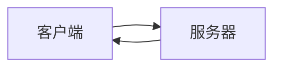
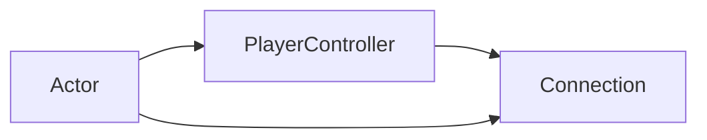

# 1 虚幻中的网络
虚幻引擎使用标准的**客户端 - 服务器 （Client-Server）架构**。这意味着服务器是**权威（Authoritative）** 的，所有数据必须首先从客户端发送到服务器。之后，服务器验证数据并根据您的代码做出反应。

## 一个小例子​

当您作为客户端在多人游戏中移动角色时，您不会自己移动角色，而是告诉服务器您想要移动它。然后，服务器会为其他人（包括您）更新角色的变换。

> [!info] 
>
> 此外，为了防止本地客户端有 “滞后” 的感觉，程序员通常还让本地客户端直接控制他们的角色——尽管当客户端开始作弊时，服务器仍然可能覆盖角色的位置！这意味着客户端（几乎）永远不会直接与其他客户端“交谈”。

##  另一个例子​

When sending a chat message to another client you are sending it to the server first, which then passes it to the client you wanted to reach. This could also be a team, guild, group, etc.  
当向另一个客户端（个人、公会、队伍等）发送聊天消息时，您首先将其发送到服务器，然后服务器将其传递给您想要联系的客户端。

Important 重要的

**Never** trust the client! Trusting the client here means you don't test the client's actions before executing them.  

> [!danger] 
> 永远不要相信客户端！信任客户端意味着您在执行客户端的操作之前不会测试它们。
这会允许他们作弊！
一个简单的例子是发射武器：确保在服务器上测试客户端是否拥有所需数量的弹药，之后再允许射击而不是直接处理射击！

# 2 GamePlay 架构 + 网络
## 1 架构总结
根据前面关于虚幻引擎的 CS 架构和常用类的信息，我们可以将虚幻类分为四类： 
- **Server Only** -  仅服务器 - 这些对象只存在于服务器上
- **Server & Clients** - 服务器和所有客户端 - 这些对象存在于服务器和所有客户端中
- **Server & Owning Client** - 服务器和拥有客户端（即本地客户端） - 这些对象只存在于服务器和拥有客户端上
- **Owning Client Only** - 仅拥有客户端，这些对象只存在于拥有客户端上

>**拥有客户端（Owning Client）** 是指拥有相关 Actor 的 player/client。就像你拥有自己的电脑一样。所有权（Ownership）对于后面章节中的 "RPC "非常重要。

**下面两幅图向您展示了一些常见的类别，以及它们属于哪些类别。**
![[8a1f656c0ccacdb389055b2e883b707f_MD5.svg|"Common Classes layed out in the four sections mentioned above."]]

第二幅图展示了一个有两个连接客户端的专用服务器（dedicated server）的示例。

![[27b08f9e7b9ed6bc9c57882c9cbe197a_MD5.svg|"Venn Diagram of the Classes in a Dedicated Server with two connected Clients example."]]


## 2 GameMode（仅服务器）
> [!NOTE]
> 在 4.14 中，AGameMode 类分为 AGameModeBase 和 AGameMode。 GameModeBase 的功能较少，因为某些游戏可能不需要旧 AGameMode 类的完整功能列表。
> 

AGameMode 类用于定义游戏规则。这包括要生成的其他游戏框架类，例如 APawn、APlayerController、APlayerState 等。

**它仅在服务器上可用。客户端没有 AGameMode 类的实例，并且在尝试检索它时只会得到 nullptr。**

### 示例和用法​

游戏模式的一些用例可能来自较早的第一人称射击游戏，例如《虚幻竞技场》：

**Deathmatch**, **Team Deathmatch** or **Capture the Flag**.  
死亡竞赛、团队死亡竞赛或夺旗。

这意味着 GameMode 可以定义如下内容：

* 团队赛还是个人赛？
- 获胜条件是什么？
    *   杀敌数到达多少胜利？
* 积分是如何获得的？
    *   杀人？
    *   夺旗？
*   将使用什么角色？
*    允许携带哪些武器？
    * 只有手枪吗？
    * 只有刀？

对于多人游戏场景，GameMode 还具有一些有趣的功能，可以帮助我们管理玩家和比赛的总体流程。


#### 函数

GameMode蓝图的 Override 函数部分：
![[cbde69313852572dab83dc34073ca75f_MD5.png]]

您可以实现这些函数的逻辑，以适应您的游戏的特定规则。 这包括更改 GameMode 生成 DefaultPawn 的方式或您想要如何决定游戏是否已准备好开始。

**一个例子可能是检查所有玩家是否已加入服务器并准备好：**
- @ 蓝图：
![[Pasted image 20231001162035.png]]
>玩家数到达最大玩家数时返回 true

- @ C++：
由于 `ReadyToStartMatch` 是 `BlueprintNativeEvent`，因此该函数的实际 C++ 实现称为 `ReadyToStartMatch_Implementation`。这是我们想要覆盖的：

```c++ file:MyGameMode.h
// 本场比赛所需/允许的最大Player人数
int32 MaxNumPlayers;

virtual bool ReadyToStartMatch_Implementation() override;
```

```c++ file:MyGameMode.cpp
bool ATestGameMode::ReadyToStartMatch_Implementation()
{
    Super::ReadyToStartMatch();

    return MaxNumPlayers == NumPlayers;
}
```

---
**但也有一些事件可以用来对整个比赛中发生的某些事情做出反应。**
我经常使用的一个很好的例子是事件 `OnPostLogin`。每次新玩家加入游戏时都会调用此方法。该事件会向您传递一个有效的 PlayerController 引用，该 Controller 由连接玩家的 UConnection 拥有 （详情 [[#Actors 和他们的拥有关系]]）。

- @ 蓝图
![[Pasted image 20231001160607.png|300]]
![[Pasted image 20231001162106.png]]

 - @ C ++
`OnPostLogin` 函数是虚函数，在 C++ 中简称为 `PostLogin`
```c++ file:MyGameMode.h
// List of PlayerControllers
UPROPERTY()
TArray<APlayerController*> PlayerControllerList;

// Overriding the PostLogin function
virtual void PostLogin(APlayerController* NewPlayer) override;
```

```c++ file:MyGameMode.cpp
void ATestGameMode::PostLogin(APlayerController* NewPlayer)
{
    Super::PostLogin(NewPlayer);

    PlayerControllerList.Add(NewPlayer);
}
```
这可以用于与该玩家进行交互，例如，为他们生成一个新的 Pawn，或者只是将其 PlayerController 保存在数组中以供以后使用。

正如已经提到的，您可以使用 GameMode 来管理游戏的一般比赛流程。为此，您可以找到一些功能，其中一些功能是可覆盖的，例如`Ready To Start Match`。

这些函数和事件可用于控制当前的 `MatchState（匹配状态）`。当“`Ready To Start Match`”函数返回 **TRUE** 时，它们中的大多数将被自动调用，但您也可以手动使用它们。
![[Pasted image 20231001162147.png]]
>“`New State`”是一个简单的“FName”类型。您现在可能会问，“为什么这不在 AGameState 类中处理？”嗯，确实如此。这些 GameMode 函数与 GameState 协同工作。
**这只是为了给您一个点来管理任何客户端都无法访问的 `MatchState`，因为 GameMode 只存在于服务器上！**

#### 变量​

这是已经继承的变量的列表。其中一些可以通过 GameMode 蓝图的 ClassDefaults 进行设置：

![[80d227b1ee73d70c373d2144046809bd_MD5.png]]

![[ac948e6651eb07cead5c485776186c8c_MD5.png]]

其中大多数命名都很直白，例如`Default Player Name`，它使您能够为每个连接的玩家提供一个可以通过 `APlayerState` 类访问的默认玩家名称。
还有 `bDelayedStart`，这将使游戏无法开始，即使 `Ready To Start Match` 的默认实现满足所有其他条件。 

更重要的变量之一是 `Options String`。这些是选项，用“`?`”分隔，您可以通过`OpenLevel`函数或当您将`ServerTravel`作为控制台命令调用时传递这些选项。 

您可以使用 `Parse Option` 来提取传递的选项，例如`MaxNumPlayers`：  
![[Pasted image 20231001163900.png|400]]
![[Pasted image 20231001164757.png]]

## 3 GameState（所有客户端+服务器）

> [!info] 
> 在 4.14 中，GameState 类被分为 AGameStateBase 和 AGameState。 GameStateBase 的功能较少，因为某些游戏可能不需要旧 GameState 类的完整功能列表。

AGameState 类可能是服务器和客户端之间共享信息的最重要的类。
GameState 用于跟踪游戏 / 比赛的当前状态。对于多人游戏来说，这**包括已连接玩家的列表 (`APlayerState`)。**

**此外，它会复制给所有客户端，因此每个人都可以访问它**。这使得 GameState 成为多人游戏中信息方面最为核心的类之一。 
  
虽然 GameMode 会告诉您需要多少杀敌数才能获胜，但 GameState 将跟踪每个玩家和 / 或团队当前的杀敌数！

您在这里存储什么信息完全取决于您。它可以是得分数组或自定义结构数组

###  示例和用法​

在多人游戏中，AGameState 类用于跟踪游戏的当前状态，其中还包括**玩家及其 PlayerState**。

GameMode 确保调用 GameState 的 `MatchState` 函数，并且 **GameState 本身也允许您在客户端上使用它们**。

与 GameMode 相比，GameState 并没有给我们太多的帮助，但这仍然允许我们创建我们的逻辑，**该逻辑主要应该尝试将信息传播给客户端。**

#### 变量​

![[460a118ae262e844e17ac30050cdac94_MD5.png]]

我们从 AGameState 基类中获取一些可以利用的变量。 PlayerArray、MatchState 和 ElapsedTime 都会被复制，因此客户端也可以访问它们。
>`AuthorityGameMode` 除外。只有服务器可以访问它，因为 GameMode 仅存在于服务器上。

**PlayerArray 不会直接复制，但是，每个 PlayerState 都会被复制，并且它们会在构造时将自己添加到 PlayerArray 中**。此外，它们由 GameState 收集，只是为了确保竞争条件不会导致问题。

以下是 C++代码示例，展示了将 PlayerState 收集到 PlayerArray 中的快速插入方法： 
PlayerState 类本身的内部
```c++ 
void APlayerState::PostInitializeComponents()
{
    // […]

    UWorld* World = GetWorld();
    // Register this PlayerState with the Game's ReplicationInfo
    if (World->GameState != NULL)
    {
        World->GameState->AddPlayerState(this);
    }

    // […]
}
```

并且在 GameState 中
```c++
void AGameState::PostInitializeComponents()
{
    // […]

    for (TActorIterator<APlayerState> It(World); It; ++It)
    {
        AddPlayerState(*It);
    }
}

void AGameState::AddPlayerState(APlayerState* PlayerState)
{
    if (!PlayerState->bIsInactive)
    {
        PlayerArray.AddUnique(PlayerState);
    }
}

```

所有这一切都发生在服务器以及 Player 和 GameState 的客户端实例上！

#### 示例
我可以为您提供的一个小的函数示例是**跟踪 “A” 和“B”两支球队的得分。** 假设我们有一个 `CustomEvent`，当球队得分时会调用该事件。

它传递一个布尔值，这样我们就知道哪支球队得分了。我们还可以传递 PlayerState、Team 或任何您用来识别得分者的信息。

稍后在 “Replication 复制” 章节中，您将了解**只有服务器可以（并且应该）复制变量的规则**，因此我们确保只有服务器可以调用此事件。

该事件是从另一个类调用的（例如杀死某人的武器），并且这应该发生在服务器上（总是！），因此我们在这里不需要 RPC。

- @ 蓝图
![[Pasted image 20231001173813.png]]
由于这些变量和 GameState 是复制的，因此您可以使用这两个变量并将它们放入您需要的任何其他类中。例如，将它们显示在记分板 widget 中。 

- @ C++

为了重新创建这个例子，我们需要更多的代码，但是除了函数本身之外，设置复制所需的代码只需要每个类一次。

```c++ file:MyGameState.h
// You need this included to get the replication working.
#include “UnrealNetwork.h”

// Replicated specifier used to mark this variable to replicate
UPROPERTY(Replicated)
int32 TeamAScore;

UPROPERTY(Replicated)
int32 TeamBScore;

// Function to increase the score of a team
void AddScore(bool bTeamAScored);
```

```c++ file:MyGameState.cpp
void ATestGameState::AddScore(bool bTeamAScored)
{
    if (bTeamAScored)
    {
        TeamAScore++;
    }
    else
    {
        TeamBScore++;
    }
}
```

## 4 PlayerState （所有客户端+服务器）

`APlayerState` 类是**共享特定玩家信息的最重要的类**。它旨在保存有关玩家的当前信息。**每个玩家都有自己的 PlayerState**。

**PlayerState 也会复制给每个人，并可用于在其他客户端上检索和显示数据。
访问所有 PlayerState 的一个简单方法是 AGameState 类中的 `PlayerArray`。**

您可能想要存储在 PlayerState 中的示例信息：
- PlayerName - 玩家的当前名称
- Score - 玩家当前的分数
- Ping - 玩家当前的 ping
- TeamID - 玩家所在团队的 ID
- 或其他玩家可能需要了解的其他复制信息

### 示例和用法​

我能提供的大多数例子都非常具体。因此，我们将看看一些已经可用的属性，以及一些更有趣的函数。

#### 蓝图示例​

蓝图暴露了一些变量，它们或多或少有用。遗憾的是，其中一些并未公开其所有函数，因此最好用您自己的函数替换它们。

![[104ed35e4fa0a9d27583ee86b3d4d64f_MD5.png]]
>**这些变量都会被复制，因此它们在所有客户端上保持同步。**

遗憾的是，它们在蓝图中不容易设置，但没有什么可以阻止您创建它们的版本。

设置 PlayerName 变量的一个示例是通过调用 GameMode 函数`ChangeName`，并将其传递给玩家的 PlayerController。
![[Pasted image 20231001174629.png]]

PlayerState 还用于**确保数据在无缝关卡更改或意外连接问题期间保持持久性。**

PlayerState 有两个专门用于处理重新连接玩家和与服务器无缝切换到新地图的玩家的功能。**PlayerState 负责将其已保存的信息复制到新的 PlayerState 中**。这要么是通过关卡更新创建的，要么是因为玩家重新连接而创建的。
![[Pasted image 20231001175334.png]]

- @ c++实现
让我们看一下 C++ 中的相同函数。
```c++ file:TestPlayerState.h
// Used to copy properties from the current PlayerState to the passed one
virtual void CopyProperties(class APlayerState* PlayerState) override;

// Used to override the current PlayerState with the properties of the passed one
virtual void OverrideWith(class APlayerState* PlayerState) override;
```
这些函数可以在您自己的 C++ PlayerState 子类中实现，以管理您添加到自定义 PlayerState 的数据。确保在末尾添加“override”说明符，并调用“Super::”，以便原始实现保持活动状态。

您的实现可能与此类似：
```c++ file:TestPlayerState.cpp
void ATestPlayerState::CopyProperties(class APlayerState* PlayerState)
{
    Super::CopyProperties(PlayerState);

    if (IsValid(PlayerState))
    {
        ATestPlayerState* TestPlayerState = Cast<ATestPlayerState>(PlayerState);
        if (IsValid(TestPlayerState))
        {
            TestPlayerState->SomeVariable = SomeVariable;
        }
    }
}

void ATestPlayerState::OverrideWith(class APlayerState* PlayerState)
{
    Super::OverrideWith(PlayerState);

    if (IsValid(PlayerState))
    {
        ATestPlayerState* TestPlayerState = Cast<ATestPlayerState>(PlayerState);
        if (IsValid(TestPlayerState))
        {
            SomeVariable = TestPlayerState->SomeVariable;
        }
    }
}
```

## 5 Pawn / Character（所有客户端+服务器）

PlayerController 一次只能拥有一个 Pawn，但可以通过-possess  和 unpossess 来轻松切换 Pawn。

**Pawn 大部分被复制到所有客户端。**

Pawn 的子类 ACharacter 经常被使用，因为它带有一个已经**联网**的 MovementComponent，用于处理复制玩家角色的位置、旋转等。

### 示例和用法​


在多人游戏中，我们主要使用 Pawn 的 `Replication` 部分来显示角色并与其他人共享一些信息。一个简单的例子是角色的“Health”。  

我们不仅仅复制“Health”以使其对其他玩家可见，我们还复制它以使服务器对其具有权限，以防止客户端作弊。

#### 蓝图​

尽管有标准的可重载函数，Pawn 也有两个事件可以让您对它被 PlayerController 或 AIController 拥有时做出反应。
![[Pasted image 20231001180252.png|300]]

> [!NOTE] 
>- 由于 possess 逻辑发生在服务器上，这些事件仅在 Pawn/Character 的服务器版本上调用。
>- `ReceiveControllerChanged` 事件：在 Controller 变更时后调用，在客户端和服务端都能调用。

下图将展示如何使用 `EventAnyDamage` 函数和复制的 `Health` 变量来降低玩家的生命值。
>这发生在服务器上而不是客户端上！

![[Pasted image 20231001181826.png]]

由于 Pawn 应该被复制，只要服务器调用 DestroyActor 节点，它也会销毁 Pawn 的客户端版本。  

在客户端站点上，我们可以将复制的“`Health`”变量用于 HUD 或每个人头顶上的健康栏。您可以通过创建带有 ProgressBar 和对 Pawn 的引用的 UserWidget 来轻松完成此操作。

假设我们的“BP_Character”类上有一个“Health”和“MaxHealth”变量，全部设置为**复制**（如果 MaxHealth 永远不会运行时改变，您可以不设置复制）。

现在，在 UserWidget 和 ProgressBar 内部创建“BP_Character”引用变量后，我们可以将该条的百分比绑定到以下函数：


![[Pasted image 20231001182325.png]]

此外，在设置 WidgetComponent 后，我​​们可以将“Widget Class To Use”设置为您的 HealthBar UserWidget，并在 BeginPlay 上执行以下操作：

![[Pasted image 20231001182420.png]]

**“BeginPlay”在 Pawn 的所有实例上（服务器和所有客户端上）调用

所以现在每个实例都将自己设置为它所拥有的 UserWidget 的 Pawn 引用。

由于 Pawn 和生命值变量被复制，我们在每个 Pawn 的头部上方都有正确的百分比。

![[Pasted image 20231001182430.jpg]]

#### C++

对于 C++ 示例，我不会重新创建 UserWidget 示例。要让 UserWidgets 在 C++ 中工作需要做太多的模板式的东西，我不想在这里讨论这个。

所以我们将重点关注占有和伤害事件。在 C++中，两个 Possess 事件被称为：
```c++
virtual void PossessedBy(AController* NewController);

virtual void UnPossessed();
```
>注意，`UnPossessed` 事件不会传递旧的 PlayerController。

And we also want to recreate the Health example in C++. As always, if you don't understand the steps of replication at this moment, don't worry, the upcoming chapters will explain it to you.  
我们还想用 C++ 重新创建 Health 示例。如果您现在不明白复制的步骤，请不要担心，接下来的章节将为您解释。
>如果示例在复制方面看起来太复杂，请暂时跳过这些示例。

“`TakeDamage`”函数相当于“`EventAnyDamage`”节点。为了造成伤害，您通常会对要对其造成伤害的 Actor 调用“TakeDamage”，如果该 Actor 实现了该函数，它将对此做出反应，类似于本示例的做法。

```c++ file:TestPawn.h
// Replicated Health variable
UPROPERTY(Replicated)
int32 Health;

// Overriding the TakeDamage event
virtual float TakeDamage(float Damage, struct FDamageEvent const& DamageEvent, AController* EventInstigator, AActor* DamageCauser) override;
```

```c++ file:TestPawn.cpp
// 该函数是必需的，UPROPERTY 宏中的Replicated指示符会为我们声明该函数。我们只需实现它
void ATestPawn::GetLifetimeReplicatedProps(TArray<FLifetimeProperty>& OutLifetimeProps) const
{
    Super::GetLifetimeReplicatedProps(OutLifetimeProps);

    // 告诉 UE 我们要复制这个变量
    DOREPLIFETIME(ATestPawn, Health);
}

float ATestPawn::TakeDamage(float Damage, struct FDamageEvent const& DamageEvent, AController* EventInstigator, AActor* DamageCauser)
{
    const float ActualDamage = Super::TakeDamage(Damage, DamageEvent, EventInstigator, DamageCauser);

    // Lower the Health of the Player
    Health -= ActualDamage;

    // And destroy it if the Health is less or equal 0
    if (Health <= 0.f)
    {
        Destroy();
    }

    return ActualDamage;
}
```

## 6 PlayerController （拥有客户端+服务器）

APlayerController 类可能是我们遇到的最有趣、最复杂的类。它也是大量客户端逻辑的中心，因为**这是客户端真正 "拥有 (owns) "的第一个类**。

PlayerController 可以看作是玩家的 "`Input`"。它是玩家与服务器的链接。这进一步意味着**每个客户端都有一个 PlayerController**。  

**客户端的 PlayerController 只存在于本客户端和服务器**：
- 每个客户端**只知道**自己的 PlayerController，**无法访问其他客户端的 PlayerController。**
- 服务器拥有**所有**客户端 PlayerControllers 的引用！

"Input"一词并不直接意味着所有实际输入（按键、鼠标移动、控制器轴等）都需要放在 PlayerController 中。一个好的做法是：
- 将 Pawn/Character **特定**的输入（汽车的工作方式与人类不同）放入 APawn/ACharacter 类中
- 将适用于**所有** Character 或甚至当 Character 对象无效时的输入，放入 PlayerController 中。 

> [!question] 
> 如何获取正确的 PlayerController？

节点 `GetPlayerController(0)` 或代码行 `UGameplayStatics::GetPlayerController(GetWorld(), 0);` 在服务器和客户端上的工作方式不同：
- 在监听服务器（Listen-Server）上调用它将返回**监听服务器**的 PlayerController
- 在客户端上调用它将返回**客户端**的 PlayerController
- 在专用服务器（Dedicated Server）上调用它将返回**第一个客户端**的 PlayerController

>除 "0 "以外的其他数字将不会返回某个客户端的其他客户端 PlayerControllers。该索引用于本地玩家（分屏），我们在此不做介绍。

### 示例和用法

尽管 APlayerController 是网络中最重要的类之一，但默认情况下它的功能并不多。

因此，我们将创建一个小示例来说明为什么需要它。在 "所有权 (ownership) "一章中，你会了解到**为什么 PlayerController 对于 RPC 非常重要。**

下面的示例将向您展示如何利用 PlayerController，通过按下 UserWidget 按钮来递增 GameState 中的一个复制变量。

> [!question] 为什么需要使用 PlayerController？
> UserWidgets 只存在于本地播放器（客户端或 ListenServer）上，即使它们被客户端拥有，ServerRPC 也无法在服务器上运行它们的实例。它根本无法复制！
>
这意味着我们需要一种方法，将 button Press 发送到服务器，这样服务器就可以递增变量。
>
>RPC 和所有权章节会有详细介绍！

> [!question] 为什么不直接调用 GameState 上的 RPC？
> 因为它归服务器所有。ServerRPC 需要客户端作为所有者！

#### 蓝图

因此，首先，我们需要一个简单的 UserWidget，上面有一个可以按下的按钮。


我将以相反的顺序张贴图片，这样你就能看到图片的结尾，以及哪些事件呼应了前面图片中的事件。

因此，从我们的目标 GameState 开始。它会收到一个普通事件，该事件会递增一个复制的整数变量：
![[Pasted image 20231001200904.png]]

该事件将在服务器端调用，就在我们的 PlayerController 中的 ServerRPC 内部：
![[Pasted image 20231001200911.png]]

最后，我们的按钮被按下并调用 ServerRPC：
![[Pasted image 20231001200919.png]]

因此，当我们点击按钮（客户端）时，我们**使用 PlayerController 中的 ServerRPC 来进入服务器端**（这是可能的，因为 PlayerController 是客户端所有的！），然后调用 GameState 的 "IncreaseVariable "事件来递增复制的整数变量。

由于这个整数变量是由服务器复制和设置的，因此现在会在 GameState 的所有实例上更新，这样客户端也能看到更新！

##### C++

```c++ file:TestGameState.h
// Replicated integer variable
UPROPERTY(Replicated)
int32 OurVariable;

public:
// Function to increment the variable
void IncreaseVariable();
```

```c++ file:file:TestGameState.cpp
//此函数是必需的，并且UPROPERTY宏中复制的说明符会为我们声明它。我们只需要实现它
void ATestGameState::GetLifetimeReplicatedProps(TArray<FLifetimeProperty>& OutLifetimeProps) const
{
    Super::GetLifetimeReplicatedProps(OutLifetimeProps);

    // This tells UE that we want to replicate this variable
    DOREPLIFETIME(ATestGameState, OurVariable);
}

void ATestGameState::IncreaseVariable()
{
    OurVariable++;
}
```

在本例的 C++ 版本中，我将用 PlayerController 的 BeginPlay 代替 UserWidget。不过，用 C++ 实现 UserWidget 需要更多代码，我不想在此赘述。

```c++ file:TestPlayerController.h
// Server RPC. You will read more about this in the RPC chapter  
UFUNCTION(Server, unreliable, WithValidation)  
void Server_IncreaseVariable();  
  
// Also overriding the BeginPlay function for this example  
virtual void BeginPlay() override;
```

```c++ file:TestPlayerController.cpp
// Otherwise we can't access the GameState functions
#include “TestGameState.h”

// You will read later about RPCs and why '_Validate' is a thing
bool ATestPlayerController::Server_IncreaseVariable_Validate()
{
    return true;
}

// You will read later about RPCs and why '_Implementation' is a thing
void ATestPlayerController::Server_IncreaseVariable_Implementation()
{
    ATestGameState* GameState = Cast<ATestGameState>(UGameplayStatics::GetGameState(GetWorld()));
    GameState->IncreaseVariable();
}

void ATestPlayerController::BeginPlay()
{
    Super::BeginPlay();

    //BeginPlay在Actor的每个实例上都被调用，在该PlayerController的服务器版本上也是如此。
    //我们希望确保，只有本地player调用此RPC。同样，这个例子不一定有多大意义
    //因为我们可以翻转条件，根本不需要RPC，但是C++Widget，你知道。。。
    //我们也可以在这里使用“IsLocalPlayerController（）”
    if (Role < ROLE_Authority)
    {
        Server_IncreaseVariable();
    }
}
```

这是相当多的代码。如果你还不理解其中一些函数的用法和命名，不用担心。接下来的章节将帮助你理解为什么要这样做。

## 7 AHUD（仅拥有客户端）
**AHUD 类仅在每个客户端上可用，可通过 PlayerController 访问。它将由 PlayerController 自动生成。**

在 UMG（虚幻动态图形）发布之前，AHUD 类一直用于在客户端的视口中绘制文本、纹理等。

**现在，UserWidgets 在 99% 的情况下都取代了 HUD 类。**

您仍然可以使用 AHUD 类进行调试，或者使用一个独立区域来管理 UserWidget 的创建、显示、隐藏和销毁。

>由于 HUD 与多人游戏没有直接联系，因此示例只能显示单人游戏的逻辑，所以本课将跳过这些示例。

## 8 UUserWidget （仅拥有客户端）

UUserWidgets 用于 Epic Games 的用户界面系统，该系统被称为**虚幻动态图形（UMG，Unreal Motion Graphics）**。

它们**继承自 Slate**，Slate 是一种用于在 C++ 中创建用户界面的语言，同时也用于虚幻引擎编辑器本身。

Widgets are only available locally. They don't replicate and should not contain and replication code. Preferably they wouldn't contain any gameplay code either, but some games might require it.  
Widgets**只能在本地使用**。它们**不会复制，也不应包含复制代码**。**它们最好也不包含任何游戏代码**，但有些游戏可能需要。
 
要了解有关 UMG 和小工具的更多信息，请使用上面提供的 API 链接。

在 APawn 示例中，我们已经有一个使用 Widgets 的小例子。因此，我将在此略过。


# 3 专用服务器与监听服务器
## Dedicated Server 专用服务器

专用服务器是**不需要玩家托管的独立服务器。**

它与游戏客户端分离运行，主要用于运行一个服务器，玩家可以随时加入/离开，而服务器不会随之关闭。

专用服务器可在 Windows 和 Linux 下编译，也可在云服务器上运行，玩家可通过固定 IP 地址连接到云服务器。

专用服务器没有视觉（visual）部分，因此不需要 UI，也没有 PlayerController 。它们在游戏中也没有 Character 或类似的代表。  
 
## Listen Server 监听服务器

监听服务器是指同时也是客户端的服务器。（用自己的电脑开服务器，还能同时玩游戏~）

由于同时也是客户端，Listen-Server 需要 UI，并有一个代表客户端部分的 PlayerController。**在监听服务器上获取 `PlayerController(0)`将返回该客户端的  PlayerController 。**

**由于监听服务器在客户端上运行，其他人需要连接的 IP 就是客户端的 IP。与专用服务器相比，这往往会带来玩家没有静态 IP 的问题。**

不过，使用 OnlineSubsystem（稍后解释）可以解决更改 IP 的问题。
# 4 Replication 复制 
##  简介

Replication 是**服务器将信息 / 数据传递给客户端**的行为。

> [!bug] 注意方向，不能反过来！
> ```mermaid
>flowchart LR
	>服务器--Replication-->客户端;
	>```

这可以仅限于特定的实体和组。蓝图大多根据受影响 AActor 的设置执行复制。

**第一个可以复制属性的类是 AActor 类**。虽然您也可以复制 UObject，但它们是通过 AActor 复制的，因此仍然需要某种 AActor 来处理复制。
UActorComponent 就是一个很好的例子，它支持通过 AActor 复制 UObjects，而不需要我们做太多额外的工作。

**前面提到的所有类都在某种程度上继承自 AActor，从而使它们能够在需要时复制属性。不过，并非所有类的复制方式都相同。**
例如，**AGameMode 根本不会复制**，因为只存在于服务器上。**而 AHUD、UUserWidget 只存在于客户端，也不会复制。**

## 如何使用 Replication
![[Pasted image 20231001225526.png|450]]
复制可以在 AActor 子类的类默认设置 / 构造函数中激活：

Character构造函数示例

```c++
ATestCharacter::ATestCharacter(const FObjectInitializer& ObjectInitializer)
    : Super(ObjectInitializer)
{
    bReplicates = true;
    bReplicateMovement = true;
}
```

- **如果一个 Actor 的 `bReplicates` 设置为 `true`，那么该角色将被生成并复制到所有客户端（如果该角色是由服务器生成的）。而且只有在服务器生成时才会复制。**
- **如果客户端生成了这个 Actor，该 Actor 将只存在于这个客户端上。**

##  复制属性
![[Pasted image 20231001225820.png|500]]

### Replicated
启用复制后，我们可以在 Actor 内部复制变量。有多种方法可以做到这一点。我们将从最基本的方法开始：

**将 "复制" 下拉菜单设置为 "`Replicated`"，将确保此变量被复制到此 Actor 的所有复制实例中。**
变量可以在某些条件下复制。下面我们将进一步讨论。

![[Pasted image 20231001230029.png|298]]
>Replicated 变量用两个白圈标出。

- @ 在 C++ 中复制变量所需的工作稍多一些：
```c++ file:TestPlayerCharacter.h
// Create replicated health variable
UPROPERTY(Replicated)
float Health;
```

.cpp 文件将获得 `GetLifetimeReplicatedProps` 函数。在将变量标记为复制时，UE 已经为我们创建了该函数的头声明。

**在此函数中，您可以定义复制变量的规则。**

```c++ file:TestPlayerCharacter.cpp
void ATestPlayerCharacter::GetLifetimeReplicatedProps(TArray<FLifetimeProperty>& OutLifetimeProps) const
{
    Super::GetLifetimeReplicatedProps(OutLifetimeProps);

    // 这里列出我们想要复制的变量
    DOREPLIFETIME(ATestPlayerCharacter, Health);
}
```

您也可以在这里进行**有条件复制**（对应蓝图中的复制条件）：

```c++
// 仅向该Object/Class的所有者复制变量 
DOREPLIFETIME_CONDITION(ATestPlayerCharacter, Health, COND_OwnerOnly);
```

| Condition 条件                          |说明|
| --------------------------------------- | ----------------------------------------------------------------------------------------------------------------------------------------------------------------------------------------- |
| COND_InitialOnly                        |该属性只会尝试在初始束（initial bunch）上发送|
| COND_OwnerOnly COND_OwnnerOnly          | 该属性只会发送给演员的所有者（owner）|
| COND_SkipOwner                          |此属性会发送给所有连接，但 owner 除外 |
| COND_SimulatedOnly                      |此属性只会发送到模拟的（simulated） Actor|
| COND_AutonomousOnly                     |该属性只会发送给自主行为autonomous Actor|
|COND_SimulatedOrPhysics |该属性将发送到simulated 或 bRepPhysics Actor。|
|COND_InitialOrOwner| 该属性将在初始束上发送，或发送给 Actor 的所有者|
| COND_Custom                             | 该属性没有特定条件，但希望能够通过 SetCustomIsActiveOverride 切换开关|

**重要的是要明白，整个复制过程只能<mark style="background: #FF5582A6;">从服务器到客户端</mark>，而不能反过来！**

我们稍后将学习如何让服务器复制客户端希望与他人共享的内容（例如他们的 PlayerName）。

### RepNotify—ReplicatedUsing

复制变量的另一种方法是将变量标记为 `ReplicatedUsing`。

在蓝图中，这被称为 `RepNotify`（代表通知）。**它允许指定一个函数，当变量的新值被复制到客户端时，该函数将被调用。**
![[Pasted image 20231001233317.png]]
>Set 变为“使用通知设置”

在蓝图中，一旦在 "复制" 下拉菜单中选择 "`RepNotify`"，该功能就会自动创建：
![[Pasted image 20231001233531.png|373]]

C++ 版本需要的更多，但工作原理相同：
```c++ file:ATestCharacter.h
// Create RepNotify Health variable
UPROPERTY(ReplicatedUsing = OnRep_Health)
float Health;

// Create OnRep function | UFUNCTION() Macro is important! | Doesn't need to be virtual
UFUNCTION()
virtual void OnRep_Health();
```

```c++ file:ATestCharacter.cpp
void ATestCharacter::OnRep_Health()
{
    if (Health <= 0.f)
    {
        PlayDeathAnimation();
    }
}
```
 
**通过 `ReplicatedUsing=函数名`，我们指定了变量复制成功后应调用的函数。该函数必须包含 "`UNFUNCTION ()`" 宏，即使该宏为空！**

> [!NOTE] RepNotify 蓝图和 C++之间的区别
> 值得注意的是，C++ 和 Blueprints 对 RepNotify 的处理方式略有不同。
> - **在 C++ 中，OnRep 函数只调用客户端。**
>     - 当服务器更改值并要求同时调用 OnRep 函数时，您**需要在调整变量后手动调用该函数**。这是因为 **OnRep 函数的作用是在变量复制到客户端时进行回调。**
> 
> - **在蓝图中，OnRep 函数将调用客户端和服务器**。
>     - 这是因为 BP 版本的 OnRep 是 **"属性已更改（Property Changed）" 回调**。这意味着该函数不仅会调用服务器，而且如果客户端在本地更改了变量，也会调用客户端。

# 5 RPC 远程过程调用
Remote Procedure Calls

RPC 是在本地调用但在其他机器（不同于执行调用的机器）上远程执行的**函数**。
>类似电视遥控器对电视机的控制。

RPC 函数非常有用，可允许客户端或服务器通过网络连接**相互**发送消息。


**主要作用是执行那些不可靠的暂时性/修饰性游戏事件。** 这其中包括播放声音、生成粒子或产生其他**临时效果**之类的事件，它们**对于 Actor 的正常运作并不重要**。在此之前，这些类型的事件往往要通过 Actor 属性进行复制。

在使用 RPC 时，还必须要了解 [[#6 Ownership 连接所有权]]，因为它决定了大多数 RPC 将在哪里运行。
![[UE网络精粹#^uh7l5h]]

> [!warning] 
>  RPC **不能有返回值**！要返回一些信息，您需要在另一个方向上使用第二个 RPC。

## 使用 RPC
### 蓝图

![[9237d6adf6779d0342e27319939ac35b_MD5.png|450]]

如果被标记为 RPC 的函数是从蓝图中调用，它们也会被复制。这时，它们将遵循相同的规则，就像是从 C++ 调用一样。在此情况下，您无法将函数动态标记为蓝图的 RPC。

然而，**自定义事件却可以从蓝图编辑器内部被标记为复制**。

蓝图中的 RPC 是通过创建 `CustomEvent` 并将设置 `Replicates` 来创建的。**RPC 不能有返回值，因此不能使用函数来创建 RPC。**

![[d900cca98dc7a2a1829d62f9d4fcec4c_MD5.png]]

### C++ （三种 RPC 函数）
[[UE4 Network] RPC 之哪里调用和哪里执行 - 知乎 (zhihu.com)]( https://zhuanlan.zhihu.com/p/245358090 )

#### 相关概念的简介
1. 由 `AActor->LocalRole == ROLE_Authority` 检测是否为本地权威角色
2. 由 `AActor::GetNetConnection() != NULL` 检测 AActor 是否有所属链接
3. 由 `AActor->RemoteRole != ROLE_None` 检测 AActor 是否为参与属性同步


> [!tip] 区分调用和执行
> 假设我们声明了一个名为 `FunctionName()` 的 RPC 函数，用户并不需要实现这个函数，而是要额外的实现一个名为 `FunctionName_Implementation()` 函数处理真正要执行逻辑。而这个 `FunctionName()` 函数会由 UHT 来为我们实现来处理 RPC 调用的逻辑。
> 
> 我们将用户调用 `FunctionName()` 函数行为称为用户发起了这个 RPC 函数的**调用**，
> 而将真正执行到 `FunctionName_Implementation()` 函数时称为这个 RPC 函数被**执行**。

要将一个函数声明为 RPC，您只需将 `Server`、`Client` 或 `NetMulticast` 关键字添加到 `UFUNCTION()` 声明。

#### `UFUNCTION(Server)`
用于声明**由客户端发起调用，在服务器执行**的 RPC 函数。  

无论是否可靠，构造的 RPC Bunch 都会由 UChannel::SendBunch() 立即发送。

**执行空间：**
1. 在服务器调用时仅本地执行
2. 在客户端调用时，对于本地权威角色的 AActor ，若其参与属性同步且有所属链接则远程执行，否则仅本地执行
3. 在客户端调用时，对于非本地权威角色的 AActor ，若其参与属性同步且有所属链接则远程执行，否则终止执行

#### `UFUNCTION(Client)`
用于声明**由服务器发起调用，在客户端执行**的 RPC 函数。  

无论是否可靠，构造的 RPC Bunch 都会由 UChannel::SendBunch() 立即发送。

**执行空间：**
1. 在客户端调用时则仅本地执行
2. 在服务器调用时，对于本地权威角色的 AActor ，若其参与属性同步且有所属链接则远程执行，否则仅本地执行
3. 在服务器调用时，对于非本地权威角色的 AActor ，若其参与属性同步且有所属链接则远程执行，否则终止执行


#### `UFUNCTION(NetMulticast)`
用于声明**由服务器发起调用，并广播到所有客户端执行**的 RPC 函数。  
若为可靠的则 RPC Bunch 会立即发送，若为不可靠的则 RPC Bunch 会随着下次此 RPC 函数所在对象向此链接进行属性同步时，才会一起发送。  

**执行空间：**
1. 在客户端调用时仅本地执行
2. 在服务器调用时，对于参与同步的 AActor 即会本地执行也会远程执行，对于不参与同步的 AActor 仅本地执行

#### 例子
```c++
// 这是一个 ServerRPC，被标记为unreliable，并且 WithValidation（需要！）。
UFUNCTION(Server, unreliable, WithValidation)
void Server_Interact();
```

CPP 文件将实现一个不同的函数。该文件需要以 "`_Implementation`" 作为后缀。

```c++
// 这是实际的实现，而不是 Server_Interact（由 UHT 自动实现）。
// 但在调用时，我们使用 Server_Interact。
// 调用Server_Interact后，会执行该函数
void ATestPlayerCharacter::Server_Interact_Implementation()
{
    // Interact with a door or so!
}
```

CPP 文件还需要一个以 `_Validate` 为后缀的版本，用于 [[#Validation 验证 (C++)]]。

```c++
bool ATestPlayerCharacter::Server_Interact_Validate()
{
    return true;
}
```

其他两类 RPC 也是这样创建的：都需要标记为 `reliable` 或 `unreliable`。

```c++
//ClientRPC
UFUNCTION(Client, reliable)
void ClientRPCFunction();

//MulticastRPC
UFUNCTION(NetMulticast, unreliable)
void MulticastRPCFunction();
```

## 要求和注意事项

**要使 RPC 完全发挥作用，需要满足一些要求：**
1. 它们必须在 Actor 或复制的子对象 SubObject（如 Component）上调用  
2. Actor（和 Component）必须被复制
3. 如果 **RPC 由服务器调用并在客户端执行（`UFUNCTION (Client)`）**，则只有**拥有该 Actor** 的客户端才会执行该函数
4. 如果 **RPC 由客户端调用并在服务器上执行（`UFUNCTION (Server)`）**，则客户端必须拥有 RPC 调用的 Actor
5.  **多播 RPC （`UFUNCTION (NetMulticast`）是个例外**：
    * 如果它们被服务器调用，服务器将在本地执行它们，并在当前连接的所有客户端上执行它们，这些客户端都有一个相关的 Actor 实例
    * 如果从客户端调用，多播只能在本地执行，而不会在服务器或其他客户端上执行
    *  目前，我们有一个针对多播事件的简单**节流机制**（throttling mechanism）：
        *  在特定的 Actor 的网络更新周期内，多播函数的复制次数不会超过两次。  


### 从服务器调用的 RPC
下面的表格**根据执行调用的 actor 的所有权，总结了特定类型的 RPC 将在哪里执行。**

|Actor Ownership <br> 所有权 |未复 制| `NetMulticast` | `Server` | `Client` |
|---|---|---|---|---|
|被客户端拥有|服务器上运行|服务器+所有客户端|服务器|在 actor 的所属客户端上运行|
|被服务器拥有|服务器|服务器+所有客户端|服务器 |服务器|
|未被拥有|服务器|服务器+所有客户端|服务器|服务器|
>未标记 Replicated 则都在服务器上运行
### 从客户端调用的 RPC
从客户端调用的 RPC

|Actor Ownership <br> 所有权|未复制| `NetMulticast` | `Server` | `Client` |
|---|---|---|---|---|
|被执行调用的客户端拥有|在执行调用的客户端上运行|执行调用的客户端|服务器上|执行调用的客户端|
|被不同客户拥有|执行调用的客户端|执行调用的客户端|丢弃|执行调用的客户端|
|被服务器拥有|执行调用的客户端|执行调用的客户端|丢弃|执行调用的客户端|
|未被拥有|执行调用的客户端|执行调用的客户端|丢弃|执行调用的客户端|

## 可靠性 Reliable

- 默认情况下，RPC 不可靠，通过指定  `Reliable` 标记为可靠
- 不要将每个 RPC 都标记为 `Reliable`！您**只应在偶尔调用一次且需要它们到达目的地的 RPC 上这样做。**
- 在 Tick 上调用 `reliable` RPC 可能会产生副作用，如填满可靠缓冲区，从而导致其他属性和 RPC 不再被处理。

> [!NOTE] 网络通信的可靠性与不可靠性
> 在网络通信中，可靠和不可靠是指数据传输的特性。
>
可靠传输意味着数据在传输过程中能够保证完整性和顺序性。这意味着发送的数据将按照发送的顺序到达接收端，并且不会丢失或损坏。如果发生数据丢失或损坏，可靠传输机制会自动进行重传，以确保数据的完整性和正确性。
>
不可靠传输则不提供数据的完整性和顺序性保证。在不可靠传输中，数据可能会丢失、损坏或乱序到达接收端，而且没有自动重传机制。
>
在网络通信中，可靠传输通常用于需要确保数据完整性和顺序性的场景，例如文件传输、实时视频流等。而不可靠传输通常用于对实时性要求较高，但对数据完整性和顺序性要求较低的场景，例如实时游戏中的网络同步。

## Validation 验证 (C++)

检测错误数据/输入的一个手段

**验证的原理**：如果 RPC 的验证函数检测到任何参数有问题，就会通知系统**断开**发起 RPC 调用的客户端 / 服务器。

现在，每个 `ServerRPCFunction` 都需要验证。`UFUNCTION` 宏中的 `WithValidation` 关键字就是用于此目的。

```c++
UFUNCTION(Server, unreliable, WithValidation)
void SomeRPCFunction(int32 AddHealth);
```


下面举例说明如何使用 `_Validate` 函数： 

```c++
bool ATestPlayerCharacter::SomeRPCFunction_Validate(int32 AddHealth)
{
    if (AddHealth > MAX_ADD_HEALTH)
    {
        return false; // 这将断开调用
    }

    return true; // 允许调用 RPC！
}
```

> [!info]
> **客户端到服务器** RPC 要求使用 `_Validate`函数，以确保服务器 RPC 功能的安全性，并尽可能方便用户添加代码，根据所有已知的输入约束条件检查每个参数是否有效。
> 

# 6 Ownership 连接所有权

所有权是非常重要的一点。你已经看到了一个包含 "Client-owned Actor "等条目的表格 [[#从服务器调用的 RPC]]。

服务器或客户端可以 own（拥有） 一个Actor。

例如，本地 player（客户端或监听服务器）拥有 PlayerController。
另一个例子是场景中生成/放置的门。这主要由服务器所有。

**但为什么会出现这样的问题呢？**
如果你再查看一下前面的表格，就会发现，例如，如果客户端在不属于自己的 Actor 上调用服务器 RPC，该 RPC 就会被丢弃。因此，客户端无法在服务器拥有的 Actor上调用 "`Server_Interact`"。但我们该如何解决这个问题呢？

我们使用客户端拥有的 Class/Actor，这就是 PlayerController 开始大显身手的地方。在讨论 PlayerController 类时，我们已经举过一个类似的例子，即根据 UserWidget 按钮的按压情况发送 RPC 以递增数值。

![[Pasted image 20231002095346.png]]

因此，与其在 Actor 上启用输入并在那里调用 ServerRPC，不如**在 PlayerController 中创建 ServerRPC，让服务器调用 Actor 上的接口函数（例如 "Interact"）。**  

## Actors 和他们的拥有连接
Owning Connections（拥有连接）

Gameplay 架构+网络 章节中提到，PlayerController 是客户端真正 "拥有 (owns) "的第一个类。这意味着什么呢？

每个 "Connection（连接）"都有一个专门为该 Connection创建的 PlayerController。**这个 PlayerController 归该 "Connection "所有。**

**因此，当我们想确定某个 Actor 是否被某个人拥有时，我们会向上查询（递归），直到查询到最外层的所有者，如果是一个 PlayerController，那么拥有该 PlayerController 的 Connection 也拥有该 Actor。**



Pawn/Character。它们被 PlayerController possess，在此期间，PlayerController 是 possessed Pawn 的所有者。**这意味着拥有该 PlayerController 的 Connection 也拥有该 Pawn。** 这只是在玩家控制器 possess Pawn 时的情况。**un-possess 将导致客户端不再拥有该 Pawn。**
在确定关联连接方面，Component 有一些特殊之处。这时，我们要首先确定 Component 的所有者，方法是遍历组件的"外链"，直到找出所属的 actor，然后确定这个 actor 的关联连接，像上面那样继续下去。

> [!question]  所有权是以下情形中的重要因素：
>
> - RPC 需要确定哪个客户端将执行 Run-On-Client RPC（运行于客户端的 RPC）
> - Actor 复制（replication）和 Connection 相关性（relevancy）
> - 涉及所有者时的 Actor 属性复制条件

连接所有权对于 RPC 这样的机制至关重要，因为当您在 actor 上调用 RPC 函数时，**除非 RPC 被标记为多播，否则就需要知道要在哪个客户端上执行该 RPC。它可以查找关联连接来确定将 RPC 发送到哪条连接。** ^uh7l5h

连接所有权会在 actor 复制期间使用，用于确定各个 actor 上有哪些连接获得了更新。对于那些将 `bOnlyRelevantToOwner` 设置为 `true` 的 actor，只有拥有此 actor 的连接才会接收这个 actor 的属性更新。默认情况下，所有 PlayerController 都设置了此标志，正因如此，客户端才只会收到它们拥有的 PlayerController 的更新。这样做是出于多种原因，其中最主要的是防止玩家作弊和提高效率。

对于那些要用到所有者的 [需要复制属性的情形](https://docs.unrealengine.com/5.2/zh-CN/conditional-property-replication-in-unreal-engine)来说，连接所有权具有重要意义。例如，当使用 `COND_OnlyOwner` 时，只有此 actor 的所有者才会收到这些属性更新。

最后，关联连接对那些作为自治代理的 actor（Role 为 `ROLE_AutonomousProxy`）来说也很重要。这些 actor 的 Role 会降级为 `ROLE_SimulatedProxy`，其属性则被复制到不拥有这些 actor 的连接中。 

---

你已经了解到，RPC 在被客户端或服务器调用时，会根据其所属的 Connection 做出不同的反应。

您还了解到条件复制，即变量只在特定条件下复制。

下文将介绍列表的相关性部分。
# 7 Actor 的相关性和优先级

## Relevancy 相关性

> [!question] 
> 什么是相关性，为什么我们需要它？
> 

想象一下，游戏中的 Levels/Maps 大到足以让玩家认为其他玩家 "unimportant"。如果玩家 "A "和玩家 "B "相隔万里，为什么还需要从玩家 "B "那里获取网络更新？

为了提高带宽，虚幻引擎的网络代码**允许服务器只告诉客户端在其相关集合中的角色。**

> [!quote] 带宽
> 在计算机网络中，带宽是指在单位时间内传输数据的能力或速率。它通常以每秒传输的比特数（bps）或字节（Bps）来衡量。带宽决定了网络连接的数据传输速度，即能够在特定时间内传输多少数据量。

虚幻应用以下规则（**按顺序**）来**确定与玩家相关的 Actors 集合（Set）**。这些测试在虚函数 `AActor::IsNetRelevantFor()` 中实现。
![[Pasted image 20231002112835.png|350]]
1. 如果 Actor 被标记为 "`bAlwaysRelevant`"（始终相关）、被 Pawn 或 PlayerController 所拥有、本身为 Pawn，或者 Pawn 是某些行为（如 noise 或 damage）的 Instigator（发起者），则其具有相关性。
2. 如果 Actor 被标记为 "`bNetUserOwnerRelevancy(使用所有者相关性)` "且有一个所有者，则使用**所有者**的相关性。
3.  如果 Actor 被标记为 "`bOnlyRelevantToOwner`"，并且没有通过第一轮检查，则不具有相关性。
4. 如果该 Actor Attach 到另一个 Actor 的骨骼上，则其相关性由另一个 Actor 的相关性决定。
5. 如果 Actor 是隐藏的（`bHidden == true`），并且根组件没有发生碰撞，那么不具有相关性。
    - 如果没有根组件，"`AActor::IsNetRelevantFor()` "将记录警告并询问是否应将 Actor 设置为 "`bAlwaysRelevant = true`"
6. 如果 "`AGameNetworkManager` "设置为使用基于距离的相关性，则如果角色比 net cull distance  更近，则被视为具有相关性。

> [!info]
>Pawn 和 PlayerController 重载了 `AActor::IsNetRelevantFor()`，因此具有不同的相关性条件。

请注意，`bStatic Actor`（保留在客户端上）也是可以复制的。

## Prioritization 优先次序
![[Pasted image 20231002113159.png|400]]
>优先级更高则意味着其复制的可能性更高

虚幻采用了负载平衡（load-balancing）技术，该技术会优先处理所有 Actors，并根据每个 Actors 对游戏的重要性为其提供合理的带宽份额。

Actor 有一个名为 `NetPriority`（网络优先级）的浮点变量。这个数字越大，该 Actor 相对于其他 Actor 获得的带宽就越多。  
NetPriority 为 2.0 的 Actor 的更新频率是 NetPriority 为 1.0 的 Actor 的两倍。
>优先级只决定分配带宽的比例，显然无法通过提高所有优先级来提高虚幻的网络性能。

- Actor 的当前优先级通过虚函数 `AActor::GetNetPriority()` 计算。   
- 为避免饥饿（starvation），`AActor::GetNetPriority()` 使用 Actor 上次复制后经过的时间 去乘以 `NetPriority`
-  `GetNetPriority` 函数还考虑了 "Actor "与 "观察者 "之间的相对位置和距离。

这些设置大多可以在蓝图的 "类默认值 "中找到，也可以在每个角色子代的 C++ 类中设置。
```c++
bOnlyRelevantToOwner = false;
bAlwaysRelevant = false;
bReplicateMovement = true;
bNetLoadOnClient = true;
bNetUseOwnerRelevancy = false;
bReplicates = true;
NetUpdateFrequency = 100.f;
NetCullDistanceSquared = 225000000.f;
NetPriority = 1.f;
```
# 8 Actor Role / RemoteRole

在 Actor 的复制过程中，有两个属性扮演了重要角色，分别是 **Role** 和 **RemoteRole**。

有了这两个属性，您可以知道：
- 谁有权管理 Actor
- Actor 是否被复制 
- 复制模式

我们首先要确定的是谁有权管理特定的 Actor。
要确定当前运行的引擎实例是否具有权限，请检查 Role 属性（role property）是否为 `ROLE_Authority`（权威角色）。  
如果是，那么这个引擎实例就负责掌管这个 Actor（**决定其是否被复制**）。

> [!info] 这与所有权（Ownership）不同！


> [!NOTE] 
> 就目前而言，**只有服务器能够向已连接的客户端同步 Actor （客户端永远都不能向服务器同步）**。始终记住这一点， **只有服务器才能看到** `Role == ROLE_Authority` 和 `RemoteRole == ROLE_SimulatedProxy` 或者 `ROLE_AutonomousProxy`。

## Role/RemoteRole Reversal 对调

对于不同的数值观察者，它们的 Role 和 RemoteRole 值可能发生对调。

例如，在服务器上有这样的配置：
- `Role == Role_Authority`
- `RemoteRole == ROLE_SimulatedProxy  `

客户端会将其识别为以下形式：
- `Role == ROLE_SimulatedProxy`
- `RemoteRole == ROLE_Authority`

**这种情况是正常的，因为<mark style="background: #FF5582A6;">服务器</mark>要负责掌管 actor 并将其复制到客户端。而<mark style="background: #FF5582A6;">客户端</mark>只是接收更新，并在更新的间歇模拟 actor。**

## 复制模式

服务器不会在每次更新时都复制 Actor。这会消耗太多的带宽和 CPU 资源。实际上，服务器将按照 `AActor:: NetUpdateFrequency（网络更新频率）` 属性指定的频率复制 Actor。

因此在 Actor 更新的间歇，会有一些时间数据被传递到客户端。这可能会导致 Actor 的动作看起来不连贯。**为了弥补这一点，客户端将在更新的间歇模拟 Actor。**

**目前有两种模拟方式：**
- **`ROLE_SimulatedProxy`** 模拟代理
- **`ROLE_AutonomousProxy`** 自治（自主）代理

###  ROLE_SimulatedProxy

**这是标准的模拟路径，通常是根据上次获得的速率对移动进行推算。**

当服务器为特定 Actor 发送更新时，客户端将向着新的方位调整其位置，然后利用更新的间歇，根据由服务器发送的最近的速率值来继续移动 actor。

使用上次获得的速率值进行模拟，只是普通模拟方式中的一种。您完全可以编写自己的自定义代码，在服务器更新的间隔使用其他的一些信息来进行推算。

###  ROLE_AutonomousProxy

**一般只用于被 PlayerController possess 的 Actor。**

这只是意味着这个 Actor 正在接收来自外部（玩家）的输入，因此当我们进行推算时，我们可以获得更多的信息，并使用实际的外部输入来填补缺失的信息（而不是根据上次获得的速率来进行推算）。

# 9 Travel 关卡切换 
[虚幻引擎中的关卡切换 | 虚幻引擎5.3文档 (unrealengine.com)](https://docs.unrealengine.com/5.3/zh-CN/travelling-in-multiplayer-in-unreal-engine/)
## 无缝与非无缝切换
**Seamless** and **Non-seamless Travel**

UE 中主要有两种关卡切换方式：**无缝** 和 **非无缝方式**

无缝切换和非无缝切换之间的区别：
- **无缝切换**是一种非阻塞（non-blocking）操作，而**非无缝切换**则将是阻塞（blocking）调用。
- 客户端执行**非无缝切换**意时，他们**与服务器断开连接，然后重新连接到同一服务器**，而服务器将准备新的 Map 以供加载。

**Epic 建议虚幻引擎多人模式游戏尽量采用<mark style="background: #FF5582A6;">无缝切换</mark>**，因为这将带来更流畅的体验，并避免重新连接过程中可能出现的任何问题。

**有三种情况必然发生<mark style="background: #FF5582A6;">非无缝切换</mark>：**
-  第一次加载地图时
- 初次作为客户端连接到服务器时
- 想要终止一个多人模式游戏并启动新游戏时

## 主要切换函数

驱动切换的三大主要函数：

### UEngine::Browser

- 就像是加载新地图时**硬重置（hard reset）
- 始终导致<mark style="background: #FF5582A6;">非无缝</mark>切换
- 将导致服务器在切换到目的 Map 之前与当前客户端断开连接
- 客户端将与当前服务器断开连接。
- 专用服务器（Dedicated Serve）无法访问其他服务器，因此 Map 必须存储再本地的（不能是 URL）

### UWorld::ServerTravel

-  **仅适用于服务器**
- 会将服务器跳转到新的 World/Level 
- 所有连接的客户端都会跟随
- 这就是多人游戏从一个 Map 切换到另一个 Map 的方式，服务器负责调用此函数
- 服务器将为所有连接的客户端玩家调用 `APlayerController::ClientTravel`

### APlayerController::ClientTravel

- 如果由客户端调用，将切换到新服务器
- 如果由服务器调用，将指示特定客户端切换到新 Map（但保持与当前服务器的连接）

## 启用无缝切换​

无缝切换需要设置一个**过渡 Map（Transition Map）**。这是通过 `UGameMapsSettings:: TransitionMap` 属性进行配置的。  
该属性默认为空，如果您的游戏保持默认状态，则会为过度地图创建一个空地图。

> [!NOTE] 
>  - 过渡 Map 存在的原因是必须始终加载一个 World（用于存放 Map），因此我们无法在加载新 Map 之前释放旧 Map。 
> - 由于 Map 可能非常大，因此将旧 Map 和新 Map 同时存储在内存中是个坏主意，因此这就是 Transition Map 的用武之地。过渡地图非常小，不会造成太大的资源消耗

设置好过渡地图后，将 `AGameMode::bUseSeamlessTravel` 设置为 true，这样就可以实现无缝切换了。
## 无缝切换流程

下面是执行无缝切换时的一般流程：

1. 标记出要在过渡 Level 中的持久化actor（Persisting Actors）（更多信息请见下面）
2. 转移到过渡 Level 
3. 标记出要在最终 Level 中持久化actor（更多信息请见下面）
4. 转移到最终 Level 

## 无缝切换中的持久化Actor

在使用无缝切换时，可以将（持久化）actor 从当前关卡带到新的关卡。这适用于一些特定的 actor，如道具栏物品和玩家等。

**默认情况下，这些 actor 将自动存留：**
- `GameMode` actor（仅限服务器）
    - 通过 `AGameModeBase::GetSeamlessTravelActorList` 额外添加的任何 actor
- 拥有一个有效的 `PlayerState` （仅限服务器）的所有`Controller`
- 所有 `PlayerController` （仅限服务器）
- 所有本地 `PlayerController` （服务器和客户端）
    - 通过 `APlayerController::GetSeamlessTravelActorList` （在本地`PlayerControllers`上调用）额外添加的任何 actor
# 10 如何开始多人游戏

开始多人游戏的最简单方法是在 "Play "下拉菜单中将"玩家数量"设置为大于 1 的数值。
![[Pasted image 20231002203934.png]]

这将自动在服务器和客户端之间建立网络连接。因此，即使您在主菜单层级中启动游戏，并将 "玩家人数 "设置为 2+ ，游戏也会连接起来！

这始终是一种网络连接。这不是本地多人游戏连接。这需要以不同的方式处理，目前不会涉及。

##  高级设置

![[9a85779ca82237f7738f54dcd6f05f1e_MD5.png|"Advanced Settings"]]
![[Pasted image 20231002204121.png]]

### 单进程下运行

- 选中时，将在 UE 的单个实例中生成多个玩家窗口。
- 不选中时，将为每个分配的 player 启动多个 UE 实例。

如果不选中 "`Run Dedicated Server` 运行专用服务器"，第一个 player 将是一个监听服务器 ListenServer。

另一方面，当标记为 "`TRUE` "时，所有 Player 都将成为客户端。

## 启动并连接服务器

Check the "Session Management" Tab to learn how to set up a Session/Server via the Session System. Let's have a look at how you can start and join a server without sessions.  
查看 "会话管理（Session Management） "选项卡，了解如何通过会话系统设置会话/服务器。

让我们看看如何在没有会话的情况下启动和加入服务器。


### 启动（监听）服务器
- @ 蓝图
![[dbe15fd24cd12eb791c2da618741e0a5_MD5.png|"Listen Server"]]
  
要**在不使用会话系统的情况下启动服务器**，只需使用 `OpenLevel` 节点，并将 "Level Name "和 "listen "选项传给它即可。  
您还可以传入更多选项，以"`?` "分隔，这些选项可以在 AGameMode 类中检索到。

**没有会话系统的专用服务器**已经在正确的 Map 上启动，您可以在项目设置的 "地图和模式 "部分指定正确的地图。

- @ C++
  与蓝图类似，您也可以使用这两个函数，其结果与蓝图节点相同。

```c++
//启动（监听）服务器
UGameplayStatics::OpenLevel(GetWorld(), “LevelName”, true, “listen”);
```

### 连接到服务器
- @ 蓝图
![[6e1d9a284e660e8e1a742103f4a3b4de_MD5.png|"Connect Via IP"]]

要连接服务器，只需在 "`Execute Console Command` (执行控制台命令) "节点上使用 "`open IPADDRESS` "命令，其中 "`IPADDRESS` "由服务器的**实际 IP 地址**代替。

- @ C++
```c++
//连接到服务器
APlayerController* PlayerController = UGameplayStatics::GetPlayerController(GetWorld(), 0);

PlayerController->ClientTravel(“IPADDRESS”, ETravelType::TRAVEL_Absolute);
```


### 通过命令行启动

基本命令行（这些命令使用编辑器，因此不需要熟数据（cooked data）：

|Type 类型|Command 指挥|
|---|---|
|Listen Server |UE4Editor.exe ProjectName MapName?Listen -game|
|Dedicated Server |UE4Editor.exe ProjectName MapName -server -game -log|
|Client |UE4Editor.exe ProjectName ServerIP -game|


> [!info]
> 专用服务器默认情况下是无头的（headless）。如果不使用"-log"，就看不到任何显示专用服务器的窗口！

##  连接过程

当新客户首次连接时，会发生几件事：
- 首先，客户端会向服务器发送连接请求。
- 服务器将处理该请求，如果服务器没有拒绝连接，就会向客户端发回响应，并提供适当的信息以继续处理。

以下页面将展示连接过程的主要步骤。这是从官方文档中直接摘录的。

#### The major steps are[​](https://cedric-neukirchen.net/docs/multiplayer-compendium/start-multiplayer-game#the-major-steps-are "Direct link to The major steps are")  
主要步骤如下

1. 客户端向服务器发送连接请求。
2. 如果服务器接受，它将发送当前 Map 
3. 服务器将等待客户端加载该 Map 
4. 加载完成后，服务器将在本地调用 **`AgameMode::PreLogin`**
    -  这将给 GameMode 拒绝该连接的机会
5. 如果接受，服务器将调用 **`AgameMode::Login`**
    - 该函数的作用是创建一个 PlayerController，然后将其复制到新连接的客户端。  
    - 一旦接受，该 PlayerController 将替换连接过程中用作占位符的客户端临时 PlayerController。注意，这里将调用 `APlayerController:: BeginPlay`。 
    - 需要注意的是，在该 Actor 上调用 RPC 函数还不安全。您应该等到 "`AGameMode::PostLogin` 被调用后再调用。
6. 假设一切顺利，就会调用 **`AGameMode::PostLogin`**。
    - 此时，服务器就可以开始调用该 PlayerController 上的 RPC 函数了。

# 11 其他博客文章和网站

### Wizardcell 发表的帖子

- [Unreal Engine Multiplayer Tips and Tricks  
    虚幻引擎多人游戏技巧和窍门](https://wizardcell.com/unreal/multiplayer-tips-and-tricks/)
- [Persistent Data Compendium  
    持久性数据简编](https://wizardcell.com/unreal/persistent-data/)

### Vori (Vorixo) 发表的帖子

- [Multicast/Client RPCs vs OnReps (towards stateful replication)  
    组播/客户端 RPC 与 OnReps（面向有状态复制）](https://vorixo.github.io/devtricks/stateful-events-multiplayer/)
- [How to replicate thousands of Actors efficiently (network managers)  
    如何高效复制数千个代理（网络管理员）](https://vorixo.github.io/devtricks/network-managers/)
- [A better and non-destructive synced network clock  
    更好的无损同步网络时钟](https://vorixo.github.io/devtricks/non-destructive-synced-net-clock/)
- [Understanding replication atomicity (why you need NetSerialize on some critical structs)  
    了解复制原子性（为什么需要在某些关键结构上使用 NetSerialize）](https://vorixo.github.io/devtricks/atomicity/)
- [Rewinding in Multiplayer  
    多人游戏中的倒带](https://vorixo.github.io/devtricks/simple-rewinding/)

###  KaosSpectrum 发表的帖子

- [How to call RPCs inside UObjects  
    如何在 UObject 内部调用 RPC](https://www.thegames.dev/?p=45)

###  各种

- [Experimental: Sample Code for implementing Instance Replays  
    实验：实施实例重播的示例代码](https://forums.unrealengine.com/t/experimental-sample-code-for-implementing-instant-replays/264946)
- [Sequence Diagram of the Character Movement Component  
    角色运动组件序列图](https://github.com/staticJPL/UE4SequenceCharacterMovement/blob/master/UE4MovementNetCodeSequence.pdf)
- [Custom Struct Serialization for Networking in Unreal Engine  
    虚幻引擎中用于联网的自定义结构序列化](http://www.aclockworkberry.com/custom-struct-serialization-for-networking-in-unreal-engine/#NetDeltaSerialize_and_Fast_TArray_Replication)
- [Unreal Engine Improvements for Fortnite: Battle Royal  
    虚幻引擎对《堡垒之夜：皇室战争》的改进](https://www.unrealengine.com/en-US/blog/unreal-engine-improvements-for-fortnite-battle-royale)
- [Finding Network Exploits  
    查找网络漏洞](https://www.unrealengine.com/en-US/blog/finding-network-based-exploits)
- [Twitter Post by Michael Noland (@joatski) - Check if Server or Client caused a Breakpoint in C++  
    Michael Noland (@joatski) 在 Twitter 上发布的帖子 - 在 C++ 中检查是服务器还是客户端引起了断点](https://twitter.com/joatski/status/1257751888658915328)

### Online Beacons 在线信标

- [Online Beacons UE Docs  
    在线信标 UE 文档](https://docs.unrealengine.com/en-us/Gameplay/Networking/OnlineBeacons)
- [Online Beacons Tutorial with Blueprint Access  
    附带蓝图访问权限的在线信标教程](https://forums.unrealengine.com/community/community-content-tools-and-tutorials/1355434-onlinebeacons-tutorial-with-blueprint-access)
- [What are Online Beacons and how do they work?  
    什么是在线信标？](https://answers.unrealengine.com/questions/467973/what-are-online-beacons-and-how-do-they-work.html)
- [Party Beacon - How does it work?  
    党员灯塔 - 它是如何工作的？](https://forums.unrealengine.com/development-discussion/c-gameplay-programming/85348-party-beacon-how-does-it-work-o-o)

### 资料库

- [Predicted Movement: CMC extended for predicted abilities  
    预测移动：预测能力的 CMC 扩展](https://github.com/Vaei/PredictedMovement/)

### 视频和频道

- [Multiplayer in Unreal Engine: How to understand Network Replication  
    虚幻引擎中的多人游戏：如何理解网络复制](https://www.youtube.com/watch?v=JOJP0CvpB8w)
- [UE4 - Advanced Networked Movement Tutorial (Sprinting & Wall Running)  
    UE4 - 高级联网运动教程（冲刺和跑墙）](https://www.youtube.com/watch?v=RtQRMcupJs0&ab_channel=ReidsChannel)
- [Network Multiplayer Fundamentals | Live from HQ | Inside Unreal  
    网络多人游戏基础 | 来自总部的现场直播 | 虚幻内部](https://www.youtube.com/watch?v=09yWANtKmC8)
- [Replication Graph for Optimizing Real-Time Strategy Games | Unreal Fest Europe 2019 | Unreal Engine  
    用于优化实时战略游戏的复制图 | Unreal Fest Europe 2019 | 虚幻引擎](https://www.youtube.com/watch?v=VusAHXoHF3Y)
- [Replicating Chaos: Vehicle Replication in Watch Dogs 2  
    复制混乱看门狗 2》中的车辆复制](https://www.youtube.com/watch?v=_8A2gzRrWLk)
- [Deterministic vs Replicated AI: Building the Battlefield of "For Honor"  
    确定型人工智能与复制型人工智能：构建 "荣誉 "战场](https://www.gdcvault.com/play/1024035/Deterministic-vs-Replicated-AI-Building)
- [Network Scripted Weapons and Abilities in "Overwatch"  
    守望先锋》中的网络脚本武器和能力](https://www.gdcvault.com/play/1024041/Networking-Scripted-Weapons-and-Abilities)
- [Overwatch Gameplay Architecture and Netcode  
    守望先锋》游戏架构和网络代码](https://www.youtube.com/watch?v=W3aieHjyNvw)
- [I Shot You First: Networking the Gameplay of Halo: Reach  
    我先开枪的：光环：到达》游戏联网](https://www.youtube.com/watch?v=h47zZrqjgLc)
- [It IS Rocket Science! The Physics of Rocket League Detailed  
    这就是火箭科学！火箭联盟的物理原理详解](https://youtu.be/ueEmiDM94IE?t=1413)